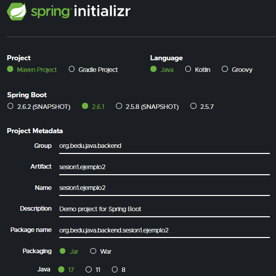

## Ejemplo: Creación de proyecto Gradle con Spring Initializr

### OBJETIVO
- Crear un proyecto Gradle usando Spring Initializr.
- Compilar, empaquetar y ejecutar la aplicación o proyecto generados desde la línea de comandos.

#### REQUISITOS
1. Tener instalada la última versión del JDK 11 o 17.

### DESARROLLO

1. Entra al sitio de [Spring Initializr](https://start.spring.io/). Ahí verás una sola página dividida en dos secciones. Comienza llenando la información de la sección del lado izquierdo. Selecciona:
  - Gradle Proyect (no te preocupes, no es necesario que tengas Gradle instalado).
  - Lenguaje: **Java**.
  - Versión de Spring Boot, la versión estable más reciente
  - Grupo, artefacto y nombre del proyecto.
  - Forma de empaquetar la aplicación: **jar**.
  - Versión de Java: **17** u **11**.

2. En la sección de la derecha (las dependencias) presiona el botón `Add dependencies` y en la ventana que se abre busca la dependencia `Web` o `Spring Web`.

3. Selecciona la dependencia `Spring Web` y con eso debes verla en la lista de las dependencias del proyecto:

4. Presiona el botón "GENERATE" (o presiona `Ctrl` + `Enter` en tu teclado) para que comience la descarga del proyecto.

5. Descomprime el archivo `zip` descargado, el cual tiene más o menos el siguiente contenido.

6. Abre una terminal o línea de comandos en el directorio que acabas de descomprimir y ejecuta los siguientes comandos, los cuales se ejecutan en Gradle gracias a un *wrapper* que se distribuye dentro del paquete que acabas de descargar:

        gradlew clean build
      
7. La salida del comando anterior debe ser parecida a la siguiente:

8. Una vez que todo está compilado, usa el siguiente comando para ejecutar la aplicación. 

        gradlew bootRun
        
9. Debes obtener una salida similar a la siguiente:

Esto indica que la aplicación se está ejecutando en el puerto **8080**. Como no hemos colocado ningún contenido en la aplicación no hay mucho que mostrar pero podremos comprobar que la aplicación está bien configurada, que todos los elementos necesarios están instalados y configurados y que nuestra aplicación se ejecuta de forma correcta:

      http://localhost:8080
      
Una vez que el sitio cargue, debes ver una pantalla como la siguiente:

10. Detén la aplicación presionando `Ctrl + C` en la terminal en donde levantaste la aplicación.

Puesto que la aplicación está completamente contenida en un archivo `jar`, también es posible ejecutarla de otra forma.

11. Al compilar la aplicación con `gradlew build` se creó un directorio `build` y dentro de este un directorio `libs`. Navega a este directorio, el cual debe contener solamente un archivo `jar`.

12. Abre una terminal en este directorio y ejecuta el siguiente comando (cambia el nombre del jar si en tu caso es diferente):

        java -jar backend.sesion1-0.0.1-SNAPSHOT.jar
        
13. Con esto debes obtener una salida como la siguiente:

Nuevamente, esto indica que la aplicación se levantó correctamente en el puerto **8080**.

      http://localhost:8080
      
Una vez que el sitio cargue, debes ver una pantalla como la siguiente:

13. ¡¡Felicidades, acabas de ejecutar tu primer "Hola mundo" con Spring Boot!!
