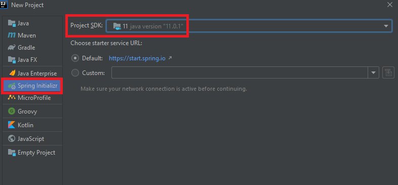
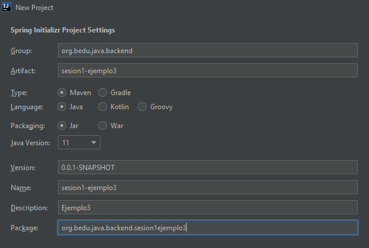
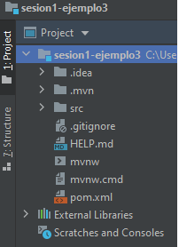
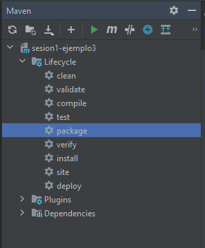
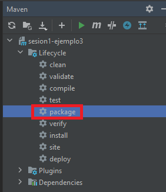
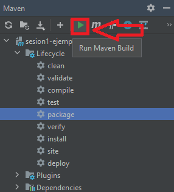
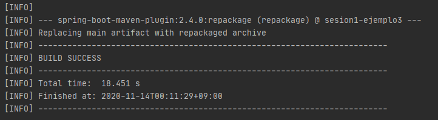
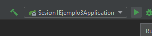

## Ejemplo 02: Creación de proyecto Maven con Spring Initializr desde IntelliJ Idea

### OBJETIVO
- Crear un proyecto Maven usando Spring Initializr desde IntelliJ Idea.
- Compilar, empaquetar y ejecutar la aplicación o proyecto generados desde el IDE.

#### REQUISITOS
- Tener instalado la última versión del JDK 11 o 17.
- Tener instalado la última versión del IDE IntelliJ Idea Ultimate (con licencia o el trial de la última edition).
- Tener una conexión a Internet.

#### DESARROLLO

> NOTA:
> Esta ejemplo requiere la versión de paga o de prueba de IDE IntelliJ Idea, si no lo tienes instalado te puedes apoyar con este material para conocer como es el proceso de creación de un proyecto desde el IDE, en los siguientes modulos utilizaremos el sitio de <a href="https://start.spring.io/" target="_blank">Spring Initializr</a>.

1. Abre el IDE IntelliJ Idea. Crea un nuevo proyecto usando el menú `New -> Project`. 

2. En el menú que se abre selecciona la opción `Spring Initializr` y como SDK Java **11** o superior.

3. En la ventana que se abre selecciona las siguientes opciones: 
- Grupo, artefacto y nombre del proyecto.
- Tipo de proyecto: **Maven Project**.
- Lenguaje: **Java**.
- Forma de empaquetar la aplicación: **jar**.
- Versión de Java: **11** o **17**.

4. En la siguiente ventana selecciona Spring Web como dependencia para el proyecto. 

5. En la última ventana dale un nombre y una ubicación al proyecto y presiona el botón `Finish`. Con esto se creará un nuevo proyecto que tiene la siguiente estructura:

En esta sesión no modificaremos nada del código que el IDE ha creado de forma automática, eso lo dejaremos para la siguiente sesión.

6. El siguiente paso es compilar el código de la aplicación. Para hacerlo ve al panel llamado **Maven** que se encuentra del lado derecho del IDE. Es posible que este panel se encuentre minimizado, como se muestra en la siguiente imagen:

Para abrirlo solo haz clic sobre el nombre del panel, con esto debe desplegarse como se muestra en la siguiente imagen:

7. Ahora, para compilar el código de la aplicación y generar el archivo `jar` que permite la ejecución de esta, existen dos formas de hacerlo. La primera es haciendo doble clic sobre el elemento `package` (con lo que se le indica a Maven que este es el último paso del ciclo de vida de construcción de la aplicación que debe ejecutar).

La otra forma de ejecutar este paso del ciclo de vida es seleccionándolo en el panel de Maven y haciendo clic en el botón de la fecha verde, el cual se llama `Run Maven Build`. Este iniciará la ejecución de los pasos del ciclo de vida hasta el paso seleccionado (en este caso `package`).

Con cualquiera de las dos formas el resultado final será el mismo.

8. En el panel de salida del IDE debemos ver un mensaje como el siguiente, que indica que la aplicación se compiló y ejecutó correctamente:

9. Finalmente, para ejecutar la aplicación debemos presionar el botón de la flecha verde situado en la parte superior del IDE.

Con esto debemos ver una salida similar a la siguiente en el panel de salida del IDE:

Esto indica que la aplicación se levantó correctamente en el puerto **8080**.

  http://localhost:8080

Una vez que el sitio cargue, debes ver una pantalla como la siguiente:

10. Detén la aplicación presionando el botón del cuadro rojo en el panel de salida del IDE.

 

[**`Siguiente`** -> reto 03](../Reto-03/)