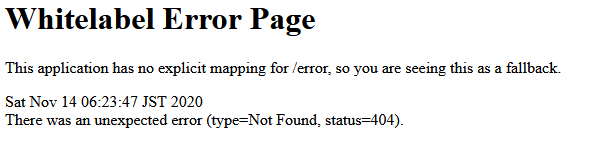

## Postwork Sesión 01

### OBJETIVO
Crear la estructura de tu proyecto personal, el cual implementará las funciones básicas de un sistema para **CRM** (*Customer Relationship Management*), el cual es un software de apoyo a la gestión de las relaciones con los clientes, a la venta y al marketing.

En este primer Postwork crearás el proyecto *Maven* desde IntelliJ Idea que servirá para implementar, a lo largo de resto de las sesiones, la estructura básica del CRM.

#### DESARROLLO
- Crea un nuevo proyecto Maven desde IntelliJ Idea.
- Selecciona Spring Initializr como tipo de proyecto.
- Selecciona las siguientes opciones para tu proyecto:
    - Herramienta de construcción: **Maven**
    - Lenguaje de programación: **Java 11 o 17**
    - Versión de Spring Boot: la más actual que no sea un `SNAPSHOT` ni un `RC`.
- Agrega `Spring Web` como dependencia de tu proyecto.
- Genera el proyecto en tu IDE y ejecútalo para asegurarte de que todo está configurado correctamente.

**-Nota:** También puedes generar tu proyecto desde el sitio de [Spring Initializr](https://start.spring.io/), descargarlo en tu computadora e importarlo en IntelliJ Idea desde el menú `File -> New -> Project from Existing Sources`:

El resultado final debe ser una página similar a la siguiente, la cual debe verse en tu navegador al entrar a la dirección [http://localhost:8080](http://localhost:8080)

