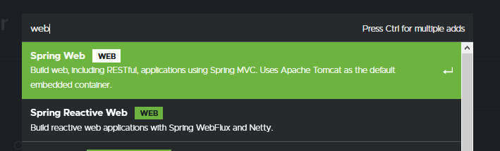

## Postwork Sesión 01

### OBJETIVO
Crear la estructura de tu proyecto personal, el cual implementará las funciones básicas de un sistema para **CRM** (*Customer Relationship Management*), el cual es un software de apoyo a la gestión de las relaciones con los clientes, a la venta y al marketing.

#### DESARROLLO

En este primer Postwork crearás el proyecto Maven desde Spring Initializr que servirá para implementar, a lo largo del resto de las sesiones, la estructura básica del CRM.

Puedes generar el proyecto desde <a href="https://start.spring.io/" target="_blank">Spring Initializr</a> como lo hicimos en el ejemplo 1.

El postwork se realizará en equipo, los cuales serán formados previamente a la sesión uno.

 

	
Solución

1. Entra al sitio de <a href="https://start.spring.io/" target="_blank">Spring Initializr</a>. Ahí verás una sola página dividida en dos secciones. Comienza llenando la información de la sección del lado izquierdo. Selecciona:
   - Tipo de proyecto: **Maven Project**.
   - Lenguaje: **Java**.
   - Versión de Spring Boot, la versión estable más reciente.
   - Grupo, artefacto y nombre del proyecto.
   - Forma de empaquetar la aplicación: **jar**.
   - Versión de Java: **11** o **17**.

    

2. En la sección de la derecha (las dependencias) presiona el botón `Add dependencies` y en la ventana que se abre busca la dependencia `Web` o `Spring Web`.

    

3. Selecciona la dependencia `Spring Web` y con eso debes verla en la lista de las dependencias del proyecto:

     

4. Presiona el botón "GENERATE" (o presiona `Ctrl` + `Enter` en tu teclado) para que comience la descarga del proyecto.

    

5. Descomprime el archivo `zip` descargado, el cual tiene más o menos el siguiente contenido.

    

6. Abre una terminal o línea de comandos en el directorio que acabas de descomprimir y ejecuta los siguientes comandos, los cuales se ejecutan en **Maven** gracias a un *wrapper* que se distribuye dentro del paquete que acabas de descargar (Nota: si es la primera vez que ejecutas Maven en tu computadora, el comando tardará un buen rato en ejecutarse, ya que debe descargar las librerías y paquetes necesarios):

        mvnw clean package
      
7. La salida del comando anterior debe ser parecida a la siguiente:

    

8. Una vez que todo está compilado, usa el siguiente comando para ejecutar la aplicación. 

        mvnw spring-boot:run
        
9. Debes obtener una salida similar a la siguiente:

    

    Esto indica que la aplicación se levantó correctamente en el puerto **8080**. 

    http://localhost:8080
      
    Una vez que el sitio cargue, debes ver una pantalla como la siguiente:

    

10. Detén la aplicación presionando `Ctrl + C` en la terminal en donde levantaste la aplicación.

    Puesto que la aplicación está completamente contenida en un archivo `jar`, también es posible ejecutarla de otra forma.

11. Al compilar la aplicación con `mvnw package` se creó un directorio `target`. Navega a este directorio, el cual debe contener, entre otras cosas, un archivo `jar`.

    

12. Abre una terminal en este directorio y ejecuta el siguiente comando (cambia el nombre del jar si en tu caso es diferente):

        java -jar sesion1.ejemplo2-0.0.1-SNAPSHOT.jar
        
13. Con esto nuevamente debes obtener una salida como la siguiente:

    

    Nuevamente, esto indica que la aplicación se levantó correctamente en el puerto **8080**.

      http://localhost:8080
      
    Una vez que el sitio cargue, debes ver una pantalla como la siguiente:

    

 

[**`Siguiente`** -> sesión 2](../../Sesion-02/)

[**`Regresar`**](../)
