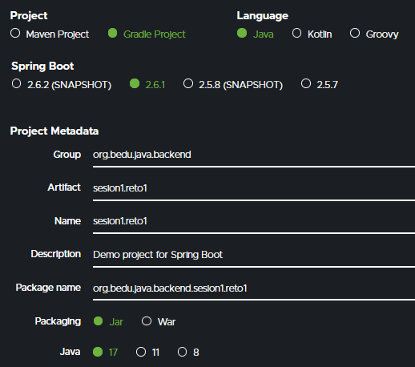
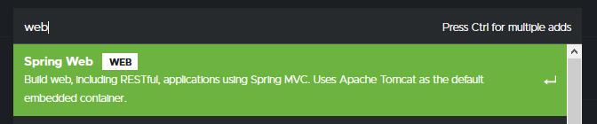
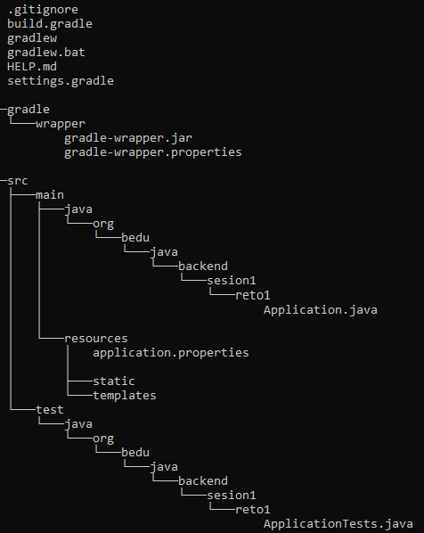
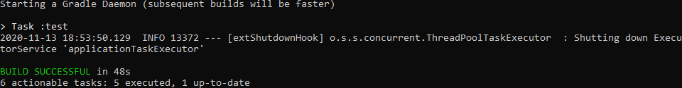
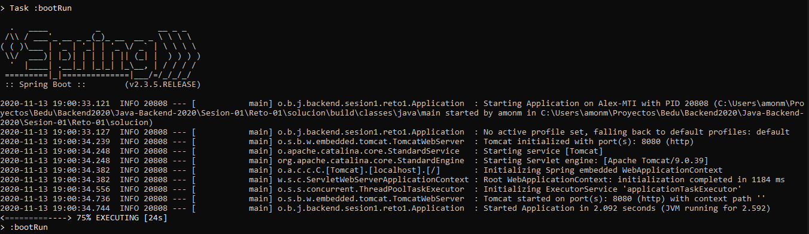

## Reto 01: Creación de Proyecto Gradle con Spring Initializr

### OBJETIVO
- Crear un nuevo proyecto Spring Boot, usando Spring Initializr, sin ayuda del instructor.
- Ejecutar una aplicación desde la línea de comandos sin necesidad de instalar Gradle.

#### REQUISITOS
- Tener instalado la última versión del **JDK 11 o 17**.
- Tener acceso a la línea de comandos.

### DESARROLLO
Crear un proyecto de Spring Boot usando Spring Initializr con las siguientes características:
- Herramienta de construcción: **Gradle**
- Lenguaje de programación: **Java 17 u 11**
- Versión de Spring Boot: la más actual que no sea un `SNAPSHOT` ni un `RC`.

	
Solución

1. Entra al sitio de <a href="https://start.spring.io/" target="_blank">Spring Initializr</a>. Comienza llenando la información de la sección del lado izquierdo.
- **Gradle** Proyect
- Lenguaje: **Java**.
- Versión de Spring Boot, la versión estable más reciente
- Grupo, artefacto y nombre del proyecto.
- Forma de empaquetar la aplicación: **jar**.
 - Versión de Java: **11** o **17**.

2. En la sección de la derecha (las dependencias) presiona el botón `Add dependencies` y en la ventana que se abre busca la dependencia `Web` o `Spring Web`.

3. Selecciona la dependencia `Spring Web` y con eso debes verla en la lista de las dependencias del proyecto:

4. Presiona el botón "GENERATE" (o presiona `Ctrl + Enter` en tu teclado) para que comience la descarga del proyecto.

5. Descomprime el archivo zip descargado, el cual tiene más o menos el siguiente contenido.

6. Abre una terminal o línea de comandos en el directorio que acabas de descomprimir y ejecuta los siguientes comandos:

       gradlew clean build

La salida del comando anterior debe ser parecida a la siguiente:

7. Una vez que todo está compilado, usa el siguiente comando para ejecutar la aplicación.

       gradlew bootRun

o navega al directorio **build\libs**, abre una terminal en este directorio y ejecuta el siguiente comando (cambia el nombre del jar si en tu caso es diferente):

    java -jar backend.sesion1-0.0.1-SNAPSHOT.jar
    
Esto indica que la aplicación se levantó correctamente en el puerto **8080**. 

  http://localhost:8080

Una vez que el sitio cargue, debes ver una pantalla como la siguiente:

8. Detén la aplicación presionando Ctrl + C en la terminal en donde levantaste la aplicación.
  	

 

 

[**`Siguiente`** -> ejemplo 01](../Ejemplo-01/)