## Reto 03: Creación de Proyecto Maven con Spring Initializr desde IntelliJ Idea

### OBJETIVO
- Crear un nuevo proyecto Spring Boot, usando Spring Initializr desde el IDE IntelliJ Idea, sin ayuda del instructor.
- Ejecutar una aplicación desde el IDE.

#### REQUISITO
- Tener instalado la última versión del **JDK 11 o 17**.
- Tener instalado la última versión del IDE IntelliJ Idea Ultimate (con licencia o el trial de la última edition).
- Tener una conexión a Internet.

### DESARROLLO

> NOTA:
> Esta ejemplo requiere la versión de paga o de prueba de IDE IntelliJ Idea, si no lo tienes instalado te puedes apoyar con este material para conocer como es el proceso de creación de un proyecto desde el IDE, en los siguientes modulos utilizaremos el sitio de <a href="https://start.spring.io/" target="_blank">Spring Initializr</a>.

Crear un proyecto de Spring Boot usando Spring Initializr con las siguientes características:
- Herramienta de construcción: **Maven**
- Lenguaje de programación: **Java 11 o 17**
- Versión de Spring Boot: la más actual que no sea un `SNAPSHOT` ni un `RC`.

	
Solución

1. Abre el IDE IntelliJ Idea. Crea un nuevo proyecto usando el menú `New -> Project`.

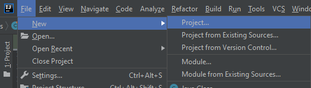

2. En el menú que se abre selecciona la opción **Spring Initializr** y como SDK Java **11** (o superior).

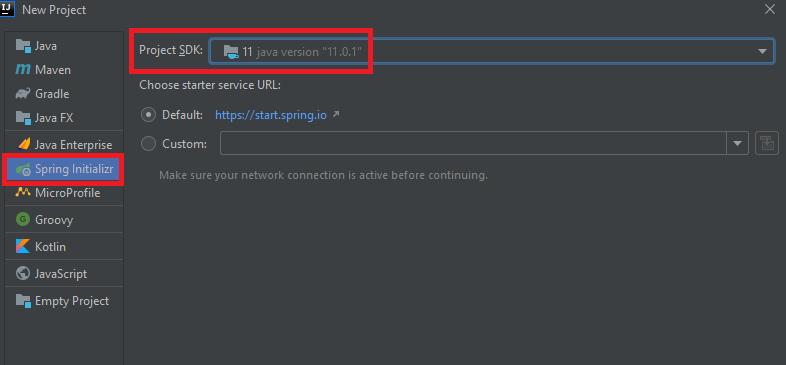

3. En la ventana siguiente selecciona las opciones:

- Grupo, artefacto y nombre del proyecto.
- Tipo de proyecto: **Maven**.
- Lenguaje: **Java**.
- Forma de empaquetar la aplicación: **jar**.
- Versión de Java: **11** o **17**.

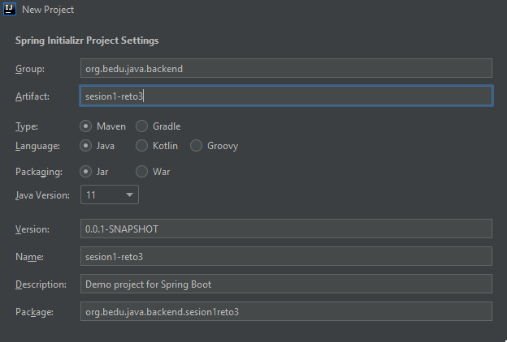

4. En la siguiente ventana selecciona Spring Web como dependencia para el proyecto.

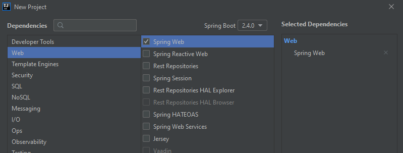

5. En la última ventana dale un nombre y una ubicación al proyecto y presiona el botón `Finish`. Con esto se creará un nuevo proyecto que tiene la siguiente estructura:

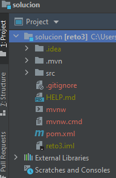

6. En esta sesión no modificarás nada del código que el IDE ha creado de forma automática, eso será hasta la siguiente sesión.

7. El siguiente paso es compilar el código de la aplicación. Para hacerlo ve al panel llamado *Maven* que se encuentra del lado derecho del IDE.

Para compilar el código de la aplicación y generar el archivo jar que permite la ejecución de este, haz doble clic sobre el elemento *package* (con lo que se le indica a Maven que este es el último paso del ciclo de vida de construcción de la aplicación que debe ejecutar).

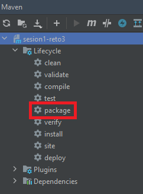

8. En el panel de salida del IDE debes ver un mensaje como el siguiente, que indica que la aplicación se compiló y ejecutó correctamente:

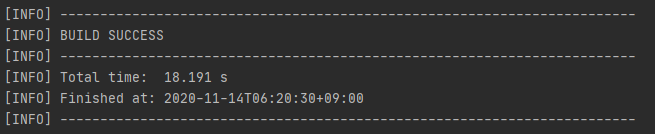

9. Para ejecutar la aplicación presiona el botón de la flecha verde situado en la parte superior del IDE.

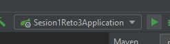

10. Debes ver una salida similar a la siguiente en el panel de salida del IDE:

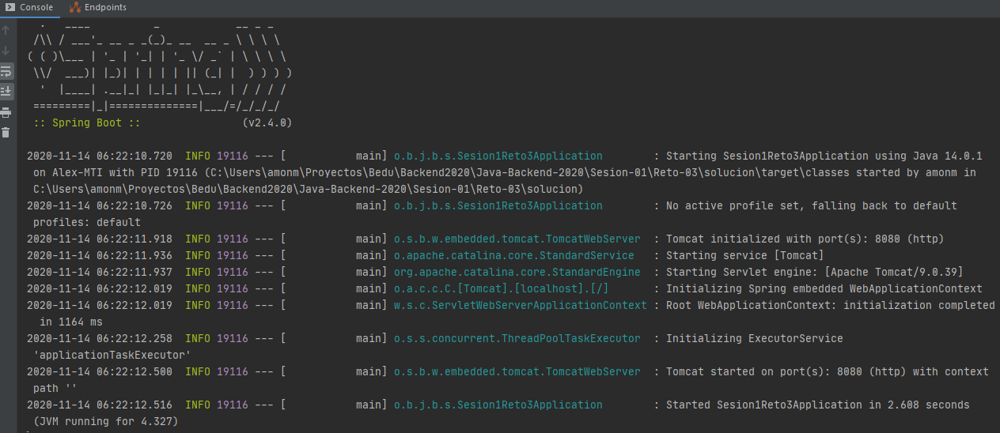

Esto indica que la aplicación se levantó correctamente en el puerto 8080. Como no hay contenido en la aplicación no hay mucho que mostrar, pero puedes comprobar que la aplicación está bien configurada, que todos los elementos necesarios están instalados y configurados y que la aplicación se ejecuta de forma correcta. Escribe la siguiente ruta en tu navegador:

http://localhost:8080

Una vez que el sitio cargue, debes ver una pantalla como la siguiente:

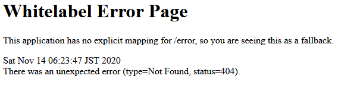

11. Detén la aplicación presionando el botón del cuadro rojo en el panel de salida del IDE.

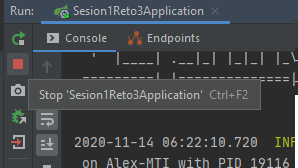

 

 

[**`Siguiente`** -> postwork](../Postwork/)

[**`Regresar`**](../)