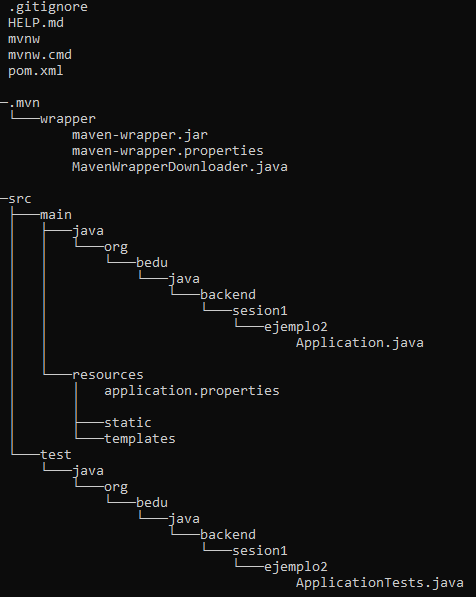

## Ejemplo 01: Controladores con Spring MVC

### OBJETIVO
- Aprender la forma de crear controladores de Spring usando su módulo web (Spring MVC).
- Crear un primer servicio REST que regrese un recurso estático.
- Consumir el servicio usando un navegador Web y con [Postman](https://www.postman.com/downloads/).

#### REQUISITOS
- Tener instalado el IDE IntelliJ Idea Community Edition.
- Tener instalada la última versión del JDK 17 u 11.
- Tener instalada la herramienta <a href="https://www.postman.com/downloads/" target="_blank">Postman</a>.

### DESARROLLO

1. Entra al sitio de <a href="https://start.spring.io/" target="_blank">Spring Initializr</a>. Ahí verás una sola página dividida en dos secciones. Comienza llenando la información de la sección del lado izquierdo. Selecciona:

    - Tipo de proyecto: **Maven Project**.
    - Lenguaje: **Java**.
    - Versión de Spring Boot, la versión estable más reciente.
    - Grupo, artefacto y nombre del proyecto.
    - Forma de empaquetar la aplicación: **jar**.
    - Versión de Java: **11** o **17**.

2. En la sección de la derecha (las dependencias) presiona el botón `Add dependencies` y en la ventana que se abre busca la dependencia `Web` o `Spring Web`.

3. Selecciona la dependencia `Spring Web` y con eso debes verla en la lista de las dependencias del proyecto:

4. Presiona el botón "GENERATE" (o presiona `Ctrl` + `Enter` en tu teclado) para que comience la descarga del proyecto.

5. Descomprime el archivo `zip` descargado, el cual tiene más o menos el siguiente contenido.

    

    Abre el proyecto en el IDE.

    

    Dentro del paquete crearemos un subpaquete que contendrá los controladores de Spring MVC (los componentes que reciben y manejan las peticiones web dentro de la aplicación).

5. Haz clic con el botón derecho del ratón sobre el paquete y en el menú que se muestra selecciona las opciones `New  -> Package`. Dale a este nuevo paquete el nombre de `controllers`.

    

6. Crea un segundo paquete llamado `model` a la misma altura que el paquete `controllers`. Al final debes tener dos paquetes adicionales:

    

7. Dentro del paquete crea una nueva clase llamada "`Saludo`". Esta clase representará el modelo de los datos que regresará el servicio que crearemos en un momento. Esta será una clase sencilla que solo tendrá una propiedad de tipo `String`: `mensaje`. Además de esta propiedad la clase debe tener su método *setter* y su método *getter*:    

    ```java
    public class Saludo {
        private String mensaje;

        public String getMensaje() {
            return mensaje;
        }

        public void setMensaje(String mensaje) {
            this.mensaje = mensaje;
        }
    }
    ```

    Cuando alguien invoque esta clase le regresaremos una instancia nueva de esta clase con un valor establecido en su atributo mensaje. Este diseño se puedde mejorar pero para este ejemplo servirá el diseño anterior.

8. En el paquete `controller` crea una nueva clase llamada `SaludoController`. Esta clase implementará los servicios web REST que manejan a los recursos de tipo `Saludo`. Para indicar a Spring que este componente es un servicio REST debemos decorar la case con la anotación `@RestController`:

    ```java
    @RestController
    public class SaludoController {

    }
    ```

    Esta clase tendrá, en este momento, un  solo método o manejador de llamadas, el cual no recibirá ningún parámetro y regresará un recurso de tipo `Saludo` con un mensaje preestablecido.

    ```java
    public Saludo saluda(){

        Saludo saludo = new Saludo();
        saludo.setMensaje("¡¡Hola Mundo!!");

        return saludo;
    }
    ```

    Para indicar que este método es un manejador de peticiones debemos indicar qué tipo de operaciones manejará (el verbo HTTP que soportará). Como en este caso solo se usará para leer información estática se usará el verbo **GET**. Spring en su módulo web (Spring MVC) proporciona una serie de anotaciones que permite indicar esto de una forma sencilla. En este caso la anotación que se usrá es `@GetMapping` a la cual hay que indicarle la URL de las peticiones que manejará. En este caso será la ruta `saludo`. El método completo queda de la siguiente forma:

    ```java
    @GetMapping("/saludo")
    public Saludo saluda(){

        Saludo saludo = new Saludo();
        saludo.setMensaje("¡¡Hola Mundo!!");

        return saludo;
    }
    ```

9. Ejecuta la aplicación, en la consola del IDE debes ver un mensaje similar al siguiente:

    

    Esto quiere decir que la aplicación se ejecutó correctamente y todo está bien configurado.

10. Desde tu navegador entra en la siguiente ruta: <a href="http://localhost:8080/saludo" target="_blank">http://localhost:8080/saludo</a>. Debes ver una salida similar a la siguiente:

    

    Dependiendo de tu navegador y de los plugins que tengas instalado, podrías ver el formato un poco diferente; lo importante es que veas el texto "**¡¡Hola Mundo!!**".

    Esto quiere decir que la aplicación ha funcionado de forma correcta.

11. Ahora, consumiremos el servicio usando *Postman*, el cual es una herrmienta cuya finalidad principal es consumir servicios REST. Al abrir Postman debes ver una ventana similar a la siguiente:

    

12. Haz clic en la opción *Create a basic request*:

    

13. En la siguiente ventana coloca la misma URL de la petición que usaste en el navegador y presiona el botón `Send`:

    

14. Una vez que recibas la respuesta, debes ver una salida similar en el panel de respuestas:

    


<br>

[**`Siguiente`** -> reto 01](../Reto-01/)