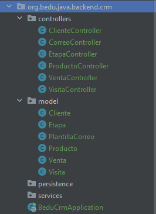

## Postwork Sesión 02

### OBJETIVO
- Crear una serie de modelos que representarán la información que es manejada por el CRM.
- Crear la estructura de los servicios que permitirán implementar las diferentes funcionalidades del CRM.
- Crear los paquetes que representarán cada una de las capas de la aplicación.


### DESARROLLO

En esta sesión se definen los manejadores de eventos para las operaciones que realizará el CRM, manejando las altas, bajas y cambios (CRUD) de los clientes, productos, visitas y ventas.

El postwork se realizará en equipo, los cuales serán formados previamente a la sesión uno.

El propósito de este Postwork es retomar el proyecto del módulo anterior y realizar las modificaciones descritas a continuación. 

1. Crea los siguientes paquetes en el proyecto principal:
    - *model*
    - *controllers*
    - *persistence*
    - *services*
2. Crea dentro de paquete "`model`" las siguientes clases:
    - *Cliente*
    - *Visita*
    - *Producto*
    - *Venta*
    - *Etapa*

    Estas clases están vacías por el momento (no tendrán atributos)

3. Crea dentro del paquete "`controllers`" las siguientes clases y decóralas con la anotación "`@RestController`".
    - *ClienteController*
    - *ProductoController*
    - *VisitaController*
    - *VentaController*
    - *EtapaController*
    
4. Dentro de cada uno de los servicios coloca métodos que permitan crear, leer, actualizar y eliminar recursos (objetos del paquete `model`). Para ello tendrás que usar los métodos HTTP: **GET**, **POST**, **PUT** y **DELETE**.

    Tus servicios deben seguir este patrón:

    ```java
    @RestController
    @RequestMapping("/cliente")
    public class ClienteController {

        @GetMapping("/{clienteId}")
        public ResponseEntity<Cliente> getCliente(@PathVariable Long clienteId){

        }

        @GetMapping
        public ResponseEntity <List<Cliente>> getClientes(){

        }

        @PostMapping
        public ResponseEntity<Void> creaCliente(@RequestBody Cliente cliente){

        }

        @PutMapping("/{clienteId}")
        public ResponseEntity<Void> actualizaCliente(@PathVariable Long clienteId, @RequestBody Cliente cliente){

        }

        @DeleteMapping("/{clienteId}")
        public ResponseEntity<Void> eliminaCliente(@PathVariable Long clienteId){

        }
    }
    ```


4. La estructura de tu proyecto debe quedar de la siguiente forma:

    

<br>

<details>
	<summary>Solución</summary>

1. Crea los siguientes paquetes en el proyecto principal:
    - *model*
    - *controllers*
    - *persistence*
    - *services*

2. Crea dentro de paquete `model` las siguientes clases:
    
    ```java
    package org.bedu.java.backend.crm.model;

    public class Cliente {
    }
    ```

    ```java
    package org.bedu.java.backend.crm.model;

    public class Etapa {
    }
    ```

    ```java
    package org.bedu.java.backend.crm.model;

    public class PlantillaCorreo {
    }
    ```

    ```java
    package org.bedu.java.backend.crm.model;

    public class Producto {
    }
    ```

    ```java
    package org.bedu.java.backend.crm.model;

    public class Venta {
    }
    ```

    ```java
    package org.bedu.java.backend.crm.model;

    public class Visita {
    }
    ```

3. Crea dentro del paquete `controllers` las siguientes clases y decóralas con la anotación `@RestController`.
    
    ```java
    @RestController
    @RequestMapping("/cliente")
    public class ClienteController {
        @GetMapping("/{clienteId}")
        public ResponseEntity<Cliente> getCliente(@PathVariable Long clienteId){
            return ResponseEntity.ok(new Cliente());
        }

        @GetMapping
        public ResponseEntity <List<Cliente>> getClientes(){
            return ResponseEntity.ok(new ArrayList<>());
        }

        @PostMapping
        public ResponseEntity<Void> creaCliente(@RequestBody Cliente cliente){
            return ResponseEntity.created(URI.create("")).build();
        }

        @PutMapping("/{clienteId}")
        public ResponseEntity<Void> actualizaCliente(@PathVariable Long clienteId, @RequestBody Cliente cliente){
            return ResponseEntity.status(HttpStatus.NO_CONTENT).build();
        }

        @DeleteMapping("/{clienteId}")
        public ResponseEntity<Void> eliminaCliente(@PathVariable Long clienteId){
            return ResponseEntity.status(HttpStatus.NO_CONTENT).build();
        }
    }
    ```

    ```java
    @RestController
    @RequestMapping("/correo")
    public class CorreoController {
    }
    ```

    ```java
    @RestController
    @RequestMapping("/etapa")
    public class EtapaController {

        @GetMapping("/{etapaId}")
        public ResponseEntity<Etapa> getEtapa(@PathVariable Long etapaId){
            return ResponseEntity.ok(new Etapa());
        }

        @GetMapping
        public ResponseEntity <List<Etapa>> getEtapas(@RequestParam Long clienteId){
            return ResponseEntity.ok(new ArrayList<>());
        }

        @PostMapping
        public ResponseEntity<Void> creaEtapa(@RequestBody Etapa etapa, @RequestParam Long clienteId){
            return ResponseEntity.created(URI.create("")).build();
        }

        @PutMapping("/{etapaId}")
        public ResponseEntity<Void> actualizaEtapa(@PathVariable Long etapaId, @RequestBody Etapa etapa){
            return ResponseEntity.status(HttpStatus.NO_CONTENT).build();
        }

        @DeleteMapping("/{etapaId}")
        public ResponseEntity<Void> eliminaEtapa(@PathVariable Long etapaId){
            return ResponseEntity.status(HttpStatus.NO_CONTENT).build();
        }
    }
    ```

    ```java
    @RestController
    @RequestMapping("/producto")
    public class ProductoController {

        @GetMapping("/{productoId}")
        public ResponseEntity<Producto> getProducto(@PathVariable Long productoId){
            return ResponseEntity.ok(new Producto());
        }

        @GetMapping
        public ResponseEntity <List<Producto>> getProductos(){
            return ResponseEntity.ok(new ArrayList<>());
        }

        @PostMapping
        public ResponseEntity<Void> creaProducto(@RequestBody Producto producto){
            return ResponseEntity.created(URI.create("")).build();
        }

        @PutMapping("/{productoId}")
        public ResponseEntity<Void> actualizaProducto(@PathVariable Long productoId, @RequestBody Producto producto){
            return ResponseEntity.status(HttpStatus.NO_CONTENT).build();
        }

        @DeleteMapping("/{productoId}")
        public ResponseEntity<Void> eliminaProducto(@PathVariable Long productoId){
            return ResponseEntity.status(HttpStatus.NO_CONTENT).build();
        }
    }
    ```

    ```java
    @RestController
    @RequestMapping("/venta")
    public class VentaController {
        @GetMapping("/{ventaId}")
        public ResponseEntity<Venta> getVenta(@PathVariable Long ventaId){
            return ResponseEntity.ok(new Venta());
        }

        @GetMapping
        public ResponseEntity <List<Venta>> getVentas(@RequestParam Long clienteId){
            return ResponseEntity.ok(new ArrayList<>());
        }

        @PostMapping
        public ResponseEntity<Void> creaVenta(@RequestBody Venta venta, @RequestParam Long clienteId){
            return ResponseEntity.created(URI.create("")).build();
        }

        @PutMapping("/{ventaId}")
        public ResponseEntity<Void> actualizaVenta(@PathVariable Long ventaId, @RequestBody Venta venta){
            return ResponseEntity.status(HttpStatus.NO_CONTENT).build();
        }

        @DeleteMapping("/{ventaId}")
        public ResponseEntity<Void> eliminaVenta(@PathVariable Long ventaId){
            return ResponseEntity.status(HttpStatus.NO_CONTENT).build();
        }
    }
    ```

    ```java
    @RestController
    @RequestMapping("/visita")
    public class VisitaController {

        @GetMapping("/{visitaId}")
        public ResponseEntity<Visita> getVisita(@PathVariable Long visitaId){
            return ResponseEntity.ok(new Visita());
        }

        @GetMapping
        public ResponseEntity <List<Visita>> getVisitas(@RequestParam Long clienteId){
            return ResponseEntity.ok(new ArrayList<>());
        }

        @PostMapping
        public ResponseEntity<Void> creaVisita(@RequestBody Visita visita, @RequestParam Long clienteId){
            return ResponseEntity.created(URI.create("")).build();
        }

        @PutMapping("/{visitaId}")
        public ResponseEntity<Void> actualizaVisits(@PathVariable Long visitaId, @RequestBody Visita visita){
            return ResponseEntity.status(HttpStatus.NO_CONTENT).build();
        }

        @DeleteMapping("/{visitaId}")
        public ResponseEntity<Void> eliminaVisita(@PathVariable Long visitaId){
            return ResponseEntity.status(HttpStatus.NO_CONTENT).build();
        }
    }
    ```

4. La estructura de tu proyecto debe quedar de la siguiente forma:

    

</details>

<br>

[**`Siguiente`** -> sesión 3](../../Sesion-03/)

[**`Regresar`**](../)