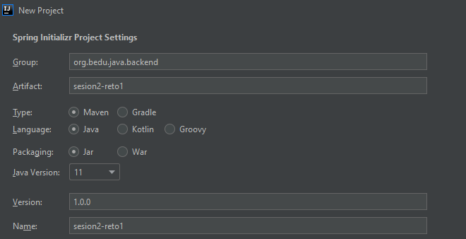
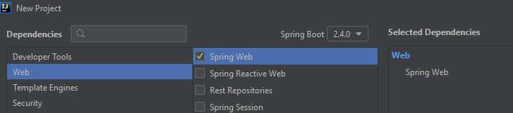
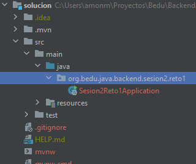
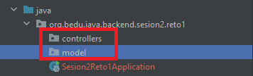
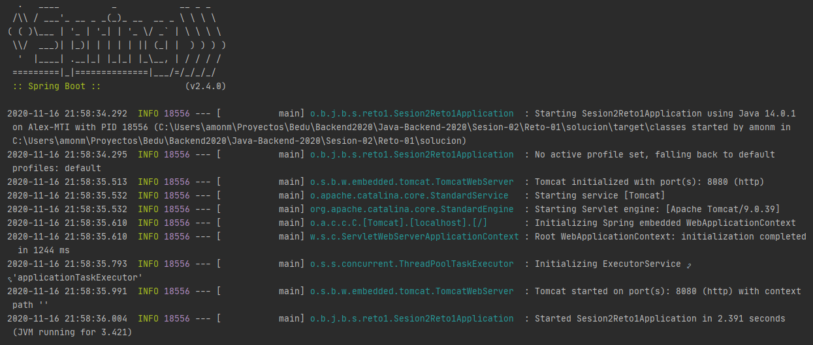

## Ejemplo : Controladores con Spring MVC con parámetros

### OBJETIVO
- Aprender la forma de crear controladores de Spring usando su módulo web (Spring MVC) y recibir un parámetro.
- Crear un servicio REST que regrese un recurso dinámico.
- Consumir el servicio usando un navegador Web y con [Postman](https://www.postman.com/downloads/).

#### REQUISITOS
- Tener instalado el IDE IntelliJ Idea Community Edition.
- Tener instalada la última versión del JDK 17 u 11.
- Tener instalada la herramienta [Postman](https://www.postman.com/downloads/).

### DESARROLLO
- Crea un nuevo proyecto Spring Boot en IntelliJ Idea como lo hiciste en la primera sesión.
- Crea una nueva clase que represente un recurso de tipo `Saludo` con dos atributos, un "mensaje" y un "nombre". 
- Crea una nueva clase que represente un servicio REST, unando la anotación `@RestController`.
- Crea un nuevo manejador de peticiones que reciba como un parámetro un numbre y lo incluya en el recurso que regresará.
- Hacer la prueba desde la herramienta *Postman*.

<details>
	<summary>Solución</summary>

1. Crea un proyecto Maven usando Spring Initializr desde el IDE IntelliJIdea como lo hiciste en la primera sesión.


2.  En la ventana que se abre selecciona las siguientes opciones:
- Grupo, artefacto y nombre del proyecto.
- Tipo de proyecto: **Maven Project**.
- Lenguaje: **Java**.
- Forma de empaquetar la aplicación: **jar**.
- Versión de Java: **17** u **11**.



3. En la siguiente ventana elige Spring Web como la única dependencia del proyecto:



4. Dale un nombre y una ubicación al proyecto y presiona el botón `Finish`.

En el proyecto que se acaba de crear debes tener el siguiente paquete: `org.bedu.java.backend.sesion2.reto1`. 



Dentro de ese paquete crearemos un subpaquete que contendrá los controladores de Spring MVC (los componentes que reciben y manejan las peticiones web dentro de la aplicación).

5. Haz clic con el botón derecho del ratón sobre el paquete y en el menú que se muestra selecciona las opciones `New  -> Package`. Dale a este nuevo paquete el nombre de `controllers`.

6. Crea un segundo paquete llamado `model` a la misma altura que el paquete `controllers`. Al final debes tener dos paquetes adicionales:



7. Dentro del paquete crea una nueva clase llamada "`Saludo`". Esta clase representará el modelo de los datos que regresará el servicio que crearemos en un momento. Esta será una clase sencilla que tendrá dos propiedades de tipo `String`: `mensaje` y `nombre`. Además sus *setter*s y *getter*s:

```java
public class Saludo {
    private String mensaje;
    private String nombre;

    public String getMensaje() {
        return mensaje;
    }

    public void setMensaje(String mensaje) {
        this.mensaje = mensaje;
    }

    public String getNombre() {
        return nombre;
    }

    public void setNombre(String nombre) {
        this.nombre = nombre;
    }
}
```

8. En el paquete `controller` crea una nueva clase llamada `SaludoController`. Esta clase implementará los servicios web REST que manejan a los recursos de tipo `Saludo`. Para indicar a Spring que este componente es un servicio REST debemos decorar la case con la anotación `@RestController`:

```java
@RestController
public class SaludoController {

}
```

Esta clase tendrá, en este momento, un  solo método o manejador de llamadas, el cual recibirá un parámetro, el nombre al cual debe saludar, y regresará un recurso de tipo `Saludo` con un mensaje preestablecido.

```java
    public Saludo saluda(String nombre){

        Saludo saludo = new Saludo();
        saludo.setMensaje("¡¡Hola Mundo!!");
	saludo.setNombre(nombre);

        return saludo;
    }
```

Para indicar que este método es un manejador de peticiones debemos indicar qué tipo de operaciones manejará (el verbo HTTP que soportará). Como en este caso solo se usará para leer información, y no para actualizarla, se usará el verbo **GET**. Spring en su módulo web (Spring MVC) proporciona una serie de anotaciones que permite indicar esto de una forma sencilla. En este caso la anotación que se usrá es `@GetMapping` a la cual hay que indicarle la URL de las peticiones que manejará. En este caso será la ruta `saludo/{nombre}`. Para indicar que `nombre` se recibirá como parámetro o parte de la ruta debemos usar la anotación `@PathVariable`.

El método completo queda de la siguiente forma:

```java
    @GetMapping("/saludo/{nombre}")
    public Saludo saluda(@PathVariable String nombre){

        Saludo saludo = new Saludo();
        saludo.setMensaje("¡¡Hola Mundo!!");
        saludo.setNombre(nombre);

        return saludo;
    }
```

9. Ejecuta la aplicación, en la consola del IDE debes ver un mensaje similar al siguiente:



Esto quiere decir que la aplicación se ejecutó correctamente y todo está bien configurado.

10. Ahora, consumiremos el servicio usando *Postman*.

11. Haz clic en la opción *Create a basic request*:

12. En la siguiente ventana coloca la URL **http://localhost:8080/saludo/beto** y presiona el botón `Send`:


13. Una vez que recibas la respuesta, debes ver una salida similar en el panel de respuestas:


</details> 
