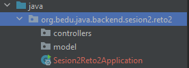
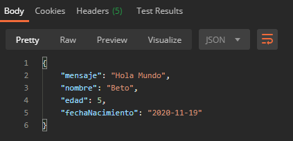
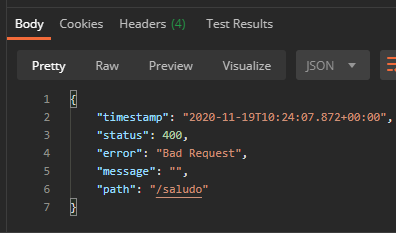

## Reto 02: Uso de método PUT y parámetros de fechas

### OBJETIVO
- Aprender la forma de crear controladores de Spring usando su módulo web (Spring MVC) y recibir un parámetro.
- Crear un servicio REST que regrese un recurso dinámico.
- Consumir el servicio usando un navegador Web y con Postman.

#### REQUISITOS
- Tener instalado el IDE IntelliJ Idea Community Edition.
- Tener instalada la última versión del JDK 17 u 11.
- Tener instalada la herramienta Postman.

### DESARROLLO
- Crea un nuevo proyecto Spring Boot en IntelliJ Idea como lo hiciste en la primera sesión.
- Crea una nueva clase que represente un recurso de tipo Saludo con cuatro atributos: "mensaje", "nombre", "edad" y "fechaNacimiento". Este último debe ser de tipo "`LocalDate`".
- Crea una nueva clase que represente un servicio REST, unando la anotación `@RestController`.
- Crea un nuevo manejador de peticiones de tipo `PUT` que reciba como un parámetro de tipo "`Saludo`" y regrese este mismo objeto.
- Hacer la prueba desde la herramienta Postman.

<details>
	<summary>Solución</summary>
  
  
1. Crea un proyecto Maven usando Spring Initializr como lo hiciste en la primera sesión.

2.  Selecciona las siguientes opciones:

    - Grupo: org.bedu.java.backend
    - Artefacto y nombre del proyecto: sesion2-reto2
    - Tipo de proyecto: **Maven Project**.
    - Lenguaje: **Java**.
    - Forma de empaquetar la aplicación: **jar**.
    - Versión de Java: **17** u **11**.

3. Elige Spring Web como la única dependencia del proyecto:

4. Da clic en `Generate`, descarga y abre el proyecto.

5. En el proyecto que se acaba de crear debes tener el siguiente paquete: `org.bedu.java.backend.sesion2.reto2`. Dentro de ese paquete crea un subpaquete con el nombre de `controllers` y otro llamado `model` a la misma altura que el paquete `controllers`. Al final debes tener dos paquetes adicionales:

    

6. Dentro del paquete crea una nueva clase llamada "`Saludo`". Esta clase representará el modelo de los datos que regresará el servicio que crearemos en un momento. Esta clase tendrá la siguientes propiedades:

    - `String mensaje`
    - `String nombre`
    - `int edad`
    - `LocalDate fechaNacimiento`

    Además sus *setter*s y *getter*s:

    ```java
    public class Saludo {
        private String mensaje;
        private String nombre;
        private int edad;
        private LocalDate fechaNacimiento;

        public String getMensaje() {
            return mensaje;
        }

        public void setMensaje(String mensaje) {
            this.mensaje = mensaje;
        }

        public String getNombre() {
            return nombre;
        }

        public void setNombre(String nombre) {
            this.nombre = nombre;
        }

        public int getEdad() {
            return edad;
        }

        public void setEdad(int edad) {
            this.edad = edad;
        }

        public LocalDate getFechaNacimiento() {
            return fechaNacimiento;
        }

        public void setFechaNacimiento(LocalDate fechaNacimiento) {
            this.fechaNacimiento = fechaNacimiento;
        }
    }
    ```

7. En el paquete `controller` crea una nueva clase llamada `SaludoController`. Esta clase implementará los servicios web REST que manejan a los recursos de tipo `Saludo`. Para indicar a Spring que este componente es un servicio REST debemos decorar la case con la anotación `@RestController`:

    ```java
    @RestController
    public class SaludoController {

    }
    ```

8. Esta clase tendrá un solo método o manejador de llamadas, el cual recibirá un parámetro de tipo `Saludo` y regresará ese mismo `Saludo`.

    ```java
    public Saludo saluda(Saludo saludo){
        return saludo;
    }
    ```

    Para indicar que este método es un manejador de peticiones debemos indicar qué tipo de operaciones manejará (el verbo HTTP que soportará) en este caso se usará el verbo **PUT**. La anotación que se usrá es `@PutMapping` a la cual hay que indicarle la URL de las peticiones que manejará. En este caso será la ruta `saludo`.  No olvides indicarle a Spring MVC que el parámetro de tipo Saludo lo recibirá en el cuerpo de la petición, usando la anotación `@RequestBody`: 

    El método completo queda de la siguiente forma:

    ```java
        @PutMapping("/saludo")
        public Saludo saluda(@RequestBody Saludo saludo){
            return saludo;
        }
    ```

9. Ejecuta la aplicación.

10. Ahora, in *Postman* crea una nueva petición de tipo `PUT` hacia la URL **http://localhost:8080/saludo**. En la pestaña `Body` selecciona la opción `Raw` como tipo de petición y `JSON` como formato de la misma. Coloca el siguiente contenido en el cuerpo de la petición:

    ```json
    {
        "mensaje": "Hola Mundo",
        "nombre": "Beto",
        "edad": 5,
        "fechaNacimiento": "2020-11-19"
    }
    ```

11. Presiona el botón `Send`. Una vez que recibas la respuesta, debes ver una salida similar en el panel de respuestas:

    

    Si por el contrario recibes una respuesta con el texto "**Bad Request**" eso quiere decir que el formato de la fecha es incorrecto, prueba moviendo la posición del día, mes y año.

    
  
</details>


<br>

[**`Siguiente`** -> reto 03](../Reto-03/)