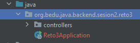
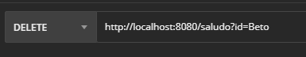
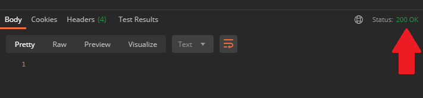

## Reto 03: Uso de método DELETE

### OBJETIVO
- Aprender la forma de crear controladores de Spring usando su módulo web (Spring MVC) y recibir un parámetro a través de un *query string*.
- Crear un servicio REST que no regrese datos, pero sí un código indicando el estado de la de respuesta.
- Consumir el servicio usando un navegador Web y con Postman.

#### REQUISITOS
- Tener instalado el IDE IntelliJ Idea Community Edition.
- Tener instalada la última versión del JDK 17 u 11.
- Tener instalada la herramienta Postman.

### DESARROLLO
- Crea un nuevo proyecto Spring Boot.
- Crea una nueva clase que represente un servicio REST, usando la anotación `@RestController`.
- Crea un nuevo manejador de peticiones de tipo `DELETE` que reciba como parámetro una cadena, para lo cual tendrás que usar la anotación `@RequestParam`, y regrese un objeto de tipo `ResponseEntity` estableciendo la respuesta a un status de "OK".
- Hacer la prueba desde la herramienta Postman.

<br>

<details>
	<summary>Solución</summary>
  
1. Crea un proyecto Maven usando Spring Initializr.

2.  Selecciona las siguientes opciones:

    - Grupo: org.bedu.java.backend
    - Artefacto y nombre del proyecto: sesion2-reto3
    - Tipo de proyecto: **Maven Project**.
    - Lenguaje: **Java**.
    - Forma de empaquetar la aplicación: **jar**.
    - Versión de Java: **17** u **11**.

3. Elige **Spring Web** como la única dependencia del proyecto:

4. Da clic en `Generate`, descarga y abre el proyecto.

5. En el proyecto que se acaba de crear debes tener el siguiente paquete: `org.bedu.java.backend.sesion2.reto3`. Dentro de ese paquete crea un subpaquete con el nombre de `controllers`.

    

6. Dentro del paquete crea una nueva clase llamada `SaludoController`. Para indicar a Spring que este componente es un servicio REST decorara la clase con la anotación `@RestController`:

    ```java
    @RestController
    public class SaludoController {

    }
    ```

8. Esta clase tendrá un solo método o manejador de llamadas, el cual recibirá un parámetro de tipo `String` y regresará un objeto de tipo `ResponseEntity`.

    ```java
    public ResponseEntity saluda(@RequestParam String id){
        return ResponseEntity.status(HttpStatus.OK).build();
    }
    ```

    Para indicar que este método es un manejador de peticiones debemos indicar qué tipo de operaciones manejará (el verbo HTTP que soportará) en este caso se usará el verbo **DELETE**. La anotación que se usrá es `@DeleteMapping` a la cual hay que indicarle la URL de las peticiones que manejará. En este caso será la ruta `saludo`.

    El método completo queda de la siguiente forma:

    ```java
    @DeleteMapping("/saludo")
    public ResponseEntity saluda(@RequestParam String id){
        return ResponseEntity.status(HttpStatus.OK).build();
    }
    ```

9. Ejecuta la aplicación.

10. Ahora, in *Postman* crea una nueva petición de tipo `DELETE` hacia la URL **http://localhost:8080/saludo?id=Beto**. 

    

11. Presiona el botón `Send`. Una vez que recibas la respuesta, debes ver una salida similar en el panel de respuestas:

    
  
</details>


<br>

[**`Siguiente`** -> postwork](../Postwork/)

[**`Regresar`**](../)