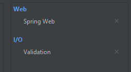
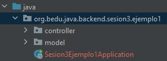
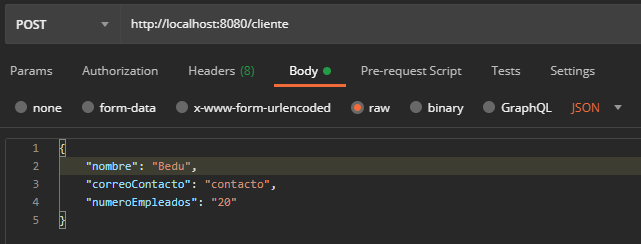
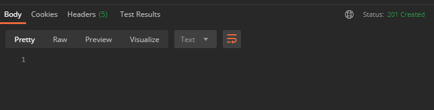
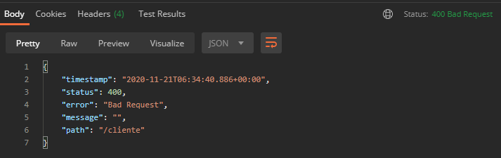
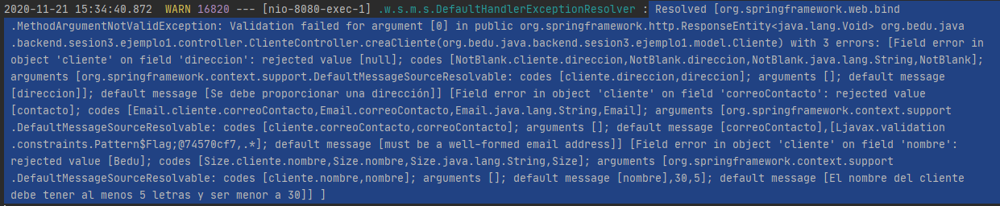
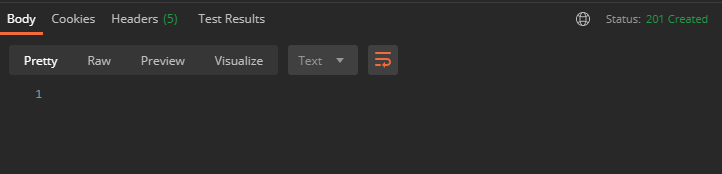

## Ejemplo 01: Validaciones de Java Beans

### OBJETIVO
- Aplicar las anotaciones proporcionadas por el JSR 380 para restringir los valores correctos de los atributos de los objetos del modelo de datos.
- Usar Hibernate Validator como implementación del JSR 380.

#### REQUISITOS
- Tener instalado el IDE IntelliJ Idea Community Edition.
- Tener instalada la última versión del JDK 11 o 17.
- Tener instalada la herramienta Postman.

#### DESARROLLO

1. Crea un proyecto Maven usando Spring Initializr.

2. Selecciona las siguientes opciones:

    - Grupo: org.bedu.java.backend
    - Artefacto y nombre del proyecto: sesion3.ejemplo1
    - Tipo de proyecto: **Maven Project**. 
    - Lenguaje: **Java**. 
    - Forma de empaquetar la aplicación: **jar**. 
    - Versión de Java: **11** o **17**.

3. Elige Spring Web y **Validation** como dependencias del proyecto:

    

4. En el proyecto que se acaba de crear debes tener el siguiente paquete: `org.bedu.java.backend.sesion3.ejemplo1`. Dentro crea dos subpaquetes: `model` y `controllers`.

    

5. Dentro del paquete crea una nueva clase llamada "Cliente" con los siguientes atributos:

    ```java
    private long id;
    private String nombre;
    private String correoContacto;
    private String numeroEmpleados;
    private String direccion;
    ```

    Agrega también los *getter*s y *setter*s de cada atributo.

6. En el paquete `controllers` agrega una clase llamada `ClienteController` y decórala con la anotación `@RestController`, de la siguiente forma:

    ```java
    @RestController
    public class ClienteController {
    }
    ```

    Agrega un nuevo manejador de peticiones tipo `POST` el cual reciba como parámetro un objeto de tipo `Cliente` y regrese un objeto de tipo `ResponseEntity`, de la siguiente forma:

    ```java
    @PostMapping("/cliente")
    public ResponseEntity<Void> creaCliente(@RequestBody Cliente cliente){
        System.out.println(cliente.getNombre());
        return ResponseEntity.created(URI.create("1")).build();
    }
    ```

7. Desde Postman envía una petición JSON con la siguiente información:

    ```json
    {
        "nombre": "Bedu",
        "correoContacto": "contacto",
        "numeroEmpleados": "20"
    }
    ```

    


8. Envía la petición, con lo que debes obtener un resultado como el mostrado a continuación, en el que no hay un cuerpo en la respuesta y se tiene un código `201 Created`

    

    Como puedes ver, a pesar de que estamos enviando información incompleta (no hemos proporcionado una dirección) y con formatos incorrectos (como en el caso del correo de contacto) la petición se recibe y se procesa de forma exitosa. En los siguientes pasos procesarás la información para evitar que esto pase.

9. Agrega las siguientes validaciones en los atributos de la clase. Con esto estamos restringiendo los valores que puede tener cada uno de estos.

    ```java
    @PositiveOrZero(message = "El identificador no puede ser un número negativo")
    private long id;

    @NotEmpty(message = "El nombre del cliente no puede estar vacío")
    @Size(min = 5, max = 30, message = "El nombre del cliente debe tener al menos 5 letras y ser menor a 30")
    private String nombre;

    @Email
    private String correoContacto;

    @Min(value = 10, message = "Los clientes con menos de 10 empleados no son válidos")
    @Max(value = 10000, message = "Los clientes con más de 10000 empleados no son válidos")
    private String numeroEmpleados;

    @NotBlank(message = "Se debe proporcionar una dirección")
    private String direccion;
    ```

10. En la clase `ClienteController` agrega la siguiente anotación, con la cual se le indica a Spring que debe aplicar las validaciones indicadas antes de darle el control al manejador. 

    ```java
    @Valid
    ```

    El método `creaCliente` queda de la siguiente forma:

    ```java
    public ResponseEntity<Void> creaCliente(@Valid @RequestBody Cliente cliente){
        System.out.println(cliente.getNombre());
        return ResponseEntity.created(URI.create("1")).build();
    }
    ```

11. Ejecuta nuevamente la petición desde Postman. Esta vez debes obtener un error como el siguiente, que indica que la petición realizada tiene un formato incorrecto:

    

    En la consola de IntelliJ debes tener el siguiente mensaje:

    ```
    Resolved [org.springframework.web.bind.MethodArgumentNotValidException: 
    Validation failed for argument [0] in public org.springframework.http.ResponseEntity<java.lang.Void> org.bedu.java.backend.sesion3.ejemplo1.controller.ClienteController.creaCliente(org.bedu.java.backend.sesion3.ejemplo1.model.Cliente) with 3 errors: 
    
    [Field error in object 'cliente' on field 'direccion': rejected value [null]; codes [NotBlank.cliente.direccion,NotBlank.direccion,NotBlank.java.lang.String,NotBlank]; arguments [org.springframework.context.support.DefaultMessageSourceResolvable: codes [cliente.direccion,direccion]; arguments []; default message [direccion]]; default message [Se debe proporcionar una dirección]] 
    
    [Field error in object 'cliente' on field 'correoContacto': rejected value [contacto]; codes [Email.cliente.correoContacto,Email.correoContacto,Email.java.lang.String,Email]; arguments [org.springframework.context.support.DefaultMessageSourceResolvable: codes [cliente.correoContacto,correoContacto]; arguments []; default message [correoContacto],[Ljavax.validation.constraints.Pattern$Flag;@74570cf7,.*]; default message [must be a well-formed email address]] 
    
    [Field error in object 'cliente' on field 'nombre': rejected value [Bedu]; codes [Size.cliente.nombre,Size.nombre,Size.java.lang.String,Size]; arguments [org.springframework.context.support.DefaultMessageSourceResolvable: codes [cliente.nombre,nombre]; arguments []; default message [nombre],30,5]; default message [El nombre del cliente debe tener al menos 5 letras y ser menor a 30]] ]

    ```
    

    En los mensajes anteriores se indica qué campos contienen errores.

12. Modifica la petición en Postman para enviar el siguiente cuerpo:

    ```json
    {
        "nombre": "BeduORG",
        "correoContacto": "contacto@bedu.org",
        "numeroEmpleados": "20",
        "direccion": "direccion"
    }
    ```

13. Envía nuevamente la petición y ahora nuevamente debes obtener una respuesta correcta:

    


<br>

[**`Siguiente`** -> reto 01](../Reto-01/)