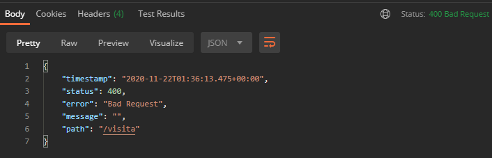
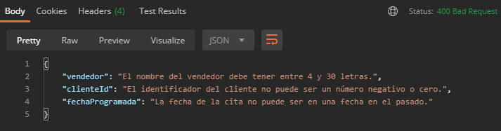
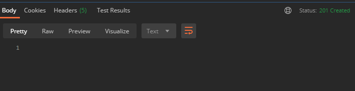

## Ejemplo 02: Validación de errores con @ExceptionHandler

### OBJETIVO
- Manejar las excepciones ocurridas en las validaciones de datos usando un método marcado con `@ExceptionHandler`
- Regresar a quien invoca los servicios (en este caso Postman) un mensaje claro y que ayude a entender qué información no es correcta.

#### REQUISITOS
- Tener instalado el IDE IntelliJ Idea Community Edition.
- Tener instalada la última versión del JDK 11 o 17.
- Tener instalada la herramienta Postman.

### DESARROLLO

1. Crea un proyecto Maven usando Spring Initializr.

2. En la ventana que se abre selecciona las siguientes opciones:
    
    - Grupo: **org.bedu.java.backend**
    - Artefacto y nombre del proyecto: **sesion3-ejemplo2**
    - Tipo de proyecto: **Maven Project**.
    - Lenguaje: **Java**.
    - Forma de empaquetar la aplicación: **jar**.
    - Versión de Java: **11** o **17**.

3. Elige Spring Web y Validation como dependencias del proyecto.

4. En el proyecto que se acaba de crear debes tener el siguiente paquete: `org.bedu.java.backend.sesion3.ejemplo2`. Dentro crea dos subpaquetes: `model` y `controllers`.

6. Dentro del paquete model crea una nueva clase llamada "`Visita`" con los siguientes atributos:

    ```java
    private long id;
    private long clienteId;
    private LocalDateTime fechaProgramada;
    private String direccion;
    private String proposito;
    private String vendedor;
    ```

7. Agrega también los *getter*s y *setter*s de cada atributo.

8. Agrega las siguientes validaciones a los atributos:

    ```java
    @PositiveOrZero(message = "El identificador de la visita no puede ser un número negativo.")
    private long id;

    @Positive(message = "El identificador del cliente no puede ser un número negativo o cero.")
    private long clienteId;

    @Future(message = "La fecha de la cita no puede ser en una fecha en el pasado.")
    private LocalDateTime fechaProgramada;

    @NotEmpty(message = "La dirección no puede estar en blanco.")
    @Size(min = 10, message = "La dirección debe tener al menos 10 letras.")
    private String direccion;

    @NotEmpty(message = "El propósito de la visita no puede estar en blanco.")
    @Size(min = 15, message = "El propósito de la visita debe tener al menos 15 letras.")
    private String proposito;

    @NotEmpty(message = "El nombre del vendedor no puede estar en blanco.")
    @Size(min = 4, max = 30, message = "El nombre del vendedor debe tener entre 4 y 30 letras.")
    private String vendedor;
    ```

9. En el paquete `controllers` agrega una clase llamada `VisitaController` y decórala con la anotación `@RestController`, de la siguiente forma:

    ```java
    @RestController
    public class VisitaController {
    }
    ```

10. Agrega un nuevo manejador de peticiones tipo **POST** el cual reciba como parámetro un objeto de tipo `Visita` y regrese un objeto de tipo `ResponseEntity`; también, indica que el objeto `Visita` debe validarse, de la siguiente forma:

    ```java
    @PostMapping("/visita")
    public ResponseEntity<Void> creaVisita(@Valid @RequestBody Visita visita){
        return ResponseEntity.created(URI.create("1")).build();
    }
    ```

11. Desde Postman envía una petición JSON a la URL `http://localhost:8080/visita`, con la siguiente información:

    ```json
    {
        "clienteId": 0,
        "fechaProgramada": "2019-11-11T09:00:00",
        "direccion": "Oficina del cliente",
        "proposito": "Mostrarle unos productos",
        "vendedor": "Ara"
    }
    ```

    En el panel de respuestas debes ver un mensaje como el siguiente:

    

    Como puedes ver, dice que la petición no es correcta (que el contenido de la misma no cumple con algunas condiciones) pero no dice qué es lo que está mal. Arreglaremos esto en un momento. 

12. Dentro de la clase `VisitaController` agrega el siguiente método:

    ```java
    public Map<String, String> handleValidationExceptions(MethodArgumentNotValidException ex) {
  
    }
    ```

    Este método será invocado cada vez que ocurra un error de tipo `MethodArgumentNotValidException`, que es el error que se lanza cuando un objeto no cumple con alguna validación de datos. Decora este método con `@ExceptionHandler(MethodArgumentNotValidException.class)`, para indicarle que estos son el tipo de excepciones que manejará, y con `@ResponseStatus(HttpStatus.BAD_REQUEST)` para indicar que ese es el estatus de respuesta que debe regresar, de la siguiente forma:

    ```java
    @ResponseStatus(HttpStatus.BAD_REQUEST)
    @ExceptionHandler(MethodArgumentNotValidException.class)
    public Map<String, String> handleValidationExceptions(MethodArgumentNotValidException ex) {
            
    }
    ```

13. Dentro del cuerpo del método coloca el siguiente contenido, el cual lee la información de la excepción y coloca la descripción, en forma de texto, dentro de `Map` que contiene la información de cada campo inválido y la regresa al usuario:

    ```java
    Map<String, String> errors = new HashMap<>();

    ex.getBindingResult().getAllErrors().forEach((error) -> {
        String fieldName = ((FieldError) error).getField();
        String errorMessage = error.getDefaultMessage();
        errors.put(fieldName, errorMessage);
    });
    
    return errors;
    ```

    el método completo queda de la siguiente forma:

    ```java
    @ResponseStatus(HttpStatus.BAD_REQUEST)
    @ExceptionHandler(MethodArgumentNotValidException.class)
    public Map<String, String> handleValidationExceptions(
            MethodArgumentNotValidException ex) {

        Map<String, String> errors = new HashMap<>();

        ex.getBindingResult().getAllErrors().forEach((error) -> {
            String fieldName = ((FieldError) error).getField();
            String errorMessage = error.getDefaultMessage();
            errors.put(fieldName, errorMessage);
        });

        return errors;
    }
    ```

14. Reinicia la aplicación web y envía nuevamente la petición, ahora debes obtener el siguiente resultado en el panel de respuestas de Postman, en donde se indica claramente el campo que contiene el error y la descripción de este:

    


15. Envía nuevamente la petición usando el siguiente objeto JSON:

    ```json
    {
        "clienteId": 10,
        "fechaProgramada": "2020-12-11T09:00:00",
        "direccion": "Oficina del cliente ubicada en la ciudad de Monterrey",
        "proposito": "Mostrarle unos productos",
        "vendedor": "Araceli García"
    }
    ```

    La petición debe recibirse de forma correcta:

    

<br>

[**`Siguiente`** -> reto 02](../Reto-02/)