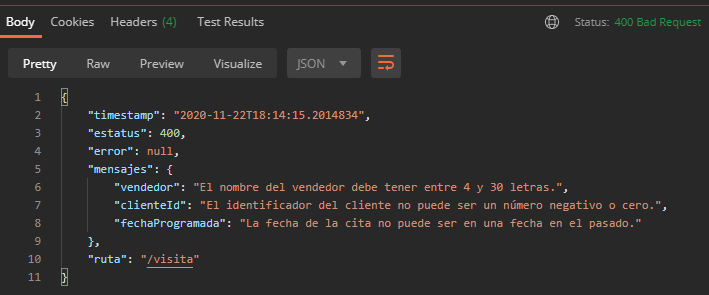

## Ejemplo 03: Manejo global de errores con @ControllerAdvice

### OBJETIVO
- Manejar las excepciones ocurridas en las validaciones de datos usando un método marcado con `@RestControllerAdvice`, sin importar en qué controlador o servicio ocurra. Este funcionará como un manejador global de excepciones.
- Regresar a quien invoca los servicios (en este caso Postman) un mensaje claro y que ayude a entender qué información no es correcta.

#### REQUISITOS
- Tener instalado el IDE IntelliJ Idea Community Edition.
- Tener instalada la última versión del JDK 11 o 17.
- Tener instalada la herramienta Postman.

### DESARROLLO

1. Crea un proyecto Maven usando Spring Initializr.

2. En la ventana que se abre selecciona las siguientes opciones:
    
    - Grupo: **org.bedu.java.backend**
    - Artefacto y nombre del proyecto: **sesion3-ejemplo3**
    - Tipo de proyecto: **Maven Project**.
    - Lenguaje: **Java**.
    - Forma de empaquetar la aplicación: **jar**.
    - Versión de Java: **11** o **17**.

3. Elige **Spring Web** y **Validation** como dependencias del proyecto.

4. En el proyecto que se acaba de crear debes tener el siguiente paquete: `org.bedu.java.backend.sesion3.ejemplo3`. Dentro crea dos subpaquetes: `model` y `controllers`.

6. Dentro del paquete model crea una nueva clase llamada "`Visita`" con los siguientes atributos:

    ```java
    private long id;
    private long clienteId;
    private LocalDateTime fechaProgramada;
    private String direccion;
    private String proposito;
    private String vendedor;
    ```

7. Agrega también los *getter*s y *setter*s de cada atributo.

8. Agrega las siguientes validaciones a los atributos:

    ```java
    @PositiveOrZero(message = "El identificador de la visita no puede ser un número negativo.")
    private long id;

    @Positive(message = "El identificador del cliente no puede ser un número negativo o cero.")
    private long clienteId;

    @Future(message = "La fecha de la cita no puede ser en una fecha en el pasado.")
    private LocalDateTime fechaProgramada;

    @NotEmpty(message = "La dirección no puede estar en blanco.")
    @Size(min = 10, message = "La dirección debe tener al menos 10 letras.")
    private String direccion;

    @NotEmpty(message = "El propósito de la visita no puede estar en blanco.")
    @Size(min = 15, message = "El propósito de la visita debe tener al menos 15 letras.")
    private String proposito;

    @NotEmpty(message = "El nombre del vendedor no puede estar en blanco.")
    @Size(min = 4, max = 30, message = "El nombre del vendedor debe tener entre 4 y 30 letras.")
    private String vendedor;
    ```

9. En el paquete `controllers` agrega una clase llamada `VisitaController` y decórala con la anotación `@RestController`, de la siguiente forma:
    
    ```java
    @RestController
    public class VisitaController {
    }
    ```

10. Agrega un nuevo manejador de peticiones tipo **POST** el cual reciba como parámetro un objeto de tipo `Visita` y regrese un objeto de tipo `ResponseEntity`; también, indica que el objeto `Visita` debe validarse, de la siguiente forma:

    ```java
    @PostMapping("/visita")
    public ResponseEntity<Void> creaVisita(@Valid @RequestBody Visita visita){
        return ResponseEntity.created(URI.create("1")).build();
    }
    ```

    Para la siguiente parte crearás un manejador global de errores, para eso crearemos una nueva clase que representará los mensajes de respuesta que regresaremos al usuario de nuestros servicios, también haremos uso del patrón de diseño `Builder` para crear las instancias de esa clase. Además, crearemos un manejador global para los errores de validación.

12. Dentro del paquete `model` crea una nueva clase llamada `RespuestaError` con el siguiente contenido, no olvides también agregar los métodos *getter*s y *setter*s de los atributos. El método `builder` permitirá crear las instancias de esta clase y a continuación crearás la clase que implementa este patrón de diseño.

    ```java
    private final LocalDateTime timestamp = LocalDateTime.now();
    private int estatus;
    private Map<String, String> errores;
    private String ruta;

    public static RespuestaErrorBuilder builder() {
        return new RespuestaErrorBuilder();
    }
    ```

13. Dentro del paquete `model` crea un nuevo subpaquete `builders` y dentro de este una clase `RespuestaErrorBuilder`. 

    ```java
    public class RespuestaErrorBuilder {
        private int estatus;
        private Map<String, String> errores;
        private String ruta;

        public RespuestaErrorBuilder estatus(int estatus) {
            this.estatus = estatus;
            return this;
        }

        public RespuestaErrorBuilder status(HttpStatus estatus) {
            this.estatus = estatus.value();

            return this;
        }

        public RespuestaErrorBuilder errores(Map<String, String> error) {
            this.errores = errores;
            return this;
        }

        public RespuestaErrorBuilder exception(MethodArgumentNotValidException exception) {
            HttpStatus status = HttpStatus.BAD_REQUEST;
            this.estatus = status.value();

            errores = new HashMap<>();

            exception.getBindingResult().getAllErrors().forEach((error) -> {
                String fieldName = ((FieldError) error).getField();
                String errorMessage = error.getDefaultMessage();
                errores.put(fieldName, errorMessage);
            });

            return this;
        }
        
        public RespuestaErrorBuilder ruta(String ruta) {
            this.ruta = ruta;
            return this;
        }

        public RespuestaError build() {
            RespuestaError respuesta = new RespuestaError();
            respuesta.setEstatus(estatus);
            respuesta.setErrores(errores);
            respuesta.setRuta(ruta);
            return respuesta;
        }

        public ResponseEntity<RespuestaError> entidad() {
            return ResponseEntity.status(estatus).headers(HttpHeaders.EMPTY).body(build());
        }
    }
    ```

14. En el paquete `controllers` crea un nuevo subpaquete llamado `handlers` y adentro de este una clase `ManejadorGlobalExcepciones`. Decora esa clase con la anotación `@RestControllerAdvice`.

    ```java
    @RestControllerAdvice
    public class ManejadorGlobalExcepciones {
        
    }
    ```

15. Adentro coloca un método decorado con la anotación `@ExceptionHandler`. Este método será invocado cada vez que ocurra un error de tipo `MethodArgumentNotValidException`, que es el error que se lanza cuando un objeto no cumple con alguna validación de datos. Decora este método con `@ExceptionHandler(MethodArgumentNotValidException.class)`, para indicarle que estos son el tipo de excepciones que manejará:

    ```java
    @ExceptionHandler(MethodArgumentNotValidException.class)
    public ResponseEntity<?> handleStatusException(MethodArgumentNotValidException ex, WebRequest request) {

        return RespuestaError.builder()
                .exception(ex)
                .ruta(request.getDescription(false).substring(4))
                .entidad();
    }
    ```

16. Envía desde Postman una petición usando el siguiente objeto JSON:

    ```json
    {
        "clienteId": 0,
        "fechaProgramada": "2010-12-11T09:00:00",
        "direccion": "Oficina del cliente ubicada en la ciudad de Monterrey",
        "proposito": "Mostrarle unos productos",
        "vendedor": "Ara"
    }
    ```

    En el panel de respuestas de Postman debes ver una respuesta como la siguiente:

    

17. Envía una petición con el siguiente objeto JSON. En esta ocasión la petición debe procesarse de forma correcta:

    ```json
    {
        "clienteId": 10,
        "fechaProgramada": "2020-12-11T09:00:00",
        "direccion": "Oficina del cliente ubicada en la ciudad de Monterrey",
        "proposito": "Mostrarle unos productos",
        "vendedor": "Araceli García"
    }
    ```


<br>

[**`Siguiente`** -> postwork](../Postwork/)

[**`Regresar`**](../)