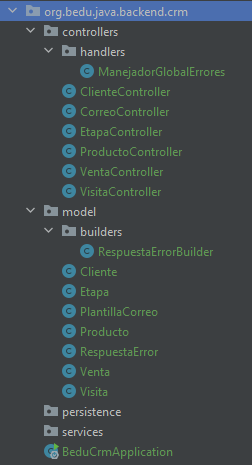

## Postwork Sesión 03

### OBJETIVO
- Agregar validaciones a los atributos de las clases que representan el modelo de negocio de la aplicación.
- Agregar un manejador de excepciones global para errores de validaciones y para errores generales de la aplicación, que pueda ser extendido conforme se agregan más funcionalidades y reglas de negocio.

### DESARROLLO

El propósito de este Postwork es retomar el proyecto del módulo anterior y realizar las modificaciones descritas.

El postwork se realizará en equipo, los cuales serán formados previamente a la sesión uno.

1. Agrega las validaciones a los modelos que consideres necesarios. Puedes elegir las validaciones de la siguiente lista:

    - @NotNull
    - @Null
    - @AssertFalse
    - @AssertTrue
    - @DecimalMax
    - @DecimalMin
    - @Digits
    - @Size
    - @Min
    - @Max
    - @Email
    - @NotEmpty
    - @NotBlank
    - @Pattern
    - @Positive y @PositiveOrZero
    - @Negative y @NegativeOrZero
    - @Past y @PastOrPresent
    - @Future y @FutureOrPresent

2. Crea un manejador global de errores usando la anotación `@RestControllerAdvice`, `@ExceptionHandler(MethodArgumentNotValidException.class)` y `@ExceptionHandler(Exception.class)`.

3. Agrega el compilador de errores `RespuestaErrorBuilder`.

    La estructura de tu proyecto debe quedar de la siguiente forma:

    

<br>

<details>
	<summary>Solución</summary>

1. Dentro del directorio `controllers` agrega una nueva carpeta con el nombre de `handlers` dentro crear un manejador global de errores usando la anotación `@RestControllerAdvice`.

    ```java
    @RestControllerAdvice
    public class ManejadorGlobalErrores {

        @ExceptionHandler(MethodArgumentNotValidException.class)
        public ResponseEntity<?> handleStatusException(MethodArgumentNotValidException ex, WebRequest request) {

            return RespuestaError.builder()
                    .exception(ex)
                    .mensaje("Ocurrió un error al validar la información de la petición.")
                    .ruta(request.getDescription(false).substring(4))
                    .entidad();
        }

        @ExceptionHandler(Exception.class)
        public ResponseEntity<?> manejaException(Exception ex, WebRequest request) {
            return RespuestaError.builder()
                    .status(HttpStatus.INTERNAL_SERVER_ERROR)
                    .mensaje("Ocurrió un error al procesar la petición")
                    .ruta(request.getDescription(false).substring(4))
                    .entidad();
        }
    }
    ```

2. Dentro del directorio *model* agregar la siguiente carpeta *builders*, luego crea la siguiente clase *RespuestaErrorBuilder* y agrega el siguiente código:

    ```java
    public class RespuestaErrorBuilder {
        private int estatus;
        private String mensaje;
        private Map<String, String> errores;
        private String ruta;

        public RespuestaErrorBuilder estatus(int estatus) {
            this.estatus = estatus;
            return this;
        }

        public RespuestaErrorBuilder status(HttpStatus estatus) {
            this.estatus = estatus.value();

            if (estatus.isError()) {
                this.errores.put("error", estatus.getReasonPhrase());
            }

            return this;
        }

        public RespuestaErrorBuilder errores(Map<String, String> error) {
            this.errores = errores;
            return this;
        }

        public RespuestaErrorBuilder mensaje(String mensaje) {
            this.mensaje = mensaje;
            return this;
        }
        public RespuestaErrorBuilder exception(MethodArgumentNotValidException exception) {
            HttpStatus status = HttpStatus.BAD_REQUEST;
            this.estatus = status.value();

            errores = new HashMap<>();

            exception.getBindingResult().getAllErrors().forEach((error) -> {
                String fieldName = ((FieldError) error).getField();
                String errorMessage = error.getDefaultMessage();
                errores.put(fieldName, errorMessage);
            });

            return this;
        }

        public RespuestaErrorBuilder ruta(String ruta) {
            this.ruta = ruta;
            return this;
        }

        public RespuestaError build() {
            RespuestaError respuesta = new RespuestaError();
            respuesta.setEstatus(estatus);
            respuesta.setMensaje(mensaje);
            respuesta.setErrores(errores);
            respuesta.setRuta(ruta);
            return respuesta;
        }

        public ResponseEntity<RespuestaError> entidad() {
            return ResponseEntity.status(estatus).headers(HttpHeaders.EMPTY).body(build());
        }
    }
    ```

3. Agrega las validaciones a los siguientes modelos:

    ```java
    public class Cliente {
        @PositiveOrZero(message = "El identificador no puede ser un número negativo")
        private long id;

        @NotEmpty(message = "El nombre del cliente no puede estar vacío")
        @Size(min = 5, max = 30, message = "El nombre del cliente debe tener al menos 5 letras y ser menor a 30")
        private String nombre;

        @Email
        private String correoContacto;

        @Min(value = 10, message = "Los clientes con menos de 10 empleados no son válidos")
        @Max(value = 10000, message = "Los clientes con más de 10000 empleados no son válidos")
        private String numeroEmpleados;

        @NotBlank(message = "Se debe proporcionar una dirección")
        private String direccion;
    }
    ```

    ```java
    public class Etapa {
        @PositiveOrZero(message = "El identificador de la etapa no puede ser un número negativo")
        private long etapaId;

        @NotEmpty(message = "El nombre de la etapa no puede estar en blanco.")
        @Size(min = 4, max = 30, message = "El nombre de la etapa debe tener entre 4 y 30 letras.")
        private String nombre;

        @Positive(message = "La etapa debe tener un orden positivo mayor a cero")
        private int orden;
    }
    ```

    ```java
    public class Producto {
        @PositiveOrZero(message = "El identificador del producto no puede ser un número negativo")
        private long id;

        @NotEmpty(message = "El nombre del producto no puede estar en blanco.")
        @Size(min = 4, max = 30, message = "El nombre del producto debe tener entre 4 y 30 letras.")
        private String nombre;

        private String categoria;

        @DecimalMin(value = "1.00", inclusive = true, message = "El precio del producto debe ser de al menos 1.00")
        private float precio;

        @NotEmpty(message = "El núemero de registro del producto no puede estar en blanco.")
        @Pattern(regexp = "^(\\d{3}[-]?){2}\\d{4}$")
        private String numeroRegistro;

        @PastOrPresent(message = "La fecha de creación del producto no puede ocurrir en el futuro.")
        private LocalDate fechaCreacion;
    }
    ```

    ```java
    public class Venta {
        @PositiveOrZero(message = "El identificador de la venta no puede ser un número negativo")
        private long ventaId;

        @DecimalMin(value = "1.00", inclusive = true, message = "La venta debe ser de al menos 1.00")
        private float monto;

        @NotEmpty(message = "La venta debe tener por lo menos un producto.")
        private List<Producto> productos;

        @NotNull(message = "La venta debe haberse realizado a algún cliente.")
        private Cliente cliente;

        @PastOrPresent(message = "La venta no puede ocurrir en el futuro.")
        private LocalDateTime fechaCreacion;
    }
    ```

    ```java
    public class Visita {
        @PositiveOrZero(message = "El identificador de la visita no puede ser un número negativo.")
        private long id;

        @NotNull(message = "La visita debe haberse realizado a algún cliente.")
        private Cliente cliente;

        @Future(message = "La fecha de la cita no puede ser en una fecha en el pasado.")
        private LocalDateTime fechaProgramada;

        @NotEmpty(message = "La dirección no puede estar en blanco.")
        @Size(min = 10, message = "La dirección debe tener al menos 10 letras.")
        private String direccion;

        @NotEmpty(message = "El propósito de la visita no puede estar en blanco.")
        @Size(min = 15, message = "El propósito de la visita debe tener al menos 15 letras.")
        private String proposito;

        @NotEmpty(message = "El nombre del vendedor no puede estar en blanco.")
        @Size(min = 4, max = 30, message = "El nombre del vendedor debe tener entre 4 y 30 letras.")
        private String vendedor;
    }
    ```

</details>

<br>

[**`Siguiente`** -> sesión 4](../../Sesion-04/)

[**`Regresar`**](../)