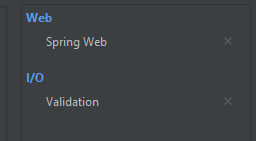
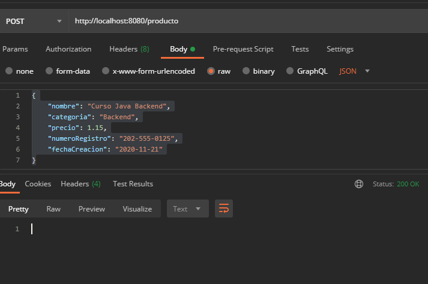

## Reto 01: Validaciones con expresiones regulares

### OBJETIVO
- Aplicar las anotaciones proporcionadas por el JSR 380 para restringir los valores correctos de los atributos de los objetos del modelo de datos.
- Hacer uso de expresiones regulares para aplicar validaciones personalizadas.
- Usar Hibernate Validator como implementación del JSR 380.

#### Requisitos
- Tener instalado el IDE IntelliJ Idea Community Edition.
- Tener instalada la última versión del JDK 11 o 17.
- Tener instalada la herramienta Postman.

### Desarrollo
1. Crea un nuevo proyecto Spring Boot.

2. Crea una nueva clase que represente un recurso de tipo `Producto` con los siguientes atributos: 
    - long id;
    - String nombre;
    - float precio
    - String categoria;
    - String numeroRegistro;
    - private LocalDate fechaCreacion;
3. Agrega las siguientes validaciones a los atributos de `Producto`:
    - El `id` debe ser cero o un entero positivo.
    - El `nombre` no puede ser un valor nulo o un espacio en blanco.
    - El `precio` debe hacer de al menos 1.00.
    - La `fechaCreacion` no puede ocurrir después del día de hoy (debe ser del pasado o el presente pero no en el futuro).
    - El `numeroRegistro` debe ser un número con el siguiente formato: `###-###-####"`; es decir: tres números, guion medio, tres números, guion medio, cuatro números.
4. Crea una nueva clase que represente un servicio REST, usando la anotación `@RestController`.
5. Crea un nuevo manejador de peticiones de tipo **POST** que reciba como un parámetro de tipo "`Producto`" y regrese un código de respuesta **201**.
6. Indica al controlador que debe validar el objeto de tipo `Producto` que recibe como parámetro.
7. Envía una petición de prueba desde la herramienta Postman.

</br>

<details>
	<summary>Solución</summary>

1. Crea un proyecto Maven usando Spring Initializr.

2. En la ventana que se abre selecciona las siguientes opciones:
    
    - Grupo: org.bedu.java.backend
    - Artefacto y nombre del proyecto: sesion3-reto1
    - Tipo de proyecto: **Maven Project**. 
    - Lenguaje: **Java**. 
    - Forma de empaquetar la aplicación: **jar**. 
    - Versión de Java: **11** o **17**.

3. Elige Spring Web y **Validation** como dependencias del proyecto:

    

4. En el proyecto que se acaba de crear debes tener el siguiente paquete: `org.bedu.java.backend.sesion3.reto1`. Dentro crea dos subpaquetes: `model` y `controllers`.

5. Dentro del paquete `model` crea una nueva clase llamada "`Producto`" con los siguientes atributos:

    ```java
    private long id;
    private String nombre;
    private String categoria;
    private float precio;
    private String numeroRegistro;
    private LocalDate fechaCreacion;
    ```

    Agrega también los *getter*s y *setter*s de cada atributo.

6. Agrega las siguientes validaciones a los atributos:

    ```java
    @PositiveOrZero
    private long id;

    @NotBlank
    private String nombre;

    private String categoria;

    @DecimalMin(value = "1.00", inclusive = true)
    private float precio;

    @Pattern(regexp = "^(\\d{3}[-]?){2}\\d{4}$")
    private String numeroRegistro;

    @PastOrPresent
    private LocalDate fechaCreacion;
    ```

7. En el paquete `controllers` agrega una clase llamada `ProductoController` y decórala con la anotación `@RestController`, de la siguiente forma:

    ```java
    @RestController
    public class ProductoController {
    }
    ```

8. Agrega un nuevo manejador de peticiones tipo `POST` el cual reciba como parámetro un objeto de tipo `Producto` y regrese un objeto de tipo `ResponseEntity`, de la siguiente forma:

    ```java
    @PostMapping("/producto")
    public ResponseEntity<Void> creaProducto(@RequestBody Producto producto){
        return ResponseEntity.ok().build();
    }
    ```

9. Indica que el objeto de tipo `Producto` se debe validar usando la anotación `@Valid`:

    ```java
    @PostMapping("/producto")
    public ResponseEntity<Void> creaProducto(@Valid @RequestBody Producto producto){
        return ResponseEntity.ok().build();
    }
    ```

10. Desde Postman envía una petición JSON con la siguiente información:

    ```json
    {
        "nombre": "Curso Java Backend",
        "categoria": "Backend",
        "precio": 1.15,
        "numeroRegistro": "202-555-0125",
        "fechaCreacion": "2020-11-21"
    }
    ```

    

</details>


<br>

[**`Siguiente`** -> ejemplo 02](../Ejemplo-02/)