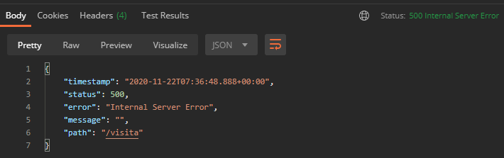
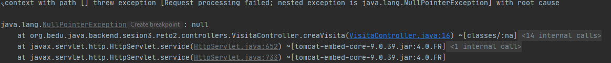
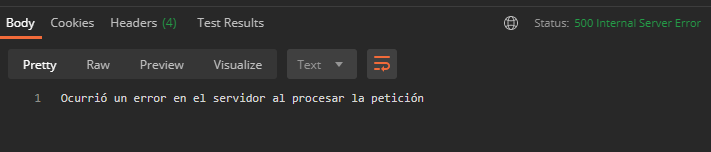

## Reto 02: Manejo de NullPointerException con @ExceptionHandler

### OBJETIVO
- Manejar las excepciones de tipo `NullPointerException` ocurridas en los servicios, usando un método marcado con `@ExceptionHandler`.
- Regresar a quien invoca los servicios (en este caso Postman) un mensaje claro y que ayude a entender qué información no es correcta.

#### REQUISITOS
- Tener instalado el IDE IntelliJ Idea Community Edition.
- Tener instalada la última versión del JDK 11 o 17.
- Tener instalada la herramienta Postman.

### DESARROLLO
1. Crea un nuevo proyecto Spring Boot.

2. Crea una clase `Cliente` con los siguientes atributos:
    - private long clienteId
    - private String nombre;

3. Crea una nueva clase que represente un recurso de tipo `Visita` con los siguientes atributos: 
    - private long id;
    - private Cliente cliente;
    - private LocalDateTime fechaProgramada;
    
4. Crea una nueva clase que represente un servicio REST, unando la anotación `@RestController`.
5. Crea un nuevo manejador de peticiones de tipo **POST** que reciba como un parámetro de tipo "`Visita`" y regrese un código de respuesta **201**.
6. Imprime en la consola el nombre del cliente.
7. Agrega un método manejador de errores para excepciones de tipo `NullPointerException` usando la anotación `@ExceptionHandler`, en la que regreses un estatus **500** y un mensaje indicando que ocurrió un error al procesar la información.
8. Envía una petición de prueba desde la herramienta Postman sin enviar el nombre del cliente.

</br>

<details>
	<summary>Solución</summary>

1. Crea un proyecto Maven usando Spring Initializr desde el IDE IntelliJ Idea.

2. En la ventana que se abre selecciona las siguientes opciones:

    - Grupo: **org.bedu.java.backend**
    - Artefacto y nombre del proyecto: **sesion3-reto2**
    - Tipo de proyecto: **Maven Project**. 
    - Lenguaje: **Java**. 
    - Forma de empaquetar la aplicación: **jar**. 
    - Versión de Java: **11** o **17**.

3. Elige Spring Web como dependencia del proyecto

4. En el proyecto que se acaba de crear debes tener el siguiente paquete: `org.bedu.java.backend.sesion3.reto2`. Dentro crea dos subpaquetes: `model` y `controllers`.

5. En el paquete `model` crea una nueva clase llamada `Cliente` con los siguientes atributos:

    ```java
    private long clienteId;
    private String nombre;
    ```

    No olvides colocar los *setter*s y *getter*s de los atributos anteriores.

6. Dentro del paquete `model` crea una nueva clase llamada "`Visita`" con los siguientes atributos:

    ```java
    private long id;
    private Cliente cliente;
    private LocalDateTime fechaProgramada;
    ```

    Agrega también los *getter*s y *setter*s de cada atributo.

7. En el paquete `controllers` agrega una clase llamada `VisitaController` y decórala con la anotación `@RestController`, de la siguiente forma:

    ```java
    @RestController
    public class VisitaController {
    }
    ```

8. Agrega un nuevo manejador de peticiones tipo `POST` el cual reciba como parámetro un objeto de tipo `Visita` y regrese un objeto de tipo `ResponseEntity`, de la siguiente forma:

    ```java
    @PostMapping("/visita")
    public ResponseEntity<Void> creaVisita(@RequestBody Visita visita){
        return ResponseEntity.created(URI.create("1")).build();
    }
    ```

9. Imprime el nombre del cliente:

    ```java
    @PostMapping("/visita")
    public ResponseEntity<Void> creaVisita(@RequestBody Visita visita){
        System.out.println("El cliente es " + visita.getCliente().getNombre());
        
        return ResponseEntity.created(URI.create("1")).build();
    }
    ```

10. Desde Postman envía una petición JSON con la siguiente información:

    ```json
    {
        "fechaProgramada": "2020-12-11T09:00:00"
    }
    ```

    En Postman debes obtener un error con estatus **500**: 

    

    y en la consola de IntelliJ el siguiente `NullPointerException` (que es lo que estamos buscando):

    

11. Agrega u nuevo método y decóralo con la anotación `@ResponseStatus` para indicar que se regresará un estatus **500** (Internal Server Error) y con `@ExceptionHandler` para indicar que este es el tipo de errores que debe manejar. El método regresará una cadena con el mensaje indicando que ocurrió un error y recibirá como parámetro la `NullPointerException` que originó el problema:

    ```java
    @ResponseStatus(HttpStatus.INTERNAL_SERVER_ERROR)
    @ExceptionHandler(NullPointerException.class)
    public String manejaNullPointerException(NullPointerException npe){
        return "Ocurrió un error en el servidor al procesar la petición";
    }
    ```

12. Vuelve a lanzar la petición desde Postman, en esta ocasión debes obtener una respuesta con el texto que regresamos desde el método en el servidor:

    

</details>

<br>

[**`Siguiente`** -> ejemplo 03](../Ejemplo-03/)