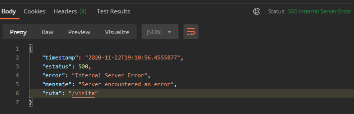

## Reto: Manejo de cualquier excepción con con @RestControllerAdvice

### OBJETIVO
- Manejar todas las excepciones ocurridas en los servicios, sin importar de qué tipo, usando un método marcado con `@RestControllerAdvice`.
- Regresar a quien invoca los servicios (en este caso Postman) un mensaje claro y que ayude a entender qué información no es correcta.

#### REQUISITOS
- Tener instalado el IDE IntelliJ Idea Community Edition.
- Tener instalada la última versión del JDK 11 o 17.
- Tener instalada la herramienta Postman.

### DESARROLLO
- Crea un nuevo proyecto Spring Boot en IntelliJ Idea como lo hiciste en la primera sesión.

- Crea una clase `Cliente` con los siguientes atributos:
    - private long clienteId
    - private String nombre;

- Crea una nueva clase que represente un recurso de tipo `Visita` con los siguientes atributos: 
    - private long id;
    - private Cliente cliente;
    - private LocalDateTime fechaProgramada;
    
- Crea una nueva clase que represente un servicio REST, unando la anotación `@RestController`.
- Crea un nuevo manejador de peticiones de tipo **POST** que reciba como un parámetro de tipo "`Visita`" y regrese un código de respuesta **201**.
- Imprime en la consola el nombre del cliente.
- Agrega un método manejador de errores global para excepciones de tipo `Exception` usando las anotaciones `@RestControllerAdvice` y `@ExceptionHandler`, en la que regreses un estatus **500** y un mensaje indicando que ocurrió un error al procesar la información. Este mensaje y estatus deben tomarse directamente de la excepción.
- Envía una petición de prueba desde la herramienta Postman sin enviar el nombre del cliente.


<details>
	<summary>Solución</summary>
1. Crea un proyecto Maven usando Spring Initializr desde el IDE IntelliJ Idea.

2. En la ventana que se abre selecciona las siguientes opciones:
- Grupo, artefacto y nombre del proyecto. 
- Tipo de proyecto: **Maven Project**. 
- Lenguaje: **Java**. 
- Forma de empaquetar la aplicación: **jar**. 
- Versión de Java: **11** o **17**.

3. En la siguiente ventana elige Spring Web como dependencia del proyecto:

4. Dale un nombre y una ubicación al proyecto y presiona el botón Finish.

En el proyecto que se acaba de crear debes tener el siguiente paquete: `org.bedu.java.backend.sesion3.reto2`. Dentro crea dos subpaquetes: `model` y `controllers`.

5. En el paquete `model` crea una nueva clase llamada `Cliente` con los siguientes atributos:
```java
private long clienteId;
private String nombre;
```

No olvides colocar los *setter*s y *getter*s de los atributos anteriores.

6. Dentro del paquete `model` crea una nueva clase llamada "`Visita`" con los siguientes atributos:

```java
private long id;
private Cliente cliente;
private LocalDateTime fechaProgramada;
```

Agrega también los *getter*s y *setter*s de cada atributo.

7. En el paquete `controllers` agrega una clase llamada `VisitaController` y decórala con la anotación `@RestController`, de la siguiente forma:

```java
@RestController
public class VisitaController {
}
```

8. Agrega un nuevo manejador de peticiones tipo `POST` el cual reciba como parámetro un objeto de tipo `Visita` y regrese un objeto de tipo `ResponseEntity`, de la siguiente forma:

```
@PostMapping("/visita")
public ResponseEntity<Void> creaVisita(@RequestBody Visita visita){
  return ResponseEntity.created(URI.create("1")).build();
}
```

9. Imprime el nombre del cliente:

```java
    @PostMapping("/visita")
    public ResponseEntity<Void> creaVisita(@RequestBody Visita visita){
        System.out.println("El cliente es " + visita.getCliente().getNombre());
        
        return ResponseEntity.created(URI.create("1")).build();
    }
```


10. Agrega una nueva clase `RespuestaError` con los siguientes atributos (no olvides agregar sus métodos *setter*s y *getter*s):
```java
    private final LocalDateTime timestamp = LocalDateTime.now();
    private int estatus;
    private String error;
    private String mensaje;
    private String ruta;

    public static RespuestaErrorBuilder builder() {
        return new RespuestaErrorBuilder();
    }
```

11. Agrega una nueva clase `RespuestaErrorBuilder` con el siguiente contenido:

```java
public class RespuestaErrorBuilder {
    private int estatus;
    private String error;
    private String mensaje;
    private String ruta;

    public RespuestaErrorBuilder estatus(int estatus) {
        this.estatus = estatus;
        return this;
    }

    public RespuestaErrorBuilder status(HttpStatus estatus) {
        this.estatus = estatus.value();

        if (estatus.isError()) {
            this.error = estatus.getReasonPhrase();
        }

        return this;
    }

    public RespuestaErrorBuilder error(String error) {
        this.error = error;
        return this;
    }

    public RespuestaErrorBuilder message(String mensaje) {
        this.mensaje = mensaje;
        return this;
    }

    public RespuestaErrorBuilder ruta(String ruta) {
        this.ruta = ruta;
        return this;
    }

    public RespuestaError build() {
        RespuestaError respuesta = new RespuestaError();
        respuesta.setEstatus(estatus);
        respuesta.setError(error);
        respuesta.setMensaje(mensaje);
        respuesta.setRuta(ruta);
        return respuesta;
    }

    public ResponseEntity<RespuestaError> entidad() {
        return ResponseEntity.status(estatus).headers(HttpHeaders.EMPTY).body(build());
    }
}
```

12. Crea una nueva clase `ManejadorGlobalExcepciones` y decórala con la anotación `@RestControllerAdvice`:
```java
@RestControllerAdvice
public class ManejadorGlobalExcepciones {

}
```

13. Agrega un método y decóralo con la anotación `@ExceptionHandler(Exception.class)` El método recibirá como parámetro la `Exception` que originó el problema:

```java
    @ExceptionHandler(Exception.class)
    public ResponseEntity<?> manejaException(Exception ex, WebRequest request) {
        return RespuestaError.builder()
                .status(HttpStatus.INTERNAL_SERVER_ERROR)
                .message("Server encountered an error")
                .ruta(request.getDescription(false).substring(4))
                .entidad();
    }
```

14. Desde Postman envía una petición JSON con la siguiente información:

```json
{
    "fechaProgramada": "2021-12-11T09:00:00"
}
```

En la consola de respuestas Postman debes obtener un error con estátus **500** y el resto de atributos que agregamos a la clase: 



</details>
