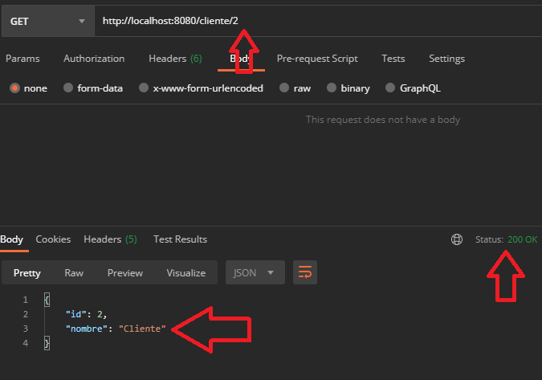
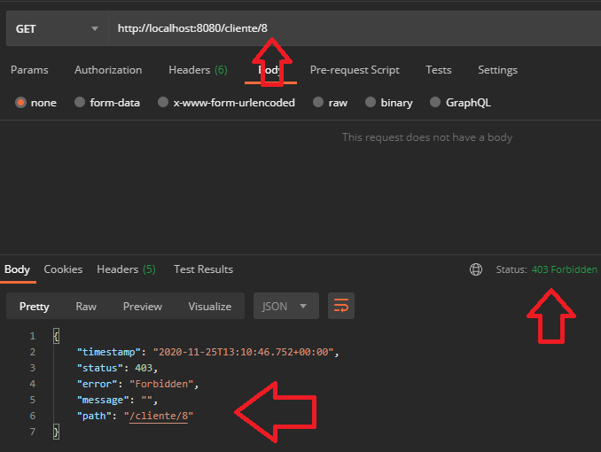
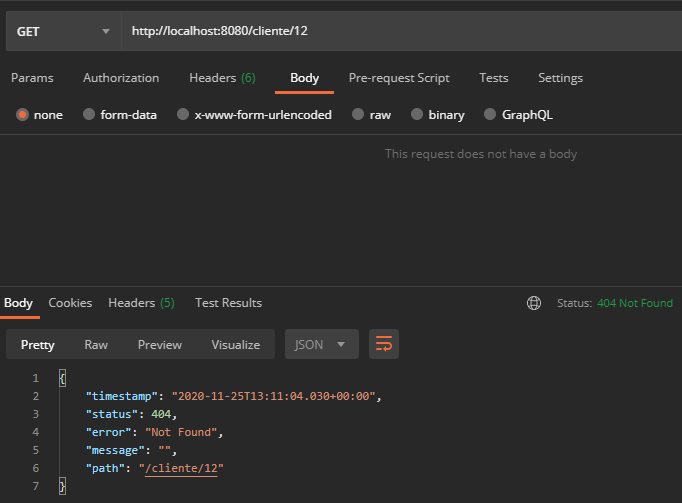

## Ejemplo: Manejo de errores con ResponseStatusException

### OBJETIVO
- Regresar los estatus de respuesta más adecuados cuando ocurre un error al procesar una petición.

#### REQUISITOS
- Tener instalado el IDE IntelliJ Idea Community Edition.
- Tener instalada la última versión del JDK 11 o 17.
- Tener instalada la herramienta Postman.


### DESARROLLO

1. Crea un proyecto Maven usando Spring Initializr desde el IDE IntelliJ Idea.

2. En la ventana que se abre selecciona las siguientes opciones:
- Grupo, artefacto y nombre del proyecto.
- Tipo de proyecto: Maven Project.
- Lenguaje: Java.
- Forma de empaquetar la aplicación: jar.
- Versión de Java: **11** o **17**.

3. En la siguiente ventana elige Spring Web como dependencia del proyecto.

4. Dale un nombre y una ubicación al proyecto y presiona el botón Finish.

5. En el proyecto que se acaba de crear debes tener el siguiente paquete `org.bedu.java.backend.sesion4.ejemplo1`. Dentro crea dos subpaquetes: `model` y `controllers`.

6. Dentro del paquete `model` crea una nueva clase llamada "`Cliente`" con los siguientes atributos:

- long id
- String nombre
- String correoContacto
- String numeroEmpleados
- String direccion  

Agrega también los *getter*s y *setter*s de cada atributo.

7. En el paquete `controllers` agrega una clase llamada `ClienteController` y decórala con la anotación `@RestController`, de la siguiente forma:

```java
@RestController
@RequestMapping("/cliente")
public class ClienteController {

}
```

8. Agrega un nuevo manejador de peticiones **GET** el cual reciba un identificador como parámetro de petición en la URL, de la siguiente forma:

```java
    @GetMapping("/{clienteId}")
    public ResponseEntity<Cliente> getCliente(@PathVariable long clienteId){

    }
```

9. Dentro de este agrega el siguiente codigo, el cual busca al cliente con el identificador esperado, si lo encuentra (que para este ejemplo serán los que tengan un id menor a 10), entonces regresará un objeto cliente con el id solicitado. Si lo encuentra validará que el usuario tenga permiso para leer la información de ese cliente (los que tengan un id menor a 5). Si el usuario no tiene permiso para leer la información del cliente obtendrá como resultado un código de respuesta **403** (Forbidden), si no lo encuentra obtendrá como respuesta un código de error **404** (Not Found), si lo encuentra y tiene permiso simplemente lo regresará. Para regresar los códigos de respuesta para los casos de error usaremos la clase `ResponseStatusException`, de la siguiente forma:

```java
    @GetMapping("/{clienteId}")
    public ResponseEntity<Cliente> getCliente(@PathVariable long clienteId){
        if(clienteId > 10) {
            throw new ResponseStatusException(HttpStatus.NOT_FOUND, "El cliente con el id especificado no existe.");
        }

        if (clienteId > 5){
            throw new ResponseStatusException(HttpStatus.FORBIDDEN, "No tiene permiso para visualizar al cliente indicado.");
        }
          
        Cliente cliente = new Cliente();
        cliente.setId(clienteId);
        cliente.setNombre("Cliente");
        
        return ResponseEntity.ok(cliente);
    }   
```

10. Ejecuta la aplicación y realiza unas peticiones desde Postman, deberías obtener los siguientes resultados:






