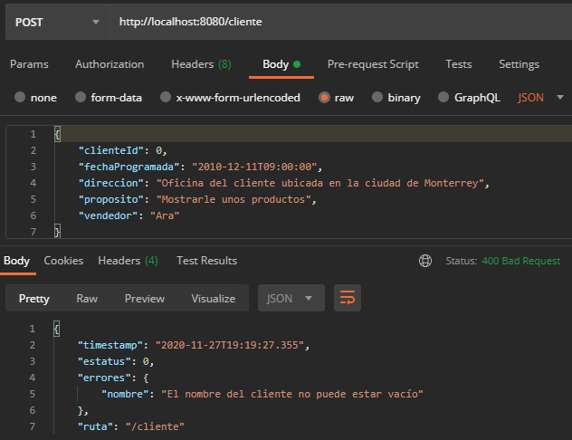
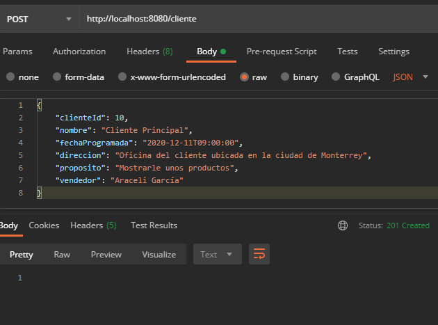

## Ejemplo 02: Manejo de errores extendiendo ResponseEntityExceptionHandler 


### OBJETIVO
- Manejar los errores comunes ocurridos dentro de una aplicación web, extendiendo de la clase base `ResponseEntityExceptionHandler` de Spring.
- Proporcionar una estructura consistente del manejo de errores.


#### REQUISITOS
- Tener instalado el IDE IntelliJ Idea Community Edition.
- Tener instalada la última versión del JDK 11 o 17.
- Tener instalada la herramienta Postman.


### DESARROLLO

1. Crea un proyecto Maven usando Spring Initializr.

2. En la ventana que se abre selecciona las siguientes opciones:

    - Grupo: **org.bedu.java.backend**
    - Artefacto y nombre del proyecto: **sesion4-ejemplo2**
    - Tipo de proyecto: **Maven Project**.
    - Lenguaje: **Java**.
    - Forma de empaquetar la aplicación: **jar**.
    - Versión de Java: **11** o **17**.

3. Elige **Spring Web** y **Validation** como dependencia del proyecto.

4. En el proyecto que se acaba de crear debes tener el siguiente paquete `org.bedu.java.backend.sesion4.ejemplo2`. Dentro crea dos subpaquetes: `model` y `controllers`.

6. Dentro del paquete `model` crea una nueva clase llamada "`Cliente`" con los siguientes atributos y validaciones:

    ```java
    @PositiveOrZero(message = "El identificador no puede ser un número negativo")
    private long id;
    @NotEmpty(message = "El nombre del cliente no puede estar vacío")
    @Size(min = 5, max = 30, message = "El nombre del cliente debe tener al menos 5 letras y ser menor a 30")
    private String nombre;
    @Email
    private String correoContacto;
    @Min(value = 10, message = "Los clientes con menos de 10 empleados no son válidos")
    @Max(value = 10000, message = "Los clientes con más de 10000 empleados no son válidos")
    private String numeroEmpleados;
    @NotBlank(message = "Se debe proporcionar una dirección")
    private String direccion;
    ```

    Agrega también los *getter*s y *setter*s de cada atributo.

7. En el paquete `controllers` agrega una clase llamada `ClienteController` y decórala con la anotación `@RestController`, de la siguiente forma:

    ```java
    @RestController
    @RequestMapping("/cliente")
    public class ClienteController {
    }
    ```

8. Agrega un nuevo manejador de peticiones **POST** el cual reciba un identificador como parámetro de petición en la URL; tambén, indica que el parámetro que recibe se debe de validar, de la siguiente forma:

    ```java
    @PostMapping
    public ResponseEntity<Void> creaCliente(@Valid @RequestBody Cliente cliente){
      return ResponseEntity.created(URI.create("")).build();
    }
    ```

9. Dentro del paquete `model` crea un nuevo paquete `builders`y dentro de este una clase llamada `RespuestaError`, con el siguiente contenido:

    ```java
        private final LocalDateTime timestamp = LocalDateTime.now();
        private int estatus;
        private Map<String, String> errores;
        private String ruta;
    ```

    Agrega también los *getter*s y los *setter*s.

10. Dentro del paquete `controllers` crea un nuevo paquete llamado `handlers` y dentro de este un clase llamada `ManejadorGlobalExcepciones` que extienda a la clase `ResponseEntityExceptionHandler`. Decora esta clase con la anotación `@ControllerAdvice`:

    ```java
    @RestControllerAdvice
    public class ManejadorGlobalExcepciones extends ResponseEntityExceptionHandler {
    
    }
    ```

11. Dentro de esta clase sobreescribe el método `handleMethodArgumentNotValid` con el siguiente contenido:

    ```java
    @Override
    protected ResponseEntity<Object> handleMethodArgumentNotValid(MethodArgumentNotValidException ex, HttpHeaders headers, HttpStatus status, WebRequest request) {
        Map<String, String> errors = new TreeMap<>();
        for (FieldError error : ex.getBindingResult().getFieldErrors()) {
            errors.put(error.getField(), error.getDefaultMessage());
        }
        for (ObjectError error : ex.getBindingResult().getGlobalErrors()) {
            errors.put(error.getObjectName(), error.getDefaultMessage());
        }
        RespuestaError respuestaError = new RespuestaError();
        respuestaError.setErrores(errors);
        respuestaError.setRuta(request.getDescription(false).substring(4));
        return handleExceptionInternal(
                ex, respuestaError, headers, HttpStatus.BAD_REQUEST, request);
    }
    ```

    Este método se llamará cada vez que ocurra un error en una validación de datos en un objeto validado por Spring.


12. Ejecuta la aplicación y, desde Postman, envía una petición **POST** con el siguiente contenido:

    ```json
    {
        "clienteId": 0,
        "fechaProgramada": "2010-12-11T09:00:00",
        "direccion": "Oficina del cliente ubicada en la ciudad de Monterrey",
        "proposito": "Mostrarle unos productos",
        "vendedor": "Ara"
    }
    ```

    Debes obtener un resultado como el siguiente:

    

13. Ahora, envía una nueva petición con el siguiente contenido:

    ```json
    {
        "clienteId": 10,
        "nombre": "Cliente Principal",
        "fechaProgramada": "2020-12-11T09:00:00",
        "direccion": "Oficina del cliente ubicada en la ciudad de Monterrey",
        "proposito": "Mostrarle unos productos",
        "vendedor": "Araceli García"
    }
    ```

    Debes obtener un resutado como el siguiente:


    


<br>

[**`Siguiente`** -> reto 02](../Reto-02/)