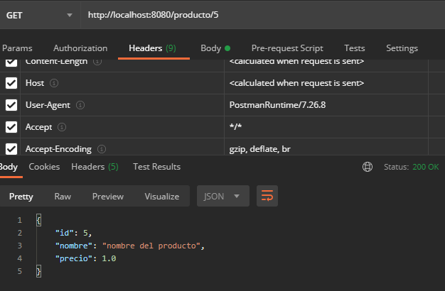
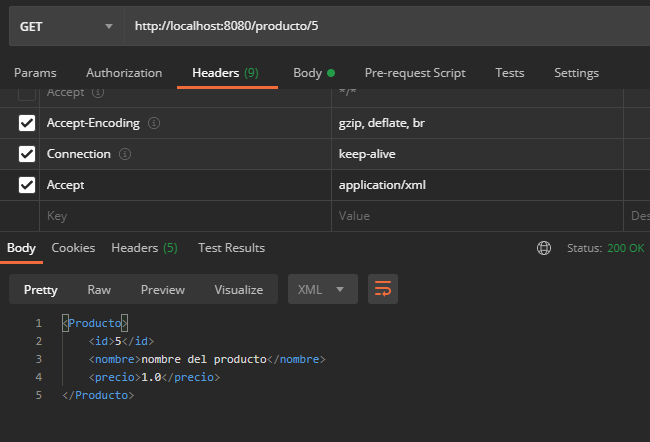

## Ejemplo 03: Negociación de contenido

### OBJETIVO
- Aprender las formas que Spring MVC ofrece para regresar al usuario una respuesta usando en formatos o tipos de contenido.
- Indicar si una respuesta debe recibirse en formato JSON o en formato XML.

#### REQUISITOS
- Tener instalado el IDE IntelliJ Idea Community Edition.
- Tener instalada la última versión del JDK 11 o 17.
- Tener instalada la herramienta Postman.

### Desarrollo
1. Crea un proyecto Maven usando Spring Initializr.

2. Selecciona las siguientes opciones:
    - Grupo: **org.bedu.java.backend**
    - Artefacto y nombre del proyecto: **sesion4.ejemplo3**
    - Tipo de proyecto: **Maven Project**.
    - Lenguaje: **Java**.
    - Forma de empaquetar la aplicación: **jar**.
    - Versión de Java: **11** o **17**.

3. Elige **Spring Web** como dependencia del proyecto.

4. En el proyecto que se acaba de crear debes tener el siguiente paquete `org.bedu.java.backend.sesion4.ejemplo3`. Dentro crea dos subpaquetes: `model` y `controllers`.

6. Dentro del paquete `model` crea una nueva clase llamada "`Producto`" con los siguientes atributos:

    ```java
    private long id;
    private String nombre;
    private float precio;    
    ```

    Agrega también los *getter*s y *setter*s de cada atributo.

7. En el paquete `controllers` agrega una clase llamada `ProductoController` y decórala con la anotación `@RestController`, de la siguiente forma:

    ```java
    @RestController
    @RequestMapping("/producto")
    public class ProductoController {

    }
    ```

8. Agrega un nuevo manejador de peticiones **GET**, de la siguiente forma:

    ```java
    @GetMapping(value = "/{productoId}")
    public ResponseEntity<Producto> getProducto(@PathVariable long productoId){
        Producto producto = new Producto();
        producto.setNombre("nombre del producto");
        producto.setId(productoId);
        producto.setPrecio(1.00f);

        return ResponseEntity.ok(producto);
    }
    ```

9. En el archivo `pom.xml` agrega la siguiente dependencia:

    ```xml
    <dependency>
      <groupId>org.springframework.boot</groupId>
      <artifactId>spring-boot-starter-web</artifactId>
    </dependency>
    ```

10. Ejecuta la aplicación y, desde Postman, envía una petición **GET** a la siguiente URL: `http://localhost:8080/producto/5`. Debes obtener un resultado como el siguiente:

    

11. En Postman agrega una cabecera llamada `Accept` que tenga como valor `application/xml` y envía nuevamente la petición, ahora debes obtener un resultado en formato XML:

    

    


<br>

[**`Siguiente`** -> postwork](../Postwork/)

[**`Regresar`**](../)