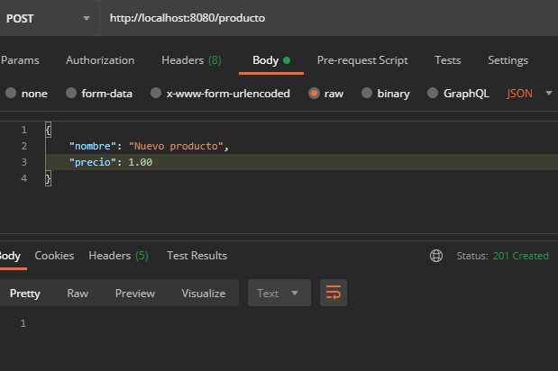
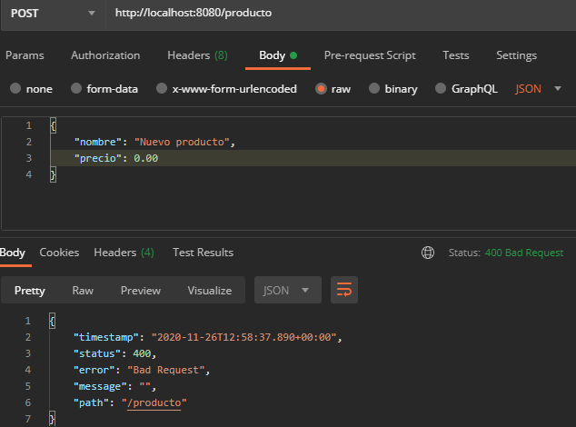
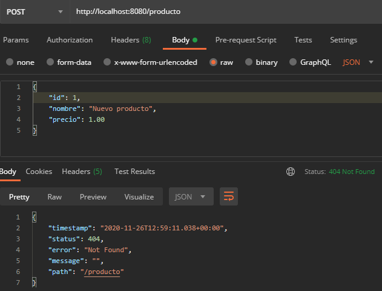

## Reto: Manejo de errores con ResponseStatusException

### OBJETIVO
- Regresar los estatus de respuesta más adecuados cuando ocurre un error al procesar una petición.

#### REQUISITOS
- Tener instalado el IDE IntelliJ Idea Community Edition.
- Tener instalada la última versión del JDK 11 o 17.
- Tener instalada la herramienta Postman.


### DESARROLLO
- Crea un nuevo proyecto Spring Boot en IntelliJ Idea como lo hiciste en la primera sesión.
- Crea una nueva clase que represente un recurso de tipo `Producto` con los siguientes atributos:
    - long id
    - String nombre
    - float precio
- Crea una nueva clase que represente un servicio REST, usando la anotación `@RestController`.
- Crea un nuevo manejador de peticiones **POST** que reciba como un parámetro un objeto `Producto`; si el precio es mayor a 1.00 y se proporciona un nombre se debe regresar un código de respuesta **201**(CREATED). Si se proporciona un id se debe regresar un código de respuesta **404** (NOT_FOUND). Si no se cumple ninguna de las condiciones anteriores se debe regresar un código de respuesta **400** (BAD_REQUEST).
- Hacer la prueba desde la herramienta Postman.


<details>
	<summary>Solución</summary>
  
1. Crea un proyecto Maven usando Spring Initializr desde el IDE IntelliJ Idea.

2. En la ventana que se abre selecciona las siguientes opciones:
- Grupo, artefacto y nombre del proyecto.
- Tipo de proyecto: **Maven Project**.
- Lenguaje: **Java**.
- Forma de empaquetar la aplicación: **jar**.
- Versión de Java: **11** o **17**.

3. En la siguiente ventana elige Spring Web como dependencia del proyecto.

4. Dale un nombre y una ubicación al proyecto y presiona el botón Finish.

5. En el proyecto que se acaba de crear debes tener el siguiente paquete `org.bedu.java.backend.sesion4.reto1`. Dentro crea dos subpaquetes: `model` y `controllers`.

6. Dentro del paquete `model` crea una nueva clase llamada "`Producto`" con los siguientes atributos:
- long id
- String nombre
- float precio

Agrega también los *getter*s y *setter*s de cada atributo.

7. En el paquete `controllers` agrega una clase llamada `ProductoController` y decórala con la anotación `@RestController`, de la siguiente forma:

```java
@RestController
@RequestMapping("/producto")
public class ProductoController {

}
```

8. Agrega un nuevo manejador de peticiones **POST** el cual reciba un identificador como parámetro de petición en la URL, de la siguiente forma:

```java
    @PostMapping
    public ResponseEntity<Void> creaProducto(@RequestBody Producto producto){
        
    }
```

9. Dentro de este agrega el siguiente codigo:

```java
    @PostMapping
    public ResponseEntity<Void> creaProducto(@RequestBody Producto producto){
        if(producto.getId() > 0){
            throw new ResponseStatusException(HttpStatus.NOT_FOUND, "El cliente con el id especificado no existe.");
        }

        if(producto.getPrecio() >= 1 && !producto.getNombre().isBlank()){
            return ResponseEntity.created(URI.create("")).build();
        }

        throw new ResponseStatusException(HttpStatus.BAD_REQUEST, "Los parámetros proporcionados no son correctos.");
    }
```

10. Ejecuta la aplicación y realiza unas peticiones desde Postman, deberías obtener los siguientes resultados:







</details>

