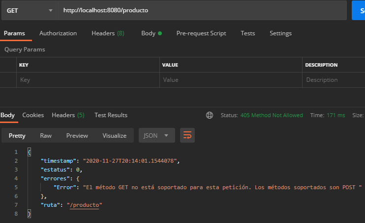

## Reto: Manejo de errores extendiendo ResponseEntityExceptionHandler 

### OBJETIVO
- Manejar los errores comunes ocurridos dentro de una aplicación web, extendiendo de la clase base `ResponseEntityExceptionHandler` de Spring.
- Proporcionar una estructura consistente del manejo de errores.

#### REQUISITOS
- Tener instalado el IDE IntelliJ Idea Community Edition.
- Tener instalada la última versión del JDK 11 o 17.
- Tener instalada la herramienta Postman.


### DESARROLLO
- Crea un nuevo proyecto Spring Boot en IntelliJ Idea como lo hiciste en la primera sesión. 
- Crea una nueva clase que represente un recurso de tipo `Producto` con los siguientes atributos: 
    - long id;
    - String nombre;
    - float precio
    - String categoria;
    - String numeroRegistro;
    - private LocalDate fechaCreacion;
- Crea una nueva clase que represente un servicio REST, usando la anotación `@RestController`.
- Crea un nuevo manejador de peticiones de tipo **POST** que reciba como un parámetro de tipo "`Producto`" y regrese un código de respuesta **201**.
- Agrega una clase `RespuestaError` como la del Ejemplo anterior.
- Agrega un manejador global de errores con una clase decorada con la anotación `@RestControllerAdvice` que extienda la clase `ResponseEntityExceptionHandler` y sobreescribe el método `handleHttpRequestMethodNotSupported` el cual se invoca cuando se hace una petición a un método HTTP que no existe en el servicio; en el ejemplo anterior estamos agregando un método **POST** pero tú deberás hacer una petición a un método **GET** (que no existe).
- Envía una petición de prueba desde la herramienta Postman, recuerda que esta petición debe ser de tipo **POST**.


<details>
	<summary>Solución</summary>
   
1. Crea un proyecto Maven usando Spring Initializr desde el IDE IntelliJ Idea.

2. En la ventana que se abre selecciona las siguientes opciones:
- Grupo, artefacto y nombre del proyecto.
- Tipo de proyecto: **Maven Project**.
- Lenguaje: **Java**.
- Forma de empaquetar la aplicación: **jar**.
- Versión de Java: **11**.

3. En la siguiente ventana elige **Spring Web** como dependencia del proyecto.

4. Dale un nombre y una ubicación al proyecto y presiona el botón Finish.

5. En el proyecto que se acaba de crear debes tener el siguiente paquete `org.bedu.java.backend.sesion4.reto2`. Dentro crea dos subpaquetes: `model` y `controllers`.

6. Dentro del paquete `model` crea una nueva clase llamada "`Producto`" con los siguientes atributos:

```java
    private long id;
    private String nombre;
    private float precio;
    private String categoria;
    private String numeroRegistro;
    private LocalDate fechaCreacion;
```

Agrega también los *getter*s y *setter*s de cada atributo.

7. En el paquete `controllers` agrega una clase llamada `ProductoController` y decórala con la anotación `@RestController`, de la siguiente forma:

```java
@RestController
@RequestMapping("/producto")
public class ProductoController {

}
```

8. Agrega un nuevo manejador de peticiones **POST** el cual reciba un identificador como parámetro de petición, de la siguiente forma:

```java
    @PostMapping
    public ResponseEntity<Void> agregaProducto(@RequestBody Producto producto){
        return ResponseEntity.created(URI.create("")).build();
    }
```
9. Dentro del paquete `controllers` crea un nuevo paquete llamado `handlers` y dentro de este un clase llamada `ManejadorGlobalExcepciones` que extienda a la clase `ResponseEntityExceptionHandler`. Decora esta clase con la anotación `@ControllerAdvice`:

```java
    @RestControllerAdvice
    public class ManejadorGlobalExcepciones extends ResponseEntityExceptionHandler {
    
    }
```

10. Dentro de esta clase sobreescribe el método `handleHttpRequestMethodNotSupported` con el siguiente contenido:

```java
    @Override
    protected ResponseEntity<Object> handleHttpRequestMethodNotSupported(HttpRequestMethodNotSupportedException ex, HttpHeaders headers, HttpStatus status, WebRequest request) {

        Map<String, String> errors = new TreeMap<>();

        StringBuilder builder = new StringBuilder();
        builder.append("El método ");
        builder.append(ex.getMethod());
        builder.append(" no está soportado para esta petición. Los métodos soportados son ");

        ex.getSupportedHttpMethods().forEach(t -> builder.append(t + " "));

        errors.put("Error", builder.toString());
        RespuestaError respuestaError = new RespuestaError();
        respuestaError.setErrores(errors);
        respuestaError.setRuta(request.getDescription(false).substring(4));

        return new ResponseEntity<Object>(respuestaError, new HttpHeaders(), HttpStatus.METHOD_NOT_ALLOWED);
    }
```

11. Ejecuta la aplicación y, desde Postman, envía una petición **GET**.

Debes obtener un resultado como el siguiente:



</details>
