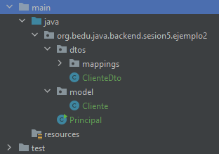
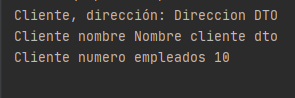
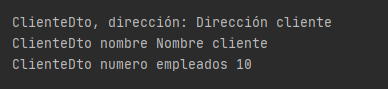

## Ejemplo 02: Uso de MapStruct

### OBJETIVO
- Crear una interfaz básica de MapStruct que permita mapear de un objeto `Cliente` a un objeto `ClienteDto` y viceversa.

#### REQUISITOS
- Tener instalado el IDE IntelliJ Idea Community Edition con el plugin de Lombok activado.
- Tener instalada la última versión del JDK 11 o 17.


### DESARROLLO

1. Crea un proyecto **Maven** desde el IDE IntelliJ Idea. Este proyecto No deberá ser creado con Spring Initilizr.

2. Agrega al proyecto, en el archivo **pom.xml** las dependencias de MapStruct:

    ```xml
    <dependencies>
            <dependency>
                <groupId>org.mapstruct</groupId>
                <artifactId>mapstruct</artifactId>
                <version>${org.mapstruct.version}</version>
            </dependency>
            <dependency>
                <groupId>org.mapstruct</groupId>
                <artifactId>mapstruct-processor</artifactId>
                <version>${org.mapstruct.version}</version>
                <optional>true</optional>
            </dependency>
    </dependencies>
    ```

4. En el caso de MapStruct también hay que agregar un plugin de Maven, el cual se encargará de generar el código para realizar el mapeo correspondiente.

    ```xml
    <build>
            <plugins>
                <plugin>
                    <groupId>org.apache.maven.plugins</groupId>
                    <artifactId>maven-compiler-plugin</artifactId>
                    <version>3.8.1</version>
                    <configuration>
                        <source>11</source>
                        <target>11</target>
                        <annotationProcessorPaths>
                            <path>
                                <groupId>org.mapstruct</groupId>
                                <artifactId>mapstruct-processor</artifactId>
                                <version>${org.mapstruct.version}</version>
                            </path>
                        </annotationProcessorPaths>
                    </configuration>
                </plugin>
            </plugins>
        </build>
    ```

5. Crea un nuevo paquete llamado `org.bedu.java.backend.sesion5.ejemplo2` y adentro crea una clase llamada `Principal` que tenga un método `main` de la siguiente forma:

    ```java
    public class Principal {
        public static void main(String[] args) {
            
        }
    }
    ```

6. Crea un subpaquete llamado `model` y adentro de este una clase llamada `Cliente` con los siguientes atributos:

    ```java
        private long id;
        private String nombre;
        private String correoContacto;
        private int numeroEmpleados;
        private String direccion;
    ```

    Coloca también sus métodos *getter* y *setter*.

7. Agrega, a la altura de `model` un paquete llamado `dtos`. Adentro de este agrega una clase llamada `ClienteDto` con los siguientes atributos:

    ```java
        private String nombre;
        private String numeroEmpleados;
        private String direccion;
    ```
    No olvides colocar también sus métodos *getter* y *setter*.

8. Dentro del paquete *dtos* agrega un subpquete llamado *mappings*.

    La estructura del proyecto hasta ahora debe verse así:

    

9. Dentro del paquete `mappings` crea una **interface** llamada `ClienteMapper` y decórala con la anotación `@@Mapper`:

    ```java
    @Mapper
    public interface ClienteMapper {
    
    }
    ```

10. Agrega los siguientes métodos dentro de la interface `ClienteMapper`, el primero le dice a MapStruct que debe crear un método que transforme de un `ClienteDto` (que recibe como parámetro) a un `Cliente` (que es el objeto que el método regresará). El segundo método hace lo opuesto, recibe un objeto `Cliente` y regresa un objeto `ClienteDto` con los atribtos mapeados provenientes del `Cliente`. MapStruct se encargará de crear una implementación de esta interface.

    ```java
    Cliente clienteDtoToCliente(ClienteDto clienteDto);

    ClienteDto clienteToClienteDto(Cliente cliente);
    ```

    La interface completa debe verse de esta forma:

    ```java
    @Mapper
    public interface ClienteMapper {
        Cliente clienteDtoToCliente(ClienteDto clienteDto);

        ClienteDto clienteToClienteDto(Cliente cliente);
    }
    ```

11. En el método `main` crea una una instancia de `ClienteDto` colocando valores en sus atributos y luego crea una instancia de la clase que implementa la interface `ClienteMapper` y que es creada por MapStruct. Por default esta clase tendrá el mismo nombre que nuestra interface, agregando `Impl` al final:

    ```java
    ClienteDto clienteDto = new ClienteDto();
    clienteDto.setDireccion("Direccion DTO");
    clienteDto.setNombre("Nombre cliente dto");
    clienteDto.setNumeroEmpleados("10");

    ClienteMapper clienteMapper = new ClienteMapperImpl();
    ```

12. Usando esta instancia usa el método `clienteDtoToCliente` e imprime los valores de los atibutos del objeto `Cliente` obtenido:
    ```java
    Cliente clienteMapeado = clienteMapper.clienteDtoToCliente(clienteDto);

    System.out.printf("Cliente, dirección: %s%n", clienteMapeado.getDireccion());
    System.out.printf("Cliente nombre %s%n", clienteMapeado.getNombre());
    System.out.printf("Cliente numero empleados %d%n%n", clienteMapeado.getNumeroEmpleados());
    ```

    En la consola de salida debe haber un mensaje similar al siguiente:

    

13. Has lo mismo pero ahora creando una instancia de `Cliente` e imprimiendo los valores del objeto `ClienteDto` mapeado:

    ```java
    Cliente cliente = new Cliente();
    cliente.setId(1L);
    cliente.setCorreoContacto("correo@cliente.com");
    cliente.setDireccion("Dirección cliente");
    cliente.setNombre("Nombre cliente");
    cliente.setNumeroEmpleados(10);

    ClienteDto clienteDtoMapeado = clienteMapper.clienteToClienteDto(cliente);
    System.out.printf("ClienteDto, dirección: %s%n", clienteDtoMapeado.getDireccion());
    System.out.printf("ClienteDto nombre %s%n", clienteDtoMapeado.getNombre());
    System.out.printf("ClienteDto numero empleados %s%n", clienteDtoMapeado.getNumeroEmpleados());
    ```

    


<br>

[**`Siguiente`** -> reto 02](../Reto-02/)