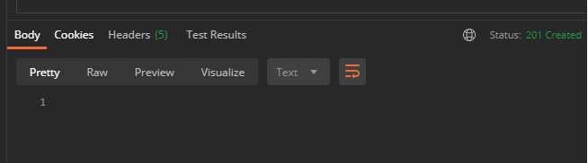
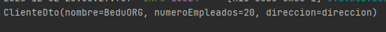

## Ejemplo 03: Uso de Lombok y MapStruct con Spring Boot

### OBJETIVO
- Crear una interfaz básica de MapStruct que permita mapear de un objeto `Cliente` a un objeto `ClienteDto` y viceversa.
- Decorar las clases anteriores con las anotaciones de Lombok para autogenerar sus métodos *setter*, *getter*, constructores, etc.
- Hacer que Spring inyecte de forma automática el objeto *Mapper* creado por MapStruct en los controladores usando las anotaciones de Lombok.

#### REQUISITOS
- Tener instalado el IDE IntelliJ Idea Community Edition con el plugin de Lombok activado.
- Tener instalada la última versión del JDK 11 o 17.


### Desarrollo

1. Entra al sitio de <a href="https://start.spring.io/" target="_blank">Spring Initializr</a>. Ahí verás una sola página dividida en dos secciones. Comienza llenando la información de la sección del lado izquierdo. Selecciona:

2. En la ventana que se abre selecciona las siguientes opciones:
    - Grupo, artefacto y nombre del proyecto.
    - Tipo de proyecto: **Maven Project**.
    - Lenguaje: **Java**.
    - Forma de empaquetar la aplicación: **jar**.
    - Versión de Java: **11** o **17**.

3. En la sección de la derecha (las dependencias) presiona el botón `Add dependencies` y en la ventana que se abre busca las dependencias `Spring Web` y `Lombok`.

4. Dale un nombre y una ubicación al proyecto y presiona el botón *Generate*.

5. En el proyecto que se acaba de crear debes tener el siguiente paquete `org.bedu.java.backend.sesion5.ejemplo3`. Dentro crea los subpaquetes: `model`, `dtos`  y `controllers`. Dentro del paquete `dtos` crea un subpaquete `mappings`.

6. Agrega al proyecto, en el archivo **pom.xml** las dependencias de MapStruct (las de Lombok se agregaron al momento de crear el proyecto):

    ```xml
    <properties>
        <java.version>11</java.version>
        <org.mapstruct.version>1.4.1.Final</org.mapstruct.version>
    </properties>


    <dependencies>
            <dependency>
                <groupId>org.mapstruct</groupId>
                <artifactId>mapstruct</artifactId>
                <version>${org.mapstruct.version}</version>
            </dependency>
            <dependency>
                <groupId>org.mapstruct</groupId>
                <artifactId>mapstruct-processor</artifactId>
                <version>${org.mapstruct.version}</version>
                <optional>true</optional>
            </dependency>
    </dependencies>
    ```

7. Agrega el plugin de Maven para MapStruct, el cual se encargará de generar el código para realizar el mapeo correspondiente.

    ```xml
    <build>
            <plugins>
                <plugin>
                    <groupId>org.apache.maven.plugins</groupId>
                    <artifactId>maven-compiler-plugin</artifactId>
                    <version>3.8.1</version>
                    <configuration>
                        <source>${java.version}</source>
                        <target>${java.version}</target>
                        <annotationProcessorPaths>
                            <path>
                                <groupId>org.mapstruct</groupId>
                                <artifactId>mapstruct-processor</artifactId>
                                <version>${org.mapstruct.version}</version>
                            </path>
                            <path>
                                <groupId>org.projectlombok</groupId>
                                <artifactId>lombok</artifactId>
                                <version>1.18.16</version>
                            </path>
                            <path>
                                <groupId>org.projectlombok</groupId>
                                <artifactId>lombok-mapstruct-binding</artifactId>
                                <version>0.1.0</version>
                            </path>
                        </annotationProcessorPaths>
                    </configuration>
                </plugin>
            </plugins>
        </build>
    ```

8. Dentro del paquete `model` crea una clase llamada `Cliente` con los siguientes atributos:

    ```java
    private long id;
    private String nombre;
    private String correoContacto;
    private int numeroEmpleados;
    private String direccion;
    ```

9. Decora esta clase con las anotaciones `@Data` y `@Builder` de Lombok:

    ```java
    @Data
    @Builder
    public class Cliente {
        private long id;
        private String nombre;
        private String correoContacto;
        private int numeroEmpleados;
        private String direccion;
    }
    ```

10. Dentro del paquete `dtos` agrega una clase llamada `ClienteDto` con los siguientes atributos. También anota esta clase con `@Data` y `@Builder`:

    ```java
    @Data
    @Builder
    public class ClienteDto {
        private String nombre;
        private String numeroEmpleados;
        private String direccion;
    }
    ```

11. Dentro del paquete `mappings` crea una **interface** llamada `ClienteMapper` y decórala con la anotación `@Mapper`:

    ```java
    @Mapper
    public interface ClienteMapper {
    
    }
    ```

12. En la anotación `@Mapper` agrega el atributo `componentModel` con el valor de `spring`. Esto le indica a MapStruct que debe marcar la clase generada para que pueda funcionar como un componente de Spring.

    ```java
    @Mapper(componentModel = "spring")
    public interface ClienteMapper {

    }
    ```

12. Agrega los siguientes métodos dentro de la interface `ClienteMapper`, el primero le dice a MapStruct que debe crear un método que transforme de un `ClienteDto` (que recibe como parámetro) a un `Cliente` (que es el objeto que el método regresará). El segundo método hace lo opuesto, recibe un objeto `Cliente` y regresa un objeto `ClienteDto` con los atribtos mapeados provenientes del `Cliente`. MapStruct se encargará de crear una implementación de esta interface.

    ```java
    Cliente clienteDtoToCliente(ClienteDto clienteDto);

    ClienteDto clienteToClienteDto(Cliente cliente);
    ```

    La interface completa debe verse de esta forma:

    ```java
    @Mapper(componentModel = "spring")
    public interface ClienteMapper {
        Cliente clienteDtoToCliente(ClienteDto clienteDto);

        ClienteDto clienteToClienteDto(Cliente cliente);
    }
    ```

13. En el paquete `controllers` agrega una clase llamada `ClienteController` y decórala con la anotación `@RestController`:

    ```java
    @RestController
    @RequestMapping("/cliente")
    public class ClienteController {

    }
    ```

14. Agrega un nuevo manejador de peticiones **POST** que reciba un identificador como parámetro Un objeto de tipo `Cliente`:
    
    ```java
    @PostMapping
    public ResponseEntity<Void> creaCliente(@RequestBody Cliente cliente){

        return ResponseEntity.created(URI.create("1")).build();
    }
    ``` 

15. Declara una instancia de tipo `ClienteMapper` en el controlador y úsala dentro del método `creaCliente` para obtener un objeto de tipo `ClienteDto` con los valores del objeto `Cliente` recibido e imprime sus valores en consola:

    ```java
    @RestController
    @RequestMapping("/cliente")
    public class ClienteController {

        private final ClienteMapper mapper;

        @PostMapping
        public ResponseEntity<Void> creaCliente(@RequestBody Cliente cliente){

            ClienteDto clienteDto = mapper.clienteToClienteDto(cliente);

            System.out.println(clienteDto);

            return ResponseEntity.created(URI.create("1")).build();
        }

    }
    ```

16. Agrega al nivel de la clase la anotación `@RequiredArgsConstructor` de Lombok para crear un constructor que reciba los atributos marcados como `final`, en este caso el el objeto `ClienteMapper`. Al final la clase debe quedar de esta forma:

    ```java
    @RestController
    @RequestMapping("/cliente")
    @RequiredArgsConstructor
    public class ClienteController {

        private final ClienteMapper mapper;

        @PostMapping
        public ResponseEntity<Void> creaCliente(@RequestBody Cliente cliente){

            ClienteDto clienteDto = mapper.clienteToClienteDto(cliente);

            System.out.println(clienteDto);

            return ResponseEntity.created(URI.create("1")).build();
        }

    }
    ```

17. Ejecuta la aplicación y envía el siguiente objeto JSon desde Postman:

    ```json
    {
        "nombre": "BeduORG",
        "correoContacto": "contacto@bedu.org",
        "numeroEmpleados": "20",
        "direccion": "direccion"
    }
    ```

18. Debes recibir la siguiente respuesta en Postman:

    

    y debes tener el siguiente mensaje en la consola de IntelliJ:

    


<br>

[**`Siguiente`** -> postwork](../Postwork/)