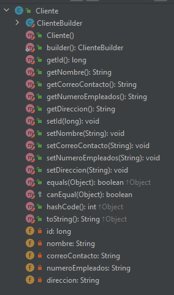
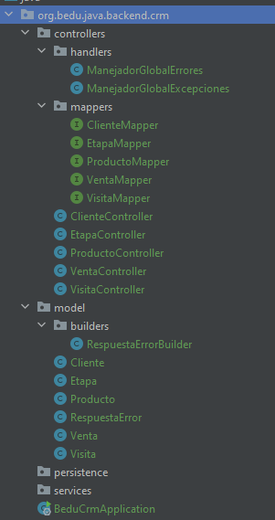

## Postwork Sesión 5

### OBJETIVO
- Usar **Lombok** como herramienta que genera código común (boilerplate) en objetos Java
- Aplicar **MapStruct** para mapear los atributos de un objeto con los de un objeto diferente.
- Exponer los objetos creados con MapStruct como componentes de Spring.


### DESARROLLO

El postwork se realizará en equipo, los cuales serán formados previamente a la sesión uno.

El propósito de este Postwork es retomar el proyecto del módulo anterior y realizar las modificaciones descritas a continuación. 

- Agrega las dependencias de *Lombok* y *MapStruct* en el archivo *pom.xml* del proyecto.

- Los objetos del paquete `model` tienen, hasta ahora, solamente atributos, usa las siguientes anotaciones de Lombok:
    - `@Data`
    - `@Builder`
    - `@RequiredArgsConstructor`
    
- Asegúrate, en el panel de estructura de la clase, que los métodos se hayan generado de forma correcta y completa:

    

- Dentro del paquete `controllers` agrega un subpaquete `mappers` y agrega una interface de mape para cada uno de los tipos de objetos en el paquete `model` (excluyendo `RespuestaError`. 

- Anota estas interfaces con `@Mapper`. Por el momento estas interfaces no tendrán métodos, los colocaremos en la siguiente sesión.

- La estructura del proyecto debe verse de la siguiente forma:

    


<br>

<details>
	<summary>Solución</summary>

1. Agrega las dependencias de *Lombok* y *MapStruct* en el archivo *pom.xml* del proyecto.

    ```xml
    <dependency>
        <groupId>org.mapstruct</groupId>
        <artifactId>mapstruct</artifactId>
        <version>${org.mapstruct.version}</version>
    </dependency>
    <dependency>
        <groupId>org.mapstruct</groupId>
        <artifactId>mapstruct-processor</artifactId>
        <version>${org.mapstruct.version}</version>
        <optional>true</optional>
    </dependency>
    <dependency>
        <groupId>org.projectlombok</groupId>
        <artifactId>lombok</artifactId>
    </dependency>
    ```

2. Agrega las siguientes anotaciones de Lombok a cada clase del paquete `model`:
    - `@Data`
    - `@Builder`
    - `@RequiredArgsConstructor`

    A continuación te dejamos un ejemplode como deben de quedar:

    ```java
    @Data
    @Builder
    @RequiredArgsConstructor
    public class Etapa {
        @PositiveOrZero(message = "El identificador de la etapa no puede ser un número negativo")
        private long etapaId;

        @NotEmpty(message = "El nombre de la etapa no puede estar en blanco.")
        @Size(min = 4, max = 30, message = "El nombre de la etapa debe tener entre 4 y 30 letras.")
        private String nombre;

        @Positive(message = "La etapa debe tener un orden positivo mayor a cero")
        private int orden;
    }
    ```
    
3. Asegúrate, en el panel de estructura de la clase, que los métodos se hayan generado de forma correcta y completa:

    

4. Dentro del paquete `controllers` agrega un subpaquete `mappers` y agrega una interface de mape para cada uno de los tipos de objetos en el paquete `model` (excluyendo `RespuestaError`.

    Anota estas interfaces con `@Mapper`. Por el momento estas interfaces no tendrán métodos, los colocaremos en la siguiente sesión.

    ```java
    @Mapper
    public interface ClienteMapper {
    }
    ```

    ```java
    @Mapper
    public interface EtapaMapper {
    }
    ```

    ```java
    @Mapper
    public interface ProductoMapper {
    }
    ```

    ```java
    @Mapper
    public interface VentaMapper {
    }
    ```

    ```java
    @Mapper
    public interface VisitaMapper {
    }
    ```

6. La estructura del proyecto debe verse de la siguiente forma:

    

</details>


<br>

[**`Siguiente`** -> sesión 6](../../Sesion-06/)

[**`Regresar`**](../)