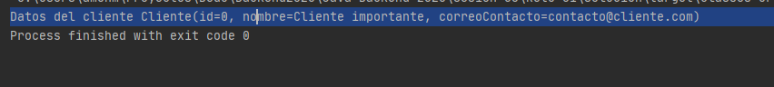

## Reto 01: Creación de getters, setters, constructores, equals y hashcode con @Data

### OBJETIVO
- Usar las anotaciones básicas de Lombok para la generación de getters, setters, constructores, equals y hashcode.

#### REQUISITOS
- Tener instalado el IDE IntelliJ Idea Community Edition con el plugin de Lombok activado.
- Tener instalada la última versión del JDK 11 o 17.
- Tener instalada la herramienta Postman.


### Desarrollo
- Crea un proyecto **Maven** desde IntelliJ Idea (este proyecto No deberá ser creado con Spring Initilizr).
- Agrega la dependencia de Lombok en el archivo **pom.xml**.
- Agrega una clase `Principal` que tenga un método `main`.
- Agrega una clase `Cliente` con los siguientes atributos:
    - private long id;
    - private String nombre;
    - private String correoContacto;
    - private int numeroEmpleados;
    - private String direccion;
- Agrega las anotaciones necesarias para generar los métodos *getter* y *setter* de cada uno de los atributos anteriores.
- Excluye los atributos `direccion` y `numeroEmpleados` de los métodos `toString`, `equals` y `hashCode`.
- Agrega un constructor por default y otro que reciba todos los atributos.

</br>

<details>
	<summary>Solución</summary>
1. Crea un proyecto **Maven** desde el IDE IntelliJ Idea.

2. Agrega al proyecto, en el archivo **pom.xml** la dependencia de Lombok 

    ```xml
    <dependencies>
        <dependency>
            <groupId>org.projectlombok</groupId>
            <artifactId>lombok</artifactId>
            <version>1.18.16</version>
            <scope>provided</scope>
        </dependency>
    </dependencies>
    ```

3. Crea un nuevo paquete llamado `org.bedu.java.backend.sesion5.reto1` y adentro crea una clase llamada `Principal` que tenga un método `main` de la siguiente forma:

    ```java
    public class Principal {
        public static void main(String[] args) {
            
        }
    }
    ```

4. Crea un subpaquete llamado `model` y adentro de este una clase llamada `Cliente` y coloca los siguientes atributos:

    ```java
    private long id;
    private String nombre;
    private String correoContacto;
    private int numeroEmpleados;
    private String direccion;
    ```

5. Decora la clase `Cliente` con la anotación `@Data`, la cual le dice a **Lombok** que debe generar una serie de métodos, entre los que se encuentran:

    ```java
    @Data
    public class Cliente {
        private long id;
        private String nombre;
        private String correoContacto;
        private int numeroEmpleados;
        private String direccion;
    }
    ```

6. Decora los atributos `numeroEmpleados` y `direccion` con las anotaciones `@ToString.Exclude` y `@EqualsAndHashCode.Exclude`, la cual indica a Lombok que no debe incluir los atributos marcados en los métodos `toString`, `equals` y `hashCode`.

    ```java
    @ToString.Exclude
    @EqualsAndHashCode.Exclude
    private int numeroEmpleados;

    @ToString.Exclude
    @EqualsAndHashCode.Exclude
    private String direccion;
    ```

7. En el método `main` crea una nueva inastancia de `Cliente` e imprime sus valores en la consola:

    ```java
    public class Principal {
        public static void main(String[] args) {
            Cliente cliente = new Cliente();
            cliente.setDireccion("Dirección del cliente");
            cliente.setCorreoContacto("contacto@cliente.com");
            cliente.setNombre("Cliente importante");
            cliente.setNumeroEmpleados(100);

            System.out.printf("Datos del cliente %s", cliente);
        }
    }
    ```

10. Ejecuta la aplicación, debes obtener un resultado como el siguiente:

    

</details>


<br>

[**`Siguiente`** -> ejemplo 02](../Ejemplo-02/)