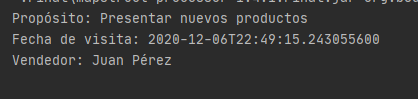
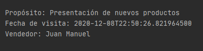

## Reto 02: Uso de MapStruct usando atributos con nombres diferentes

### OBJETIVO
- Crear una interfaz básica de MapStruct que permita mapear de un objeto `Visita` a un objeto `VisitaDto` y viceversa.
- Crear mapeos cuando el nombre de origen es diferente al nombre destino; por ejemplo: fecha -> fechaProgramada.

#### REQUISITOS
- Tener instalado el IDE IntelliJ Idea Community Edition con el plugin de Lombok activado.
- Tener instalada la última versión del JDK 11 o 17.


### Desarrollo
- Crea un proyecto **Maven** desde IntelliJ Idea (este proyecto No deberá ser creado con Spring Initilizr).
- Agrega las dependencias de MapStruct en el archivo **pom.xml**.
- Agrega el plugin de preprocesamiento de MapStruct.
- Agrega una clase `Principal` que tenga un método `main`.
- Agrega una clase `Visita` con los siguientes atributos (debes agregar también los métodos *getter* y *setter* de cada atributo):
    - private long id;
    - private LocalDateTime fechaProgramada;
    - private String direccion;
    - private String proposito;
    - private String vendedor;
- Agrega una clase `VisitaDto` con los siguientes atributos (debes agregar también los métodos *getter* y *setter* de cada atributo):
    - private LocalDateTime fecha;
    - private String lugar;
    - private String proposito;
    - private String nombreVendedor;
- Crea una interface `VisitaMapper` decorada con la anotación `@Mapper` y agrega un método que permita convertir de un objetjo `Visita` a `VisitaDto` y un método que permita convertir de un objeto `VisitaDto` a `Visita`.
- Crea un par de objetos en el método `main` de la clase `Principal` para comprobar que todo está funcionando de forma correta.

</br>

<details>
	<summary>Solución</summary>
    
1. Crea un proyecto **Maven** desde el IDE IntelliJ Idea. Este proyecto No deberá ser creado con Spring Initilizr.

2. Agrega al proyecto, en el archivo **pom.xml** las dependencias de MapStruct:

    ```xml
    <dependencies>
            <dependency>
                <groupId>org.mapstruct</groupId>
                <artifactId>mapstruct</artifactId>
                <version>${org.mapstruct.version}</version>
            </dependency>
            <dependency>
                <groupId>org.mapstruct</groupId>
                <artifactId>mapstruct-processor</artifactId>
                <version>${org.mapstruct.version}</version>
                <optional>true</optional>
            </dependency>
    </dependencies>
    ```

4. En el caso de MapStruct también hay que agregar un plugin de Maven, el cual se encargará de generar el código para realizar el mapeo correspondiente.

    ```xml
    <build>
            <plugins>
                <plugin>
                    <groupId>org.apache.maven.plugins</groupId>
                    <artifactId>maven-compiler-plugin</artifactId>
                    <version>3.8.1</version>
                    <configuration>
                        <source>11</source>
                        <target>11</target>
                        <annotationProcessorPaths>
                            <path>
                                <groupId>org.mapstruct</groupId>
                                <artifactId>mapstruct-processor</artifactId>
                                <version>${org.mapstruct.version}</version>
                            </path>
                        </annotationProcessorPaths>
                    </configuration>
                </plugin>
            </plugins>
        </build>
    ```

5. Crea un nuevo paquete llamado `org.bedu.java.backend.sesion5.ejemplo2` y adentro crea una clase llamada `Principal` que tenga un método `main` de la siguiente forma:

    ```java
    public class Principal {
        public static void main(String[] args) {
            
        }
    }
    ```

6. Crea un subpaquete llamado `model` y adentro de este una clase llamada `Visita` con los siguientes atributos:

    ```java
        private long id;
        private LocalDateTime fechaProgramada;
        private String direccion;
        private String proposito;
        private String vendedor;
    ```
    Coloca también sus métodos *getter* y *setter*.

7. Agrega, a la altura de `model` un paquete llamado `dtos`. Adentro de este agrega una clase llamada `VisitaDto` con los siguientes atributos:

    ```java
    private LocalDateTime fecha;
    private String lugar;
    private String proposito;
    private String nombreVendedor;
    ```
    No olvides colocar también sus métodos *getter* y *setter*.

8. Dentro del paquete *dtos* agrega un subpquete llamado *mappings*.

9. Dentro del paquete `mappings` crea una **interface** llamada `VisitaMapper` y decórala con la anotación `@@Mapper`:
    
    ```java
    @Mapper
    public interface VisitaMapper {
    
    }
    ```

10. Agrega los siguientes métodos dentro de la interface `VisitaMapper`, el primero le dice a MapStruct que debe crear un método que transforme de un `Visita` (que recibe como parámetro) a un `VisitaDto` (que es el objeto que el método regresará). El segundo método hace lo opuesto, recibe un objeto `Visita` y regresa un objeto `VisitaDto` con los atribtos mapeados provenientes del `Cliente`. MapStruct se encargará de crear una implementación de esta interface.

    ```java
    VisitaDto visitaToVisitaDto(Visita visita);
    
    Visita visitaDtoToVisita(VisitaDto visitaDto);
    ```

11. Decora cada uno de los métodos con las anotaciones `@Mappings` y `@Mapping` indicando los nombres de los atributos de origen y destino de cada mapeo.

    ```java
    @Mapper
    public interface VisitaMapper {

        @Mappings({
                @Mapping(source = "fechaProgramada", target = "fecha"),
                @Mapping(source = "vendedor", target = "nombreVendedor"),
                @Mapping(source = "direccion", target = "lugar")
        })
        VisitaDto visitaToVisitaDto(Visita visita);

        @Mappings({
                @Mapping(source = "fecha", target = "fechaProgramada"),
                @Mapping(source = "nombreVendedor", target = "vendedor"),
                @Mapping(source = "lugar", target = "direccion")
        })
        Visita visitaDtoToVisita(VisitaDto visitaDto);
    }
    ```

12. En el método `main` crea una una instancia de `Visita` colocando valores en sus atributos y luego crea una instancia de la clase que implementa la interface `VisitaMapper` y que es creada por MapStruct. Por default esta clase tendrá el mismo nombre que nuestra interface, agregando `Impl` al final:

    ```java
    Visita visita = new Visita();
    visita.setDireccion("Oficina del cliente");
    visita.setFechaProgramada(LocalDateTime.now().plusDays(5));
    visita.setProposito("Presentar nuevos productos");
    visita.setVendedor("Juan Pérez");

    VisitaMapper mapper  = new VisitaMapperImpl();
    ```

13. Usando esta instancia usa el método `visitaToVisitaDto` e imprime los valores de los atibutos del objeto `Visita` obtenido:
    
    ```java
    VisitaDto visitaDtoMapeada = mapper.visitaToVisitaDto(visita);

    System.out.printf("Propósito: %s%n", visitaDtoMapeada.getProposito());
    System.out.printf("Fecha de visita: %s%n", visitaDtoMapeada.getFecha());
    System.out.printf("Vendedor: %s%n%n", visitaDtoMapeada.getNombreVendedor());
    ```

    En la consola de salida debe haber un mensaje similar al siguiente:

    

14. Has lo mismo pero ahora creando una instancia de `VisitaDto` e imprimiendo los valores del objeto `Visita` mapeado:

    ```java
    VisitaDto visitaDto = new VisitaDto();
    visitaDto.setFecha(LocalDateTime.now().plusDays(7));
    visitaDto.setLugar("Casa del cliente");
    visitaDto.setNombreVendedor("Juan Manuel");
    visitaDto.setProposito("Presentación de nuevos productos");

    Visita visitaMapeada = mapper.visitaDtoToVisita(visitaDto);

    System.out.printf("Propósito: %s%n", visitaMapeada.getProposito());
    System.out.printf("Fecha de visita: %s%n", visitaMapeada.getFechaProgramada());
    System.out.printf("Vendedor: %s%n", visitaMapeada.getVendedor());
    ```

    


</details>


<br>

[**`Siguiente`** -> ejemplo 03](../Ejemplo-03/)