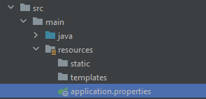
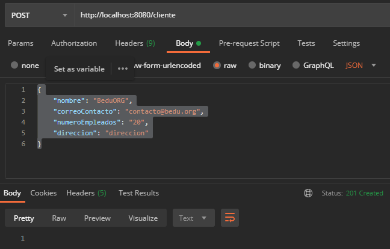
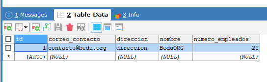

## Ejemplo 01: Persistencia de datos con Spring Data JPA

### OBJETIVO
- Hacer uso de las anotaciones básicas de JPA para indicar qué objeto debe ser tratado como una entidad de base de datos.
- Aprender qué es un repositorio y los métodos por default que ofrece.

#### REQUISITOS
- Tener instalado el IDE IntelliJ Idea Community Edition con el plugin de Lombok activado.
- Tener instalada la última versión del JDK 11 o 17.
- Tener instalada la herramienta Postman.
- Tener instalada la base de datos MySQL y los datos del usuario para conectarse


### Desarrollo

1. Entra al sitio de <a href="https://start.spring.io/" target="_blank">Spring Initializr</a>. Ahí verás una sola página dividida en dos secciones. Comienza llenando la información de la sección del lado izquierdo. Selecciona:

2. En la ventana que se abre selecciona las siguientes opciones:
    - Grupo, artefacto y nombre del proyecto.
    - Tipo de proyecto: **Maven Project**.
    - Lenguaje: **Java**.
    - Forma de empaquetar la aplicación: **jar**.
    - Versión de Java: **11** o **17**.

3. En la sección de la derecha (las dependencias) presiona el botón `Add dependencies` y en la ventana que se abre busca las dependencias `Spring Web`, `Lombok`, `Spring Data JPA` y `MySQL Driver`.

    

4. Dale un nombre y una ubicación al proyecto y presiona el botón *Generate*.

5. En el proyecto que se acaba de crear debes tener el siguiente paquete `org.bedu.java.backend.sesion6.ejemplo1`. Dentro crea los subpaquetes: `controllers`, `model` y `persistence`.

6. Dentro del paquete `model` crea una clase llamada `Cliente` con los siguientes atributos:

    ```java
    private Long id;
    private String nombre;
    private String correoContacto;
    private int numeroEmpleados;
    private String direccion;
    ```

7. Decora la clase con la anotación `@Data` de *Lombok*:

    ```java
    @Data
    public class Cliente {

    }
    ```

8. Decora también la clase con las siguientes anotaciones de JPA:

    ```java
    @Entity
    @Table(name = "CLIENTE")
    public class Cliente {

    }
    ```

9. Decora los atributos `id`, `correoContacto` y `numeroEmpleados` con las siguientes anotaciones (`nombre` y `direccion` permanecen igual)
    
    ```java
    @Id
    @GeneratedValue(strategy = GenerationType.IDENTITY)
    private Long id;
    private String nombre;

    @Column(name = "correo_contacto", length = 30)
    private String correoContacto;

    @Column(name = "numero_empleados")
    private int numeroEmpleados;

    private String direccion;
    ```

10. En el paquete `persistence` crea una **interface** llamada `ClienteRepository` que extienda de `JpaRepository`. Esta interface permanecerá sin métodos:

    ```java
    public interface ClienteRepository  extends JpaRepository<Cliente, Long> {

    }
    ```

11. En el paquete `controllers` crea una nueva clase llamada `ClienteController` y decórala con las anotaciones de Spring MVC para indicar que esta clase es un controlador web.

    ```java
    @RestController
    @RequestMapping("/cliente")
    public class ClienteController {

    }
    ```

12. Crea un método **POST** que reciba un objeto `Cliente` como parámetro y regrese un código de respuesta **201**:
    ```java
    @PostMapping
    public ResponseEntity<Void> creaCliente(@RequestBody Cliente cliente){
        return ResponseEntity.created(URI.create("")).build();
    }
    ```

13. Agrega un atributo `final` de tipo `ClienteRepository`:

    ```java
    private final ClienteRepository clienteRepository;
    ```

14. Usa la anotación `@RequiredArgsConstructor` de *Lombok*, el cual agregará un constructor que reciba el objeto `ClienteRepository` y lo inyecte en el controlador.

    ```java
    @RestController
    @RequestMapping("/cliente")
    @RequiredArgsConstructor
    public class ClienteController {

        private final ClienteRepository clienteRepository;
    }
    ```

15. Dentro del método `creaCliente` usa el objeto `clienteRepository` para guardar el objeto cliente en base de datos. Usa el `id` del objeto almacenado para regresarlo en la respuesta del método.
    ```java
    @PostMapping
    public ResponseEntity<Void> creaCliente(@RequestBody Cliente cliente){

        Cliente clienteDB = clienteRepository.save(cliente);

        return ResponseEntity.created(URI.create(clienteDB.getId().toString())).build();
    }
    ```

16. En el directorio resources busca o crea el archivo `application.properties` 

    

    Coloca el siguiente contenido en el archivo (los valores entre los signos `<` y `>` reemplazalos con tus propios valores):

    ```groovy
    spring.jpa.hibernate.ddl-auto=update
    spring.jpa.hibernate.generate_statistics=true
    spring.jpa.properties.hibernate.dialect=org.hibernate.dialect.MySQL5Dialect
    spring.datasource.driver-class-name=com.mysql.cj.jdbc.Driver
    spring.datasource.url=jdbc:mysql://localhost:3306/bedu?serverTimezone=UTC
    spring.datasource.username=<usuario>
    spring.datasource.password=<password>
    ```

17. Ejecuta la aplicación y envía la siguinte petición desde Postman:

    ```java
    {
        "nombre": "BeduORG",
        "correoContacto": "contacto@bedu.org",
        "numeroEmpleados": "20",
        "direccion": "direccion"
    }
    ```

    debes tener la siguiente respuesta en la consola de Postman:

    

18. Revisa la base de datos, la tabla `CLIENTE` debe haberse creado de forma automática y debe tener almacenado el registro con los datos enviados desde Postman:

    

<br>

[**`Siguiente`** -> reto 01](../Reto-01/)