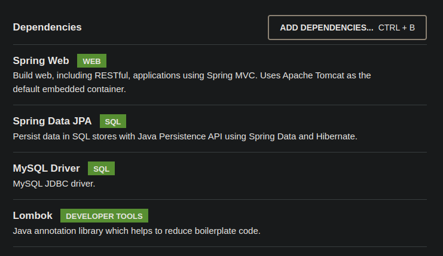
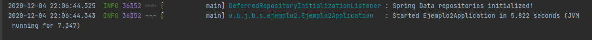
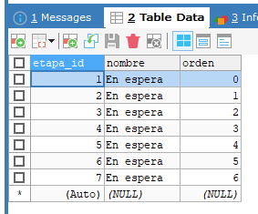

## Ejemplo 02: Inicialización de base de datos con CommandLineRunner y Lombok

### OBJETIVO
- Aprovechar la interface `CommandLineRunner` para ejecutar algunas tareas antes de que la aplicación comience a recibir peticiones.
- Inicializar valores de catálogos en base de datos.

#### REQUISITOS
- Tener instalado el IDE IntelliJ Idea Community Edition con el plugin de Lombok activado.
- Tener instalada la última versión del JDK 11 o 17.
- Tener instalada la base de datos MySQL y los datos del usuario para conectarse


### Desarrollo

1. Entra al sitio de <a href="https://start.spring.io/" target="_blank">Spring Initializr</a>. Ahí verás una sola página dividida en dos secciones. Comienza llenando la información de la sección del lado izquierdo. Selecciona:

2. En la ventana que se abre selecciona las siguientes opciones:
    - Grupo, artefacto y nombre del proyecto.
    - Tipo de proyecto: **Maven Project**.
    - Lenguaje: **Java**.
    - Forma de empaquetar la aplicación: **jar**.
    - Versión de Java: **11** o **17**.

3. En la sección de la derecha (las dependencias) presiona el botón `Add dependencies` y en la ventana que se abre busca las dependencias `Spring Web`, `Lombok`, `Spring Data JPA` y `MySQL Driver`.

    

4. Dale un nombre y una ubicación al proyecto y presiona el botón *Generate*.

5. En el proyecto que se acaba de crear debes tener el siguiente paquete `org.bedu.java.backend.sesion6.ejemplo2`. Dentro crea los subpaquetes: `runners`, `model` y `persistence`.

6. Dentro del paquete `model` crea una clase llamada `Etapa` con los siguientes atributos:
    
    ```java
    private Long etapaId;
    private String nombre;
    private Integer orden;
    ```
7. Decora la clase con la anotación `@Data` de *Lombok*:

    ```java
    @Data
    public class Etapa {

    }
    ```

8. Decora también la clase con las siguientes anotaciones de JPA:

    ```java
    @Entity
    @Table(name = "ETAPAS")
    public class Etapa {

    }
    ```

9. Decora los atributos con las siguientes de JPA:
    
    ```java
    @Id
    @GeneratedValue(strategy = GenerationType.IDENTITY)
    private Long etapaId;

    @Column(nullable = false, length = 100)
    private String nombre;

    @Column(nullable = false, unique = true)
    private Integer orden;
    ```

10. En el paquete `persistence` crea una **interface** llamada `EtapaRepository` que extienda de `JpaRepository`. Esta interface permanecerá sin métodos:

    ```java
    public interface EtapaRepository extends JpaRepository<Etapa, Long> {

    }
    ```

11. En el paquete `runners` crea una nueva clase llamada `EtapasVentaRunner` que implemente la interface `CommandLineRunner`. Decora esta clase con la anotación `@Component` de Spring.

    ```java
    @Component
    public class EtapasVentaRunner implements CommandLineRunner {

        @Override
        public void run(String... args) throws Exception {
        
        }
    }
    ```

12. Declara un atributo final de tipo `EtapaRepository` y decora la clase con `@RequiredArgsConstructor`:

    ```java
    @RequiredArgsConstructor
    @Component
    public class EtapasVentaRunner implements CommandLineRunner {

        private final EtapaRepository etapaRepository;

        @Override
        public void run(String... args) throws Exception {
        
        }
    }
    ```

13. Dentro del método `run` crea un grupo de objetos de tipo `Etapa` y guárdalos en la base de datos usando la instancia de `etapaRepository`. Usaremos un método auxiliar para crear las instancias de `Etapa` debido a una limitación con Lombok que deberás resolver en el reto para poder usar un Builder.

    ```java
    @RequiredArgsConstructor
    @Component
    public class EtapasVentaRunner implements CommandLineRunner {

        private final EtapaRepository etapaRepository;

        @Override
        public void run(String... args) throws Exception {
            Etapa etapa1 = creaEtapa("En espera", 0);
            Etapa etapa2 = creaEtapa("Reunión de exploración", 1);
            Etapa etapa3 = creaEtapa("Metas establecidas", 2);
            Etapa etapa4 = creaEtapa("Plan de acción presentado.", 3);
            Etapa etapa5 = creaEtapa("Contrato firmado", 4);
            Etapa etapa6 = creaEtapa("Venta ganada", 5);
            Etapa etapa7 = creaEtapa("Venta perdida", 6);

            List<Etapa> etapas = Arrays.asList(etapa1, etapa2, etapa3, etapa4, etapa5, etapa6, etapa7);

            etapaRepository.saveAll(etapas);
        }

        private Etapa creaEtapa(String nombre, Integer orden) {
            Etapa etapa = new Etapa();
            etapa.setNombre("En espera");
            etapa.setOrden(orden);

            return etapa;
        }
    }
    ```

14. Ejecuta la aplicación. No debería haber ningún error en la consola y la aplicación debe iniciar de forma correcta.

    

15. La base de datos debe estar inicializada con las Etapas:

    


<br>

[**`Siguiente`** -> reto 02](../Reto-02/)