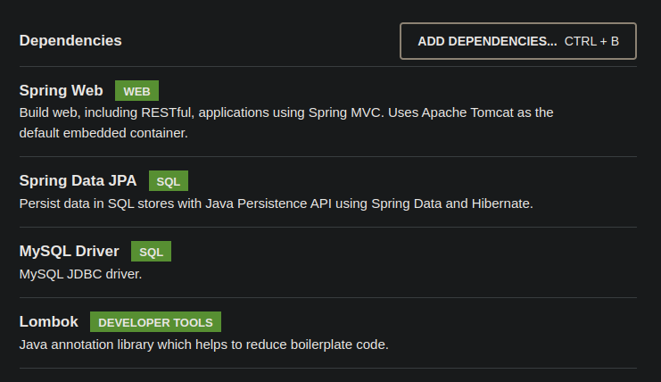
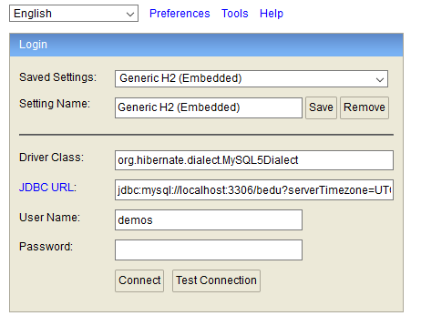
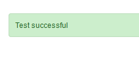
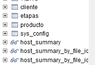

## Ejemplo 03: Uso de la consola embebdida H2 para manejar la base de datos

### OBJETIVO
- Usar la consola integrada con la base de datos embebida H2 para conectarnos a la instancia de MySQL.
- Proporcionar un mecanismo sencillo para poder adminsitrar la información de la base de datos sin herramientas externas.

#### REQUISITOS
- Tener instalado el IDE IntelliJ Idea Community Edition con el plugin de Lombok activado.
- Tener instalada la última versión del JDK 11 o 17.
- Tener instalada la base de datos MySQL y los datos del usuario para conectarse


### DESARROLLO

1. Entra al sitio de <a href="https://start.spring.io/" target="_blank">Spring Initializr</a>. Ahí verás una sola página dividida en dos secciones. Comienza llenando la información de la sección del lado izquierdo. Selecciona:

2. En la ventana que se abre selecciona las siguientes opciones:
    - Grupo, artefacto y nombre del proyecto.
    - Tipo de proyecto: **Maven Project**.
    - Lenguaje: **Java**.
    - Forma de empaquetar la aplicación: **jar**.
    - Versión de Java: **11** o **17**.

3. En la sección de la derecha (las dependencias) presiona el botón `Add dependencies` y en la ventana que se abre busca las dependencias `Spring Web`, `Lombok`, `Spring Data JPA` y `MySQL Driver`.

    

4. Dale un nombre y una ubicación al proyecto y presiona el botón *Generate*.

5. En el proyecto que se acaba de crear debes tener el siguiente paquete `org.bedu.java.backend.sesion6.ejemplo3`. Dentro crea los subpaquetes: `model` y `persistence`.

6. Dentro del paquete `model` crea una clase llamada `Etapa` con los siguientes atributos:

    ```java
    private Long etapaId;
    private String nombre;
    private Integer orden;
    ```

7. Decora la clase con la anotación `@Data` de *Lombok*:

    ```java
    @Data
    public class Etapa {

    }
    ```

8. Decora también la clase con las siguientes anotaciones de JPA:

    ```java
    @Entity
    @Table(name = "ETAPAS")
    public class Etapa {

    }
    ```

9. Decora los atributos con las siguientes de JPA:

    ```java
    @Id
    @GeneratedValue(strategy = GenerationType.IDENTITY)
    private Long etapaId;

    @Column(nullable = false, length = 100)
    private String nombre;

    @Column(nullable = false, unique = true)
    private Integer orden;
    ```

10. En el paquete `persistence` crea una **interface** llamada `EtapaRepository` que extienda de `JpaRepository`. Esta interface permanecerá sin métodos:

    ```java
    public interface EtapaRepository extends JpaRepository<Etapa, Long> {

    }
    ```

11. Coloca el siguiente contenido en el archivo `application.properties` (los valores entre los signos `<` y `>` reemplazalos con tus propios valores):

    ```groovy
    spring.jpa.hibernate.ddl-auto=update
    spring.jpa.hibernate.generate_statistics=true
    spring.jpa.properties.hibernate.dialect=org.hibernate.dialect.MySQL5Dialect
    spring.datasource.driver-class-name=com.mysql.cj.jdbc.Driver
    spring.datasource.url=jdbc:mysql://localhost:3306/bedu?serverTimezone=UTC
    spring.datasource.username=<usuario>
    spring.datasource.password=<password>
    ```

12. Agrega la dependencia de H2 en el archivo `pom.xml`:

    ```xml
    <dependency>
        <groupId>com.h2database</groupId>
        <artifactId>h2</artifactId>
        <scope>runtime</scope>
    </dependency>
    ```

13. Ejecuta la aplicación e ingresa a la siguiente dirección en tu navegador:

    http://localhost:8080/h2-console/

    debes ver una venta como la siguiente:

    

14. Cambia la información del *Driver Class*, *JDBC URL*, *User Name* y *Password* a los valores correspondientes a MySQL (los que tienes en el archivo `application.properties`.

    - Driver Class: **org.hibernate.dialect.MySQL5Dialect**
    - JDBC URL: **jdbc:mysql://localhost:3306/bedu?serverTimezone=UTC**

15. Presiona el botón *Test Connection*, debe aparecer un mensaje indicando que la prueba es exitosa (y el password debe haber desaparecido).

    


16. Vuelve a colocar el password y presiona el botón *Connect* debes entrar a la consola de H2. Esta consla muestra muchas tablas. Las de tu aplicación serán las últimas:

    

17. Escribe una consulta en la consola; la información aparcera en el panel de respuestas.


<br>

[**`Siguiente`** -> postwork](../Postwork/)