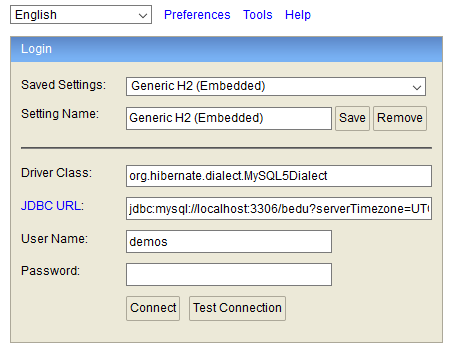
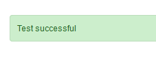
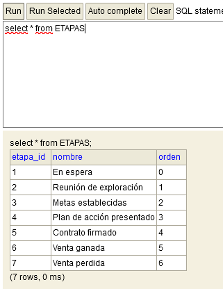

## Postwork Sesión 6

### OBJETIVO
- Declarar entidades y almacenarlas en una base de datos relacional.
- Crear un repositorio de Spring Data y para guardar y recuperar entidades.
- Usar la consola de H2 para visualizar la información de la base de datos.


### DESARROLLO

El postwork se realizará en equipo, los cuales serán formados previamente a la sesión uno.

El propósito de este Postwork es retomar el proyecto del módulo anterior y realizar las modificaciones descritas a continuación. 

1. Agrega el driver de MySQL como dependencia del proyecto.

2. Agrega las propiedades para realizar la conexión a la base de datos en el archivo `application.properties` del proyecto. 

3. Añade un nuevo paquete llamado entities, dentro del paquete persistence.

4. Crea una copia de los objetos contenidos en el paquete model pero coloca las anotaciones de JPA en lugar de las validaciones.

5. Crea un repositorio para cada una de las entidades (recuerda que debe ser una interface que extienda de `JpaRepository`).

6. Agrega la dependencia de H2 a la aplicación y asegúrate de que puedes conectarte a esta.

    

7. Agrega una clase que implemente la interface `CommandLineRunner` de Spring para inicializar los catálogos de la aplicación.

    

    


<br>

<details>
	<summary>Solución</summary>

1. Agrega el driver de MySQL como dependencia del proyecto.

    ```xml
    <dependency>
        <groupId>mysql</groupId>
        <artifactId>mysql-connector-java</artifactId>
        <scope>runtime</scope>
    </dependency>
    ```

2. Agrega las propiedades para realizar la conexión a la base de datos en el archivo `application.properties` del proyecto. 

    ```java
    spring.jpa.hibernate.ddl-auto=update
    spring.jpa.hibernate.generate_statistics=true
    spring.jpa.properties.hibernate.dialect=org.hibernate.dialect.MySQL5Dialect
    spring.datasource.driver-class-name=com.mysql.cj.jdbc.Driver
    spring.datasource.url=jdbc:mysql://localhost:3306/bedu?serverTimezone=UTC
    spring.datasource.username=demos
    spring.datasource.password=
    ```

3. Añade un nuevo paquete llamado entities, dentro del paquete persistence.

4. Crea una copia de los objetos contenidos en el paquete model pero coloca las anotaciones de JPA en lugar de las validaciones.

    ```java
    @Data
    @Table(name = "CLIENTES")
    @Entity
    @NoArgsConstructor
    public class Cliente {
        @Id
        @GeneratedValue(strategy = GenerationType.IDENTITY)
        private Long id;

        private String nombre;

        @Column(name = "correo_contacto", nullable = false)
        private String correoContacto;

        @Column(name = "numero_empleados")
        private String numeroEmpleados;

        private String direccion;
    }
    ```

    ```java
    @Data
    @Table(name = "ETAPAS")
    @Entity
    @NoArgsConstructor
    public class Etapa {
        @Id
        @GeneratedValue(strategy = GenerationType.IDENTITY)
        private Long etapaId;

        private String nombre;

        @Column(unique = true, nullable = false)
        private Integer orden;
    }
    ```

    ```java
    @Data
    @Table(name = "PRODUCTOS")
    @Entity
    @NoArgsConstructor
    public class Producto {
        @Id
        @GeneratedValue(strategy = GenerationType.IDENTITY)
        private Long id;

        private String nombre;

        private String categoria;

        private float precio;

        @Column(name = "numero_registro", length = 20)
        private String numeroRegistro;

        @Column(name = "fecha_creacion")
        private LocalDate fechaCreacion;
    }
    ```

    ```java
    @Data
    @Table(name = "VENTAS")
    @Entity
    @NoArgsConstructor
    public class Venta {
        @Id
        @GeneratedValue(strategy = GenerationType.IDENTITY)
        private long ventaId;

        private float monto;

        @OneToMany
        private List<Producto> productos;

        @ManyToOne
        private Cliente cliente;

        @Column(nullable = false)
        private LocalDateTime fechaCreacion;
    }
    ```

    ```java
    @Data
    @Table(name = "VISITAS")
    @Entity
    @NoArgsConstructor
    public class Visita {
        @Id
        @GeneratedValue(strategy = GenerationType.IDENTITY)
        private long id;

        @ManyToOne
        private Cliente cliente;

        @Column(nullable = false)
        private LocalDateTime fechaProgramada;

        @Column(nullable = false)
        private String direccion;

        @Column(nullable = false)
        private String proposito;

        @Column(nullable = false)
        private String vendedor;
    }
    ```

5. Crea un repositorio para cada una de las entidades (recuerda que debe ser una interface que extienda de `JpaRepository`).

    ```java
    public interface ClienteRepository extends JpaRepository<Cliente, Long> {
    }
    ```

    ```java
    public interface EtapaRepository extends JpaRepository<Etapa, Long> {
    }
    ```

    ```java
    public interface ProductoRepository extends JpaRepository<Producto, Long> {
    }
    ```

    ```java
    public interface VentaRepository extends JpaRepository<Venta, Long> {
    }
    ```

    ```java
    public interface VisitaRepository extends JpaRepository<Visita, Long> {
    }
    ```

6. Completa los mappers:

    ```java
    @Mapper(componentModel = "spring")
    public interface ClienteMapper {
        Cliente clienteModelToClienteEntity(org.bedu.java.backend.crm.model.Cliente clienteModel);

        org.bedu.java.backend.crm.model.Cliente clienteEntityToClienteModel(Cliente cliente);
    }
    ```

    ```java
    @Mapper(componentModel = "spring")
    public interface EtapaMapper {
        Etapa etapaModelToEtapaEntity(org.bedu.java.backend.crm.model.Etapa etapaModel);

        org.bedu.java.backend.crm.model.Etapa etapaEntityToEtapaModel(Etapa etapa);
    }
    ```

    ```java
    @Mapper(componentModel = "spring")
    public interface ProductoMapper {
        Producto productoModelToProductoEntity(org.bedu.java.backend.crm.model.Producto productoModel);

        org.bedu.java.backend.crm.model.Producto productoEntityToProductoModel(Producto producto);
    }
    ```

    ```java
    @Mapper(componentModel = "spring")
    public interface VentaMapper {
        Venta ventaModelToVentaEntity(org.bedu.java.backend.crm.model.Venta ventaModel);

        org.bedu.java.backend.crm.model.Venta ventaEntityToVentaModel(Venta venta);
    }
    ```

    ```java
    @Mapper(componentModel = "spring")
    public interface VisitaMapper {
        Visita visitaModelToVisitaEntity(org.bedu.java.backend.crm.model.Visita visitaModel);

        org.bedu.java.backend.crm.model.Visita visitaEntityToVisitaModel(Visita visita);
    }
    ```

6. Agrega la dependencia de H2 a la aplicación y asegúrate de que puedes conectarte a esta.

    

    ```xml
    <dependency>
        <groupId>com.h2database</groupId>
        <artifactId>h2</artifactId>
        <scope>runtime</scope>
    </dependency>
    ```

7. Agrega una clase que implemente la interface `CommandLineRunner` de Spring para inicializar los catálogos de la aplicación.

    

    

</details>

<br>

[**`Siguiente`** -> sesión 7](../../Sesion-07/)

[**`Regresar`**](../)