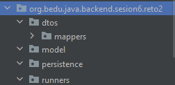
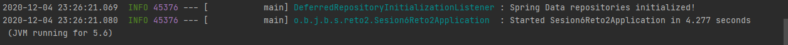
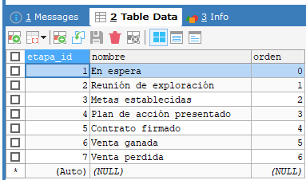

## Reto 02: Inicialización de base de datos con CommandLineRunner, Lombok y MapStruct

### OBJETIVO
- Obtener información almacenada en la base de datos.
- Hacer uso de las anotaciones básicas de JPA para indicar qué objeto debe ser tratado como una entidad de base de datos.
- Aprender qué es un repositorio y los métodos por default que ofrece.
- Aprender a usar el método `Mappers.getMapper` cuando trabajamos con `CommandLineRunner`.

#### REQUISITOS
- Tener instalado el IDE IntelliJ Idea Community Edition con el plugin de Lombok activado.
- Tener instalada la última versión del JDK 11 o 17.
- Tener instalada la herramienta Postman.
- Tener instalada la base de datos MySQL y los datos del usuario para conectarse


### DESARROLLO
- Crea un nuevo proyecto usando Spring Initilizr y agrega las dependencias de **Spring Web**, **Lombok**, **Spring Data JPA** y **MySQL Driver**.
- Crea la siguiente estructura de paquetes:

    

- Crea una clase `Etapa` y coloca las anotaciones correspondientes de *Lombok* y *JPA*.
- Crea una clase `EtapaDto` y coloca las anotaciones correspondientes de **Lombok**.
- Crea una interface `EtapaMapper` y decórala con `@Mapper(componentModel = "spring")`.
- Crea una clase `EtapaRepository` que extienda de `JpaRepository`.
- Crea una clase que implemente `CommandLineRunner` y almacena las mismas etapas que en el ejemplo anterior, pero usando los elementos creados en los puntos antiores. Al final debes construir una `EtapaDto` usando un método `builder`, convertirlo a un `Etapa` usando un mapper de MapStruct y guardarlo en base de datos.

<details>
	<summary>Solución</summary>

1. Entra al sitio de <a href="https://start.spring.io/" target="_blank">Spring Initializr</a>. Ahí verás una sola página dividida en dos secciones. Comienza llenando la información de la sección del lado izquierdo. Selecciona:

2. En la ventana que se abre selecciona las siguientes opciones:
    - Grupo, artefacto y nombre del proyecto.
    - Tipo de proyecto: **Maven Project**.
    - Lenguaje: **Java**.
    - Forma de empaquetar la aplicación: **jar**.
    - Versión de Java: **11** o **17**.

3. En la sección de la derecha (las dependencias) presiona el botón `Add dependencies` y en la ventana que se abre busca las dependencias `Spring Web`, `Lombok`, `Spring Data JPA` y `MySQL Driver`.

4. Dale un nombre y una ubicación al proyecto y presiona el botón *Generate*.

5. En el proyecto que se acaba de crear debes tener el siguiente paquete `org.bedu.java.backend.sesion6.reto2`. Dentro crea los subpaquetes mencionados en las instucciones.

6. Agrega al proyecto, en el archivo `pom.xml` las dependencias de MapStruct (las de Lombok se agregaron al momento de crear el proyecto):

    ```xml
    <properties>
        <java.version>11</java.version>
        <org.mapstruct.version>1.4.1.Final</org.mapstruct.version>
    </properties>


    <dependencies>
            <dependency>
                <groupId>org.mapstruct</groupId>
                <artifactId>mapstruct</artifactId>
                <version>${org.mapstruct.version}</version>
            </dependency>
            <dependency>
                <groupId>org.mapstruct</groupId>
                <artifactId>mapstruct-processor</artifactId>
                <version>${org.mapstruct.version}</version>
                <optional>true</optional>
            </dependency>
    </dependencies>
    ```

7. Agrega el plugin de Maven para MapStruct, el cual se encargará de generar el código para realizar el mapeo correspondiente.

    ```xml
    <build>
            <plugins>
                <plugin>
                    <groupId>org.apache.maven.plugins</groupId>
                    <artifactId>maven-compiler-plugin</artifactId>
                    <version>3.8.1</version>
                    <configuration>
                        <source>${java.version}</source>
                        <target>${java.version}</target>
                        <annotationProcessorPaths>
                            <path>
                                <groupId>org.mapstruct</groupId>
                                <artifactId>mapstruct-processor</artifactId>
                                <version>${org.mapstruct.version}</version>
                            </path>
                            <path>
                                <groupId>org.projectlombok</groupId>
                                <artifactId>lombok</artifactId>
                                <version>1.18.16</version>
                            </path>
                            <path>
                                <groupId>org.projectlombok</groupId>
                                <artifactId>lombok-mapstruct-binding</artifactId>
                                <version>0.1.0</version>
                            </path>
                        </annotationProcessorPaths>
                    </configuration>
                </plugin>
            </plugins>
        </build>
    ```

8. Dentro del paquete `model` crea una clase llamada `Etapa` con los siguientes atributos:

    ```java
        private Long etapaId;
        private String nombre;
        private Integer orden;
    ```

9. Decora la clase con la anotación `@Data` de *Lombok*:

    ```java
    @Data
    public class Etapa {

    }
    ```

10. Decora también la clase con las siguientes anotaciones de JPA:

    ```java
    @Data
    @Entity
    @Table(name = "ETAPAS")
    public class Etapa {

    }
    ```

11. Decora los atributos con las siguientes de JPA:

    ```java
    @Id
    @GeneratedValue(strategy = GenerationType.IDENTITY)
    private Long etapaId;

    @Column(nullable = false, length = 100)
    private String nombre;

    @Column(nullable = false, unique = true)
    private Integer orden;
    ```

12. En el paquete `dtos` crea una clase `EtapaDto` con los siguientes atributos:

    ```java
    private Long etapaId;
    private String nombre;
    private Integer orden;
    ```

13. Decora esta clase con las anotaciones `@Builder`y `@Data` de *Lombok*.

    ```java
    @Builder
    @Data
    public class EtapaDto {
        private Long etapaId;
        private String nombre;
        private Integer orden;
    }
    ```

14. En el paquete `persistence` crea una **interface** llamada `EtapaRepository` que extienda de `JpaRepository`. Esta interface permanecerá sin métodos:

    ```java
    public interface EtapaRepository extends JpaRepository<Etapa, Long> {

    }
    ```

15. Coloca el siguiente contenido en el archivo `application.properties` (los valores entre los signos `<` y `>` reemplazalos con tus propios valores):

    ```groovy
    spring.jpa.hibernate.ddl-auto=update
    spring.jpa.hibernate.generate_statistics=true
    spring.jpa.properties.hibernate.dialect=org.hibernate.dialect.MySQL5Dialect
    spring.datasource.driver-class-name=com.mysql.cj.jdbc.Driver
    spring.datasource.url=jdbc:mysql://localhost:3306/bedu?serverTimezone=UTC
    spring.datasource.username=<usuario>
    spring.datasource.password=<password>
    ```

16. En el paquete `mappers` crea una interface `EtapaMapper` y decórala con la anotación `@Mapper` de MapStruct:

    ```java
    @Mapper(componentModel = "spring")
    public interface EtapaMapper {

    }
    ```

17. Agrega los métodos para convertir de `EtapaDto` a `Etapa` y viceversa:

    ```java
    @Mapper(componentModel = "spring")
    public interface EtapaMapper {
        Etapa etapaDtoToEtapa(EtapaDto etapaDto);

        EtapaDto etapatoEtapaDto(Etapa etapa);
    }
    ```

18. En el paquete `runners` crea una nueva clase llamada `EtapasVentaRunner` que implemente la interface `CommandLineRunner`. Decora esta clase con la anotación `@Component` de Spring.

    ```java
    @Component
    public class EtapasVentaRunner implements CommandLineRunner {

        @Override
        public void run(String... args) throws Exception {
        
        }
    }
    ```

19. Declara un atributo final de tipo `EtapaRepository` y decora la clase con `@RequiredArgsConstructor`:

    ```java
    @RequiredArgsConstructor
    @Component
    public class EtapasVentaRunner implements CommandLineRunner {

        private final EtapaRepository etapaRepository;

        @Override
        public void run(String... args) throws Exception {
        
        }
    }
    ```

20. Declara un atributo de tipo `EtapaMapper` y usa el método `Mappers.getMapper` para obtener el Mapper correspondiente (esto sólo debes hacerlo dentro de un `CommandLineRunner`):

    ```java
    private EtapaMapper etapaMapper = Mappers.getMapper(EtapaMapper.class);
    ```

21. Dentro del método `run` crea un grupo de objetos de tipo `Etapa` y guárdalos en la base de datos usando la instancia de `etapaRepository`.

    ```java
    @RequiredArgsConstructor
    @Component
    public class EtapasVentaRunner implements CommandLineRunner {

        private final EtapaRepository etapaRepository;
        private EtapaMapper etapaMapper = Mappers.getMapper(EtapaMapper.class);

        @Override
        public void run(String... args) throws Exception {
            Etapa etapa1 = etapaMapper.etapaDtoToEtapa(EtapaDto.builder().nombre("En espera").orden(0).build());
            Etapa etapa2 = etapaMapper.etapaDtoToEtapa(EtapaDto.builder().nombre("Reunión de exploración").orden(1).build());
            Etapa etapa3 = etapaMapper.etapaDtoToEtapa(EtapaDto.builder().nombre("Metas establecidas").orden(2).build());
            Etapa etapa4 = etapaMapper.etapaDtoToEtapa(EtapaDto.builder().nombre("Plan de acción presentado").orden(3).build());
            Etapa etapa5 = etapaMapper.etapaDtoToEtapa(EtapaDto.builder().nombre("Contrato firmado").orden(4).build());
            Etapa etapa6 = etapaMapper.etapaDtoToEtapa(EtapaDto.builder().nombre("Venta ganada").orden(5).build());
            Etapa etapa7 = etapaMapper.etapaDtoToEtapa(EtapaDto.builder().nombre("Venta perdida").orden(6).build());

            List<Etapa> etapas = Arrays.asList(etapa1, etapa2, etapa3, etapa4, etapa5, etapa6, etapa7);

            etapaRepository.saveAll(etapas);
        }
    }
    ```

14. Ejecuta la aplicación. No debería haber ningún error en la consola y la aplicación debe iniciar de forma correcta.
    

15. La base de datos debe estar inicializada con las Etapas:

    

</details>

<br>

[**`Siguiente`** -> ejemplo 03](../Ejemplo-03/)