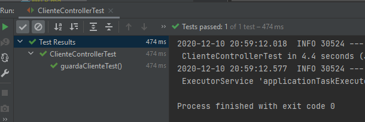

## Ejemplo 02: Pruebas unitarias de controladores con MockMvc

### OBJETIVO

- Crear una prueba unitaria que valide el funcionamiento de los controladores.
- Simular el comportamiento de los objetos en la capa de servicios de la aplicación (lógica de negocio) usando objetos mock.

#### REQUISITOS
- Tener instalado el IDE IntelliJ Idea Community Edition con el plugin de Lombok activado.
- Tener instalada la última versión del JDK 11 o 17.


### DESARROLLO

1. Entra al sitio de <a href="https://start.spring.io/" target="_blank">Spring Initializr</a>. Ahí verás una sola página dividida en dos secciones. Comienza llenando la información de la sección del lado izquierdo. Selecciona:

2. En la ventana que se abre selecciona las siguientes opciones:
    - Grupo, artefacto y nombre del proyecto.
    - Tipo de proyecto: **Maven Project**.
    - Lenguaje: **Java**.
    - Forma de empaquetar la aplicación: **jar**.
    - Versión de Java: **11** o **17**.

3. En la sección de la derecha (las dependencias) presiona el botón `Add dependencies` y en la ventana que se abre busca la dependencia `Spring Web` y `Lombok`.

4. Dale un nombre y una ubicación al proyecto y presiona el botón *Generate*.

5. En el proyecto que se acaba de crear debes tener el siguiente paquete `org.bedu.java.backend.sesion7.ejemplo2`. Dentro crea los subpaquetes: `controllers`, `model`, y `services`.

6. Dentro del paquete `model` crea una clase `Cliente` con los siguientes atributos, y las anotaciones `@Data` y `@Builder`:
    ```java
    @Data
    @Builder
    public class Cliente {
        private Long id;
        private String nombre;
        private String correoContacto;
        private int numeroEmpleados;
        private String direccion;
    }
    ```
7. En el paquete `services` crea una interface llamada `ClienteService`. Como no nos interesa implementar esta interface en este momento, la simularemos para realizar las pruebas unitarias.

    ```java
    public class ClienteService {
    }
    ```

8. Coloca dos métodos dentro de esta clase, uno para guardar a un `Cliente` y otro para recuperarlo por su id:
    ```java
    public interface ClienteService {
        Cliente guardaCliente(Cliente cliente);

        Optional<Cliente> obtenCliente(Long clienteId);
    }
    ```

9. En el paquete `controllers` agrega una clase `ClienteController` y decórala con `@RestController`. Esta clase será el punto de entrada de las peticiones y delegará sus funcionalidades a `ClienteService`:
    
    ```java
    @RestController
    @RequestMapping("/cliente")
    @RequiredArgsConstructor
    public class ClienteController {

        private final ClienteService clienteService;

        @PostMapping
        public ResponseEntity<Void> creaCliente(@RequestBody Cliente cliente) {

            Cliente clienteNuevo = clienteService.guardaCliente(cliente);

            return ResponseEntity.created(URI.create(String.valueOf(clienteNuevo.getId()))).build();
        }

        @GetMapping("/{clienteId}")
        public ResponseEntity<Cliente> getCliente(@PathVariable Long clienteId) {

            Optional<Cliente> clienteDb = clienteService.obtenCliente(clienteId);
            if (clienteDb.isEmpty()) {
                throw new ResponseStatusException(HttpStatus.NOT_FOUND, "El cliente especificado no existe.");
            }

            return ResponseEntity.ok(clienteDb.get());
        }
    }
    ```

10. En el directorio de pruebas de Maven agrega una nueva clase llamada `ClienteControllerTest`.

11. Decora la nueva clase con la anotación `@WebMvcTest(ClienteController.class)`
    ```java
    @WebMvcTest(ClienteController.class)
    class ClienteControllerTest {

    }
    ```

12. Agrega una instancia de tipo `MockMvc` y decórala con la anotación `@Autowired`:

    ```java
    @Autowired
    private MockMvc mockMvc;
    ```

13. Agrega una instancia de tipo `ClienteService` y decórala con la anotación `@MockBean`:

    ```java
    @MockBean
    private ClienteService clienteService;
    ```

14. Crea un método llamado `obtenClienteTest`y decóralo con la anotación `@Test`:

    ```java
    @Test
    public void obtenClienteTest() throws Exception {
        
    }
    ```

15. Dentro de este método indica el comportamiento que tendrá el objeto mock `clienteService` al invocar a su método `obtenCliente`. En este caso debe regresar un objeto de tipo `Optional<Cliente>`:
    ```java
    given(clienteService.obtenCliente(anyLong())).willReturn(Optional.of(Cliente.builder().id(1L).nombre("Nombre").correoContacto("cliente@contacto.com").build()));
    ```

16. Por último, usa el método `perform` de la instancia de `mockMvc` para simular una petición **GET**. Valida que los resutados regrsados son igual a los esperados.
    ```java
    mockMvc.perform(get("/cliente/1")
            .content(MediaType.APPLICATION_JSON_VALUE))
            .andExpect(status().isOk())
            .andExpect(content().contentTypeCompatibleWith(MediaType.APPLICATION_JSON))
            .andExpect(jsonPath("$.id", is(1)))
            .andExpect(jsonPath("$.correoContacto", is("cliente@contacto.com")))
            .andExpect(jsonPath("$.nombre", is("Nombre")));
    ```

El método completo queda de la siguiente forma:

    ```java
    @Test
    void obtenClienteTest() throws Exception {

        given(clienteService.obtenCliente(anyLong())).willReturn(Optional.of(Cliente.builder().id(1L).nombre("Nombre").correoContacto("cliente@contacto.com").build()));

        mockMvc.perform(get("/cliente/1")
                .content(MediaType.APPLICATION_JSON_VALUE))
                .andExpect(status().isOk())
                .andExpect(content().contentTypeCompatibleWith(MediaType.APPLICATION_JSON))
                .andExpect(jsonPath("$.id", is(1)))
                .andExpect(jsonPath("$.correoContacto", is("cliente@contacto.com")))
                .andExpect(jsonPath("$.nombre", is("Nombre")));
    }
    ```

17. Ejecuta la prueba. Debes ver el siguiente resultado en la consola de IntelliJ:

    


<br>

[**`Siguiente`** -> reto 02](../Reto-02/)