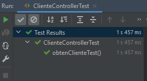

## Ejemplo 03: Pruebas integrales con TestRestTemplate

### OBJETIVO

- Crear una prueba integral que valide el funcionamiento de todos los componentes de un módulo.

#### REQUISITOS
- Tener instalado el IDE IntelliJ Idea Community Edition con el plugin de Lombok activado.
- Tener instalada la última versión del JDK 11 o 17.


### DESARROLLO

1. Entra al sitio de <a href="https://start.spring.io/" target="_blank">Spring Initializr</a>. Ahí verás una sola página dividida en dos secciones. Comienza llenando la información de la sección del lado izquierdo. Selecciona:

2. En la ventana que se abre selecciona las siguientes opciones:
    - Grupo, artefacto y nombre del proyecto.
    - Tipo de proyecto: **Maven Project**.
    - Lenguaje: **Java**.
    - Forma de empaquetar la aplicación: **jar**.
    - Versión de Java: **11** o **17**.

3. En la sección de la derecha (las dependencias) presiona el botón `Add dependencies` y en la ventana que se abre busca la dependencia `Spring Web` y `Lombok`.

4. Dale un nombre y una ubicación al proyecto y presiona el botón *Generate*.

5. En el proyecto que se acaba de crear debes tener el siguiente paquete `org.bedu.java.backend.sesion7.ejemplo3`. Dentro crea los subpaquetes: `controllers`, `model`, `persistence` y `services`.

6. Dentro del paquete `model` crea una clase `Cliente` con los siguientes atributos, y las anotaciones `@Data` y `@Builder`:
    ```java
    @Data
    @Builder
    public class Cliente {
        private Long id;
        private String nombre;
        private String correoContacto;
        private int numeroEmpleados;
        private String direccion;
    }
    ```

7. Dentro del paquete `persistence` crea una clase llamada `ClienteRepository`, decorada con la anotación `@Repository`, y agrega dos métodos, el primero para guardar un Cliente y el segundo para recuperar un cliente por su identificador. Como no queremos complicar mucho el ejemplo, esta funcionalidad será solo simulada de la siguiente forma:
    ```java
    @Repository
    public class ClienteRepository {

        public Cliente save(Cliente cliente) {

            Cliente clienteDb = Cliente.builder()
                    .id(1L)
                    .nombre(cliente.getNombre())
                    .correoContacto(cliente.getCorreoContacto())
                    .direccion(cliente.getDireccion())
                    .numeroEmpleados(cliente.getNumeroEmpleados())
                    .build();

            return clienteDb;
        }

        public Optional<Cliente> findById(Long clienteId) {
            Cliente clienteDb = Cliente.builder()
                    .id(clienteId)
                    .nombre("Nombre del cliente")
                    .correoContacto("correo@cliente.com")
                    .direccion("Direccion del cliente")
                    .numeroEmpleados(20)
                    .build();

            return Optional.of(clienteDb);
        }
    }
    ```

8. En el paquete `services` crea una clase llamada `ClienteService` y decórala con la anotación `@Service` de Spring.

    ```java
    @Service
    public class ClienteService {
    }
    ```

9. Coloca tres métodos dentro de esta clase, uno para guardar a un `Cliente` y otro para recuperarlo por su id. Usa una instancia de `ClienteRepository` para delegarle estas funcionalidades:
    ```java
    @Service
    @RequiredArgsConstructor
    public class ClienteService {

        private final ClienteRepository clienteRepository;

        public Cliente guardaCliente(Cliente cliente) {
            return clienteRepository.save(cliente);
        }

        public Optional<Cliente> obtenCliente(Long clienteId) {
            return clienteRepository.findById(clienteId);
        }
    }
    ```

10. En el paquete `controllers` agrega una clase `ClienteController` y decórala con `@RestController`. Esta clase será el punto de entrada de las peticiones y delegará sus funcionalidades a `ClienteService`:
    ```java
    @RestController
    @RequestMapping("/cliente")
    @RequiredArgsConstructor
    public class ClienteController {

        private final ClienteService clienteService;

        @PostMapping
        public ResponseEntity<Void> creaCliente(@RequestBody Cliente cliente) {

            Cliente clienteNuevo = clienteService.guardaCliente(cliente);

            return ResponseEntity.created(URI.create(String.valueOf(clienteNuevo.getId()))).build();
        }

        @GetMapping("/{clienteId}")
        public ResponseEntity<Cliente> getCliente(@PathVariable Long clienteId) {

            Optional<Cliente> clienteDb = clienteService.obtenCliente(clienteId);
            if (clienteDb.isEmpty()) {
                throw new ResponseStatusException(HttpStatus.NOT_FOUND, "El cliente especificado no existe.");
            }

            return ResponseEntity.ok(clienteDb.get());
        }
    }
    ```

11. En el directorio de pruebas de Maven agrega una nueva clase llamada `ClienteControllerTest`.

12. Decora la nueva clase con la anotación `@SpringBootTest(webEnvironment = SpringBootTest.WebEnvironment.RANDOM_PORT)`
    ```java
    @SpringBootTest(webEnvironment = SpringBootTest.WebEnvironment.RANDOM_PORT)
    class ClienteControllerTest {

    }
    ```

13. Agrega una instancia de tipo `TestRestTemplate` y decórala con la anotación `@Autowired`:

    ```java
    @Autowired
    private TestRestTemplate restTemplate;
    ```


14. Crea un método llamado `obtenClienteTest` y decóralo con la anotación `@Test`:

    ```java
    @Test
    public void obtenClienteTest() throws Exception {
        
    }
    ```

15. Dentro de este método usa el método `getForEntity` de la nstancia de `restTemplate` para hacer una petición a la URL `/cliente/1`, que es manejada por `ClienteController`

    ```java
    ResponseEntity<Cliente> response = restTemplate.getForEntity("/cliente/1", Cliente.class);

        assertThat(response.getStatusCode(), equalTo(HttpStatus.OK));
        assertThat(response.getBody().getId(), equalTo(1L));
    ```

16. Ejecuta la prueba haciendo clic derecho sobre el editor de código y seleccionando la opción `Run ClienteControllerTest` o haciendo clic sobre las dos flechas verdes que aparecen junto al nombre de la clase.

17. Debes ver el siguiente resultado en la consola de IntelliJ:

    


<br>

[**`Siguiente`** -> postwork](../Postwork/)