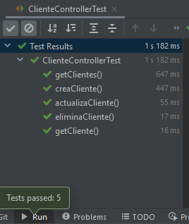

## Postwork Sesión 7

### OBJETIVO
- Integrar JUnit como framework de pruebas unitarias en una aplicación desarrollada con Spring Boot.
- Desarrollar una serie de pruebas unitarias usando los objetos proporcionados por Spring Test para validar el correcto funcionamiento de la aplicación.
- Ejecutar y obtener el resultado de las pruebas unitarias desde el entorno de desarrollo.


### DESARROLLO

En esta sesión se integra JUnit como framework de pruebas unitarias de integración y se desarrollan una serie de pruebas unitarias para validar de forma automática el correcto funcionamiento de la aplicación, sin necesidad de ejecutarla y validarla desde la interface de usuario. 

El postwork se realizará en equipo, los cuales serán formados previamente a la sesión uno.

El propósito de este Postwork es retomar el proyecto del módulo anterior y realizar las modificaciones descritas a continuación. 

1. Termina la implementación de los métodos de negocio, que se encuentran en la capa services de la aplicación, para tener las funcionalidades básicas de guardado, eliminación, bajas y actualizaciones de cada uno de los tipos de entidad.

2. Para el paso anterior será necesario implementar las funcionalidades en todas las capas de la aplicación, desde los controladores hasta los repositorios para el manejo de los datos almacenados.

3. Agrega pruebas unitarias de cada uno de los métodos existentes en los controladores usando el objeto MockMvc de Spring

4. Implementa una serie de pruebas integrales usando el objeto TestRestTemplate proporcionado por Spring. Recuerda que este objeto ejecuta la aplicación, por lo tanto modificará la información existente en tu base de datos.

5. Asegúrate que al final todas las pruebas se ejecuten de forma correcta:


    


<br>

<details>
	<summary>Solución</summary>

1. Termina la implementación de los métodos de negocio, que se encuentran en la capa services de la aplicación, para tener las funcionalidades básicas de guardado, eliminación, bajas y actualizaciones de cada uno de los tipos de entidad.

    ```java
    @Service
    @RequiredArgsConstructor
    public class ClienteService {
        private final ClienteRepository repository;
        private final ClienteMapper mapper;

        public Cliente guardaCliente(Cliente cliente) {
            return mapper.clienteEntityToClienteModel(
                    repository.save(mapper.clienteModelToClienteEntity(cliente))
            );
        }

        public List<Cliente> obtenClientes(){
            return repository.findAll().stream().map(cliente -> mapper.clienteEntityToClienteModel(cliente)).collect(Collectors.toList());
        }

        public Optional<Cliente> obtenCliente(long idCliente) {
            return repository.findById(idCliente)
                    .map(cliente -> Optional.of(mapper.clienteEntityToClienteModel(cliente)))
                    .orElse(Optional.empty());
        }

        public void eliminaCliente(long idcliente){
            repository.deleteById(idcliente);
        }

        public Cliente actualizaCliente(Cliente cliente){
            return mapper.clienteEntityToClienteModel(
                    repository.save(mapper.clienteModelToClienteEntity(cliente))
            );
        }

        public long cuenteClientes(){
            return repository.count();
        }
    }
    ```

    ```java
    @Service
    @RequiredArgsConstructor
    public class EtapaService {
        private final EtapaRepository repository;
        private final EtapaMapper mapper;

        public Etapa guardaEtapa(Etapa etapa) {
            return mapper.etapaEntityToEtapaModel(
                    repository.save(mapper.etapaModelToEtapaEntity(etapa))
            );
        }

        public List<Etapa> obtenEtapas(){
            return repository.findAll().stream().map(etapa -> mapper.etapaEntityToEtapaModel(etapa)).collect(Collectors.toList());
        }

        public Optional<Etapa> obtenEtapa(long idEtapa) {
            return repository.findById(idEtapa)
                    .map(Etapa -> Optional.of(mapper.etapaEntityToEtapaModel(Etapa)))
                    .orElse(Optional.empty());
        }

        public void eliminaEtapa(long idEtapa){
            repository.deleteById(idEtapa);
        }

        public Etapa actualizaEtapa(Etapa etapa){
            return mapper.etapaEntityToEtapaModel(
                    repository.save(mapper.etapaModelToEtapaEntity(etapa))
            );
        }

        public long cuenteEtapas(){
            return repository.count();
        }
    }
    ```

    ```java
    @Service
    @RequiredArgsConstructor
    public class ProductoService {
        private final ProductoRepository repository;
        private final ProductoMapper mapper;

        public Producto guardaProducto(Producto producto) {
            return mapper.productoEntityToProductoModel(
                    repository.save(mapper.productoModelToProductoEntity(producto))
            );
        }

        public List<Producto> obtenProductos(){
            return repository.findAll().stream().map(Producto -> mapper.productoEntityToProductoModel(Producto)).collect(Collectors.toList());
        }

        public Optional<Producto> obtenProducto(long idProducto) {
            return repository.findById(idProducto)
                    .map(producto -> Optional.of(mapper.productoEntityToProductoModel(producto)))
                    .orElse(Optional.empty());
        }

        public void eliminaProducto(long idProducto){
            repository.deleteById(idProducto);
        }

        public Producto actualizaProducto(Producto producto){
            return mapper.productoEntityToProductoModel(
                    repository.save(mapper.productoModelToProductoEntity(producto))
            );
        }

        public long cuenteProductos(){
            return repository.count();
        }
    }
    ```

    ```java
    @Service
    @RequiredArgsConstructor
    public class VentaService {
        private final VentaRepository repository;
        private final VentaMapper mapper;

        public Venta guardaVenta(Venta Venta) {
            return mapper.ventaEntityToVentaModel(
                    repository.save(mapper.ventaModelToVentaEntity(Venta))
            );
        }

        public List<Venta> obtenVentas(){
            return repository.findAll().stream().map(venta -> mapper.ventaEntityToVentaModel(venta)).collect(Collectors.toList());
        }

        public Optional<Venta> obtenVenta(long idVenta) {
            return repository.findById(idVenta)
                    .map(venta -> Optional.of(mapper.ventaEntityToVentaModel(venta)))
                    .orElse(Optional.empty());
        }

        public void eliminaVenta(long idVenta){
            repository.deleteById(idVenta);
        }

        public Venta actualizaVenta(Venta venta){
            return mapper.ventaEntityToVentaModel(
                    repository.save(mapper.ventaModelToVentaEntity(venta))
            );
        }

        public long cuenteVentas(){
            return repository.count();
        }
    }
    ```

    ```java
    @Service
    @RequiredArgsConstructor
    public class VisitaService {
        private final VisitaRepository repository;
        private final VisitaMapper mapper;

        public Visita guardaVisita(Visita visita) {
            return mapper.visitaEntityToVisitaModel(
                    repository.save(mapper.visitaModelToVisitaEntity(visita))
            );
        }

        public List<Visita> obtenVisitas(){
            return repository.findAll().stream().map(visita -> mapper.visitaEntityToVisitaModel(visita)).collect(Collectors.toList());
        }

        public Optional<Visita> obtenVisita(long idVisita) {
            return repository.findById(idVisita)
                    .map(Visita -> Optional.of(mapper.visitaEntityToVisitaModel(Visita)))
                    .orElse(Optional.empty());
        }

        public void eliminaVisita(long idVisita){
            repository.deleteById(idVisita);
        }

        public Visita actualizaVisita(Visita visita){
            return mapper.visitaEntityToVisitaModel(
                    repository.save(mapper.visitaModelToVisitaEntity(visita))
            );
        }

        public long cuenteVisitas(){
            return repository.count();
        }
    }
    ```

2. Para el paso anterior será necesario implementar las funcionalidades en todas las capas de la aplicación, desde los controladores hasta los repositorios para el manejo de los datos almacenados.

    A continuación te dejamos como quedaría *ClienteController*:

    ```java
    @RestController
    @RequestMapping("/cliente")
    @RequiredArgsConstructor
    public class ClienteController {

        private final ClienteService clienteService;

        @GetMapping("/{clienteId}")
        public ResponseEntity<Cliente> getCliente(@PathVariable Long clienteId) {

            Optional<Cliente> clienteDb = clienteService.obtenCliente(clienteId);

            if (clienteDb.isEmpty()) {
                throw new ResponseStatusException(HttpStatus.NOT_FOUND, "El cliente especificado no existe.");
            }

            return ResponseEntity.ok(clienteDb.get());
        }

        @GetMapping
        public ResponseEntity<List<Cliente>> getClientes() {
            return ResponseEntity.ok(clienteService.obtenClientes());
        }

        @PostMapping
        public ResponseEntity<Void> creaCliente(@Valid @RequestBody Cliente cliente) {
            Cliente clienteNuevo = clienteService.guardaCliente(cliente);

            return ResponseEntity.created(URI.create(String.valueOf(clienteNuevo.getId()))).build();
        }

        @PutMapping("/{clienteId}")
        public ResponseEntity<Void> actualizaCliente(@PathVariable Long clienteId, @RequestBody @Valid Cliente cliente) {

            clienteService.actualizaCliente(cliente);

            return ResponseEntity.status(HttpStatus.NO_CONTENT).build();
        }

        @DeleteMapping("/{clienteId}")
        public ResponseEntity<Void> eliminaCliente(@PathVariable Long clienteId) {
            clienteService.eliminaCliente(clienteId);
            return ResponseEntity.status(HttpStatus.NO_CONTENT).build();
        }
    }
    ```

3. Agrega pruebas unitarias de cada uno de los métodos existentes en los controladores usando el objeto MockMvc de Spring

    ```java
    @WebMvcTest(ClienteController.class)
    class ClienteControllerTest {

        @Autowired
        private MockMvc mockMvc;

        @MockBean
        private ClienteService clienteService;

        @Test
        void getCliente() throws Exception {
            given(clienteService.obtenCliente(anyLong())).willReturn(Optional.of(Cliente.builder().id(1L).nombre("Nombre").correoContacto("cliente@contacto.com").build()));

            mockMvc.perform(get("/cliente/1")
                    .content(MediaType.APPLICATION_JSON_VALUE))
                    .andExpect(status().isOk())
                    .andExpect(content().contentTypeCompatibleWith(MediaType.APPLICATION_JSON))
                    .andExpect(jsonPath("$.id", is(1)))
                    .andExpect(jsonPath("$.correoContacto", is("cliente@contacto.com")))
                    .andExpect(jsonPath("$.nombre", is("Nombre")));
        }

        @Test
        void getClientes() throws Exception {

            List<Cliente> clientes = Arrays.asList(
                    Cliente.builder().id(1L).nombre("Nombre 1").direccion("Direccion 1").numeroEmpleados(10).correoContacto("contacto@cliente1.com").build(),
                    Cliente.builder().id(2L).nombre("Nombre 2").direccion("Direccion 2").numeroEmpleados(10).correoContacto("contacto@cliente2.com").build(),
                    Cliente.builder().id(3L).nombre("Nombre 3").direccion("Direccion 3").numeroEmpleados(10).correoContacto("contacto@cliente3.com").build()
            );

            given(clienteService.obtenClientes()).willReturn(clientes);

            mockMvc.perform(get("/cliente")
                    .content(MediaType.APPLICATION_JSON_VALUE))
                    .andExpect(status().isOk())
                    .andExpect(content().contentTypeCompatibleWith(MediaType.APPLICATION_JSON))
                    .andExpect(jsonPath("$[0].id", is(1)))
                    .andExpect(jsonPath("$[1].id", is(2)))
                    .andExpect(jsonPath("$[2].id", is(3)))
                    .andExpect(jsonPath("$[0].correoContacto", is("contacto@cliente1.com")))
                    .andExpect(jsonPath("$[2].nombre", is("Nombre 3")));
        }

        @Test
        void creaCliente() throws Exception {
            Cliente clienteParametro = Cliente.builder().nombre("Nombre").direccion("Direccion").numeroEmpleados(10).correoContacto("contacto@cliente.com").build();
            Cliente clienteRespuesta = Cliente.builder().id(1L).nombre("Nombre").direccion("Direccion").numeroEmpleados(10).correoContacto("contacto@cliente.com").build();

            given(clienteService.guardaCliente(clienteParametro)).willReturn(clienteRespuesta);

            mockMvc.perform(post("/cliente")
                    .contentType(MediaType.APPLICATION_JSON)
                    .content(new ObjectMapper().writeValueAsString(clienteParametro)))
                    .andExpect(status().isCreated());
        }

        @Test
        void actualizaCliente() throws Exception {

            Cliente clienteParametro = Cliente.builder().id(1L).nombre("Nombre").direccion("Direccion").numeroEmpleados(10).correoContacto("contacto@cliente.com").build();

            mockMvc.perform(put("/cliente/1")
                    .contentType(MediaType.APPLICATION_JSON)
                    .content(new ObjectMapper().writeValueAsString(clienteParametro)))
                    .andExpect(status().isNoContent());
        }

        @Test
        void eliminaCliente() throws Exception {
            mockMvc.perform(delete("/cliente/1")
                    .content(MediaType.APPLICATION_JSON_VALUE))
                    .andExpect(status().isNoContent());
        }
    }
    ```

4. Implementa una serie de pruebas integrales usando el objeto TestRestTemplate proporcionado por Spring. Recuerda que este objeto ejecuta la aplicación, por lo tanto modificará la información existente en tu base de datos.

    ```java
    @SpringBootTest(webEnvironment = SpringBootTest.WebEnvironment.RANDOM_PORT)
    class ClienteControllerTest {
        @Autowired
        private TestRestTemplate restTemplate;

        @Test
        public void obtenClienteTest() throws Exception {
            ResponseEntity<Cliente> response = restTemplate.getForEntity("/cliente/1", Cliente.class);

            assertThat(response.getStatusCode(), equalTo(HttpStatus.OK));
            assertThat(response.getBody().getId(), equalTo(1L));
        }
    }
    ```

</details>

<br>

[**`Siguiente`** -> sesión 8](../../Sesion-08/)

[**`Regresar`**](../)
