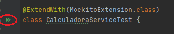
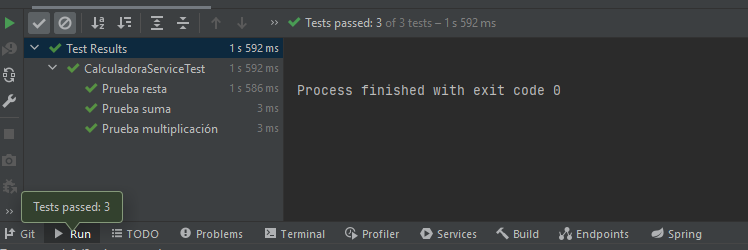

## Reto 01: Pruebas unitarias variables con JUnit 5 y Mockito

### OBJETIVO
- Simular el funcionamiento de una clase que aún no existe, usando un mock creado con Mockito, la cual variará la respuesta dependiendo del valor recibido como parámetro.  
- Crear una prueba que ayude a vaiar el correcto funcionamiento de una clase o componente.


#### REQUISITOS
- Tener instalado el IDE IntelliJ Idea Community Edition con el plugin de Lombok activado.
- Tener instalada la última versión del JDK 11 o 17.

### DESARROLLO
- Crea un nuevo proyecto usando Spring Initilizr y agrega la dependencia de **Lombok**.
- Crea los subpaquetes: `services` y `persistence`
- Crea una interface `CalculadoraDao`, que será un componente de Spring, y tendrá el siguiente método: `int findValorConstante(int valorInicial);`.
- Crea una clase `CalculadoraService`, decorada con la anotación `@Service`.
- Coloca los métodos `suma`, `resta` y `multiplica` en la clase anterior. El resultado de la operación será modificado con base a la constante recibida, por ejemplo:

    ```java
    public int suma(int a, int b, int c) {
            return a + b + calculadoraDao.findValorConstante(c);
        }
    ```

- Crea una clase de prueba `CalculadoraServiceTest` que verifique cada una de las operaciones.
- Si e valor de la constante pasada a `findValorConstante` es menor o igual a **5** este regresará un valor de **1**, si es mayor a 5 regresará un valor de **2**.

<details>
	<summary>Solución</summary>

1. Entra al sitio de <a href="https://start.spring.io/" target="_blank">Spring Initializr</a>. Ahí verás una sola página dividida en dos secciones. Comienza llenando la información de la sección del lado izquierdo. Selecciona:

2. En la ventana que se abre selecciona las siguientes opciones:
    - Grupo, artefacto y nombre del proyecto.
    - Tipo de proyecto: **Maven Project**.
    - Lenguaje: **Java**.
    - Forma de empaquetar la aplicación: **jar**.
    - Versión de Java: **11** o **17**.

3. En la sección de la derecha (las dependencias) presiona el botón `Add dependencies` y en la ventana que se abre busca la dependencia `Lombok`.

4. Dale un nombre y una ubicación al proyecto y presiona el botón *Generate*.

5. En el proyecto que se acaba de crear debes tener el siguiente paquete `org.bedu.java.backend.sesion7.reto1`. Dentro crea los subpaquetes: `persistence`, `services`.

6. Dentro del paquete `persistence` crea una interface llamada `CalculadoraDao` de la siguiente forma:
    ```java
    @Component
    public interface CalculadoraDao {
        int findValorConstante(int valorInicial);
    }
    ```

    Esta interface nos ayudará a simular que se lee un valor constante de una base de datos. Sin embargo, no habrá ninguna clase que implemente esta interface (y por eso deberemos crear un mock para simular su comportamiento).

7. En el paquete `services` crea una clase llamada `CalculadoraService` y decórala con la anotación `@Service` de Spring.
    ```java
    @Service
    public class CalculadoraService {

    }
    ```

8. Coloca tres métodos dentro de esta clase, uno que regresará la suma de dos valores, otro su resta y un tercero para su multiplicación:
    ```java
    public int suma(int a, int b) {
        return a + b;
    }

    public int resta(int a, int b) {
        return a - b;
    }

    public int multiplica(int a, int b) {
        return a * b;
    }
    ```

9. Modificaremos el valor de cada una de las operaciones sumándoles un valor constante que será regresado por el método `findValorConstante` de la interfaz `CalculadoraDao`, el cual recibirá un valor para saber qué debe regresar.
    ```java
    public int suma(int a, int b, int c) {
        return a + b + calculadoraDao.findValorConstante(c);
    }

    public int resta(int a, int b, int c) {
        return a - b + calculadoraDao.findValorConstante(c);
    }

    public int multiplica(int a, int b, int c) {
        return a * b + calculadoraDao.findValorConstante(c);
    }
    ```

10. Agrega una referencia a esta interface y usa la anotación `@RequiredArgsConstructor` de Lombok para inyectarla:
    ```java
    @Service
    @RequiredArgsConstructor
    public class CalculadoraService {

        private final CalculadoraDao calculadoraDao;
        
    }
    ```

11. En el directorio de pruebas de Maven agrega una nueva clase llamada `CalculadoraServiceTest`.

12. Decora la nueva clase con la anotación `@ExtendWith(MockitoExtension.class)`, la cual indica que usarás las funcionalidades de Mockito para la prueba. Como no hay una implementación de la interface `CalculadoraDao` (aunque `CalculadoraService` la necesita), será necesario crear un objeto mock para poder completar la prueba unitaria. 

13. Agrega una instancia de tipo `CalculadoraDao` y decórala con la anotación `@Mock`:

    ```java
    @Mock(lenient = true)
    CalculadoraDao calculadoraDao;
    ```
14. Agrega una instancia de tipo `CalculadoraService`, que es la clase que probaremos, y decórala con la anotación `@InjectMocks` para indicar que los mocks creados se deben inyectar en esta clase.

    ```java
    @InjectMocks
    private CalculadoraService calculadora;
    ```

15. Agrega un método decorado con `@BeforeEach`, el cual se ejecuta antes de cada método de prueba. Dentro de este configura la respuesta que regresara el mock de tipo `CalculadoraDao` cuando se haga una llamada al método `findValorConstante`.

    ```java
    @BeforeEach
    void setUp() {
        given(calculadoraDao.findValorConstante(AdditionalMatchers.gt(6))).willReturn(2);
        given(calculadoraDao.findValorConstante(AdditionalMatchers.lt(5))).willReturn(1);
    }
    ```

16. Crea un método llamado `sumaTest` para verificar la suma. Usa el método `assertEquals` de JUnit para asegurar que los valores regresados son correctos. Los métodos de prueba deben decorarse siempre con la anotación `@Test`:
    ```java
    @Test
    @DisplayName("Prueba suma")
    void sumaTest() {
        int esperado = 6;
        int constante = 1;
        assertEquals(esperado, calculadora.suma(3, 2, constante));
    }
    ```

17. Haz lo mismo para probar la resta y la multiplicación:
    ```java
    @Test
    @DisplayName("Prueba resta")
    void restaTest() {
        int esperado = 1;
        int constante = 5;
        assertEquals(esperado, calculadora.resta(3, 2, constante));
    }

    @Test
    @DisplayName("Prueba multiplicación")
    void multiplicaTest() {
        int esperado = 8;
        int constante = 15;
        assertEquals(esperado, calculadora.multiplica(3, 2, 15));
    }
    ```

18. Ejecuta la prueba haciendo clic derecho sobre el editor de código y seleccionando la opción `Run CalculadoraServiceTest` o haciendo clic sobre las dos flechas verdes que aparecen junto al nombre de la clase:

    

19. Debes ver el siguiente resultado en la consola de IntelliJ:

    

</details>


<br>

[**`Siguiente`** -> ejemplo 02](../Ejemplo-02/)