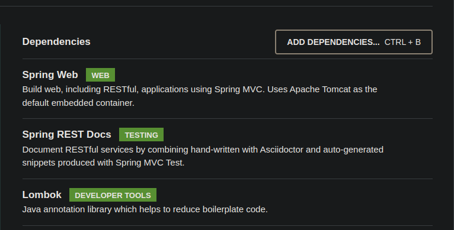

## Ejemplo 01: Generación de documentación de métodos GET

### OBJETIVO

- Crear una prueba que valide el correcto funcionamiento de una clase o componente.
- Generar, con la misma prueba, la documentación de la invocación del método **GET**, incluyendo los parámetros de petición y la respuesta obtenida.


#### REQUISITOS
- Tener instalado el IDE IntelliJ Idea Community Edition con el plugin de Lombok activado.
- Tener instalada la última versión del JDK 11 o 17.


### DESARROLLO

1. Entra al sitio de <a href="https://start.spring.io/" target="_blank">Spring Initializr</a>. Ahí verás una sola página dividida en dos secciones. Comienza llenando la información de la sección del lado izquierdo. Selecciona:

2. En la ventana que se abre selecciona las siguientes opciones:
    - Grupo, artefacto y nombre del proyecto.
    - Tipo de proyecto: **Maven Project**.
    - Lenguaje: **Java**.
    - Forma de empaquetar la aplicación: **jar**.
    - Versión de Java: **11** o **17**.

3. En la sección de la derecha (las dependencias) presiona el botón `Add dependencies` y en la ventana que se abre busca la dependencia `Spring Web`, `Spring Rest Docs`, y `Lombok`.

    

4. Dale un nombre y una ubicación al proyecto y presiona el botón *Generate*.

5. En el proyecto que se acaba de crear debes tener el siguiente paquete `org.bedu.java.backend.sesion8.ejemplo1`. Dentro crea los subpaquetes: `controllers` y `model`.

6. Dentro del paquete `model` crea una clase llamada `Cliente` de la siguiente forma:

    ```java
    @Data
    @Builder
    public class Cliente {
        private Long id;
        private String nombre;
        private String correoContacto;
        private int numeroEmpleados;
        private String direccion;
    }

    ```

7. En el paquete `controllers` crea una clase llamada `ClienteController` que represente un servicio REST de Spring:

    ```java
    @RestController
    @RequestMapping("/cliente")
    public class ClienteController {

    }
    ```

8. Coloca un método dentro de esta clase que regresará un `Cliente`.

    ```java
    @GetMapping("/{clienteId}")
    public ResponseEntity<Cliente> getCliente(@PathVariable Long clienteId){
        return ResponseEntity.ok(Cliente.builder().id(1L).correoContacto("cliente@contacto.com").nombre("Nombre").build());
    }
    ```

9. En el directorio de pruebas de Maven agrega una nueva clase llamada `ClienteControllerTest`. Decora la nueva clase con las anotaciones `@AutoConfigureRestDocs` y `@WebMvcTest(ClienteController.class)`. 

    ```java
    @AutoConfigureRestDocs
    @WebMvcTest(ClienteController.class)
    class ClienteControllerTest {

    }
    ```

10. Agrega una instancia de tipo `MockMvc` y decórala con la anotación `@Autowired`:

    ```java
    @Autowired
    private MockMvc mockMvc;
    ```

11. Crea un método llamado `obtenClienteTest` para verificar la obtención del cliente:

    ```java
    @Test
    void obtenClienteTest() throws Exception {

        mockMvc.perform(get("/cliente/{clienteId}", 1)
                .content(MediaType.APPLICATION_JSON_VALUE))
                .andExpect(status().isOk())
                .andExpect(content().contentTypeCompatibleWith(MediaType.APPLICATION_JSON))
                .andExpect(jsonPath("$.id", is(1)))
                .andExpect(jsonPath("$.correoContacto", is("cliente@contacto.com")))
                .andExpect(jsonPath("$.nombre", is("Nombre")));

    }
    ```

12. Ejecuta la prueba, esta debe pasar de forma correcta:


13. Indica en la prueba que esta debe generar documentación, y que la misma se debe colocar en el directrio `cliente/get-cliente`. Se documentarán los parámetros de la petición (en este caso el parámetro `clienteId`).

    ```java
    @Test
    void obtenClienteTest() throws Exception {

        mockMvc.perform(get("/cliente/{clienteId}", 1)
                .content(MediaType.APPLICATION_JSON_VALUE))
                .andExpect(status().isOk())
                .andExpect(content().contentTypeCompatibleWith(MediaType.APPLICATION_JSON))
                .andExpect(jsonPath("$.id", is(1)))
                .andExpect(jsonPath("$.correoContacto", is("cliente@contacto.com")))
                .andExpect(jsonPath("$.nombre", is("Nombre")))

                .andDo(document("cliente/get-cliente",
                        pathParameters(
                                parameterWithName("clienteId").description("Identificador del cliente")
                        )));

    }
    ```

14. Ejecuta la prueba haciendo nuevamente. En el directorio `target` se ha creado un subdirectorio `generated-snippets` y adentro de este un conjunto de archivos `.adoc`, Estos contienen la información generada de la ejecución de la prueba.

    


15. Abre el contenido de cualquiera de los archivos. Debes ver la nformación en texto plano, de la siguiente forma:

    

16. Dentro del directorio de código fuente de la aplicación crea un subdirectorio `docs` y dentro otro subdirectorio `asciidocs`. Adentro de este crea un archivo llamado `get-cliente.adoc`:

    

17. Coloca el siguiente contenido dentro del archivo:

    ```adoc
    [[clientes]]
    == Clientes

    === Get cliente por Id
    Obtiene un cliente específico usando su identificador único.

    ==== Ejemplo de petición
    include::{snippets}/cliente/get-cliente/http-request.adoc[]

    ==== Parámetros de la petición
    include::{snippets}/cliente/get-cliente/path-parameters.adoc[]

    ==== Ejemplo de respuesta
    include::{snippets}/cliente/get-cliente/http-response.adoc[]

    ==== Ejemplo usando CURL
    include::{snippets}/cliente/get-cliente/curl-request.adoc[]

    ```

18. En el archivo `pom.xml` del proyecto busca, en la sección de plugins, el plugin `asciidoctor-maven-plugin` y colola las siguientes elementos dentro de la etiqueta `<configuration>`:

    ```xml
    <sourceDirectory>src/docs/asciidocs</sourceDirectory>
    <outputDirectory>target/generated-docs</outputDirectory>
    ```

    El plugin debe uedar de la siguiente forma:

    ```xml
    <plugin>
        <groupId>org.asciidoctor</groupId>
        <artifactId>asciidoctor-maven-plugin</artifactId>
        <version>1.5.8</version>
        <executions>
            <execution>
                <id>generate-docs</id>
                <phase>prepare-package</phase>
                <goals>
                    <goal>process-asciidoc</goal>
                </goals>
                <configuration>
                    <backend>html</backend>
                    <sourceDirectory>src/docs/asciidocs</sourceDirectory>
                    <outputDirectory>target/generated-docs</outputDirectory>
                </configuration>
            </execution>
        </executions>
        <dependencies>
            <dependency>
                <groupId>org.springframework.restdocs</groupId>
                <artifactId>spring-restdocs-asciidoctor</artifactId>
                <version>${spring-restdocs.version}</version>
            </dependency>
        </dependencies>
    </plugin>
    ```

19. Ejecuta nuevamente la prueba. Dentro del directorio `target` debe haberse creado un subdirectorio `generated-docs` y dentro de este un archivo llamado `get-cliente.html`.

    

20. Abre este archivo en un navegador. La página con la documentación debe verse de la siguiente forma:

    


<br>

[**`Siguiente`** -> reto 01](../Reto-01/)