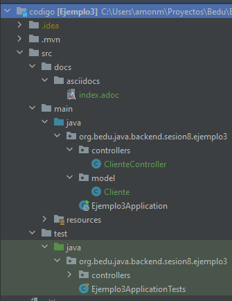
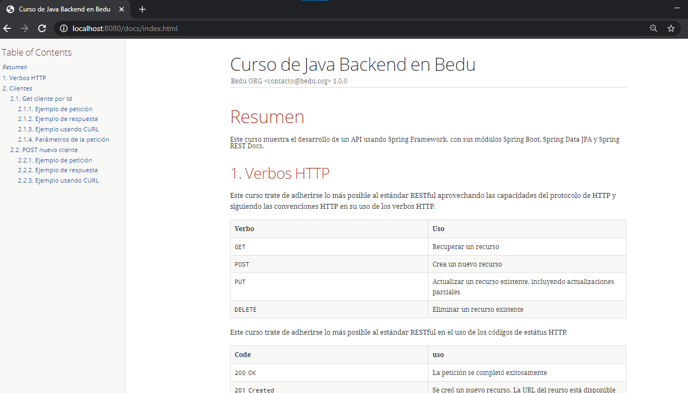

## Ejemplo: Distribución de la documentación dentro de la aplicación

### OBJETIVO

- Distribuir la documentación del uso del API junto con la aplicación.

#### REQUISITOS
- Tener instalado el IDE IntelliJ Idea Community Edition con el plugin de Lombok activado.
- Tener instalada la última versión del JDK 11 o 17.


### DESARROLLO

1. Crea un proyecto Maven usando Spring Initializr desde el IDE IntelliJ Idea.

2. En la ventana que se abre selecciona las siguientes opciones:
- Grupo, artefacto y nombre del proyecto.
- Tipo de proyecto: **Maven Project**.
- Lenguaje: **Java**.
- Forma de empaquetar la aplicación: **jar**.
- Versión de Java: **11** o **17**.

3. En la siguiente ventana elige **Spring Web**, **Spring Rest Docs**, y **Lombok** como dependencias del proyecto. En automático se agregarán también las dependencias para realizar pruebas unitarias.

4. Realiza la implementación de un controlador junto con sus pruebas, como se realizó en los ejemplos y retos anteriores. Debes tener las siguientes clases.
    - `Cliente`
    - `ClienteController`
    - `ClienteControllerTest`

Además, debes tener el archivo `index.adoc` en el directorio `src\docs\asciidocs` y debes tener configurado el plugin `asciidoctor-maven-plugin` en el archivo `pom.xml` de la aplicación.


La estructura del proyecto debe ser la siguiente:



5. Dentro del archivo `pom.xml` coloca el siguiente plugin debajo del `asciidoctor-maven-plugin`:

```xml
            <plugin>
                <groupId>org.apache.maven.plugins</groupId>
                <artifactId>maven-resources-plugin</artifactId>
                <version>3.2.0</version>
                <executions>
                    <execution>
                        <id>copy-resources</id>
                        <phase>prepare-package</phase>
                        <goals>
                            <goal>copy-resources</goal>
                        </goals>
                        <configuration>
                            <outputDirectory>${project.build.outputDirectory}/static/docs</outputDirectory>
                            <resources>
                                <resource>
                                    <directory>${project.build.directory}/generated-docs</directory>
                                </resource>
                            </resources>
                        </configuration>
                    </execution>
                </executions>
            </plugin>
```

6. Ejecuta las pruebas de la aplicación. Estas deben pasar de manera correcta.

7. Ejecuta la aplicación (la clase `Ejemplo3Application`, **NO** las pruebas). Tu aplicación debe iniciar correctamente.

8. Una vez que la aplicación se esté ejecutando, entra a la siguiente URL en tu navegador:

http://localhost:8080/docs/index.html

Debes ver una página como la siguiente:


