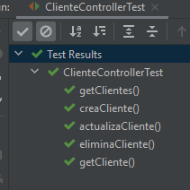
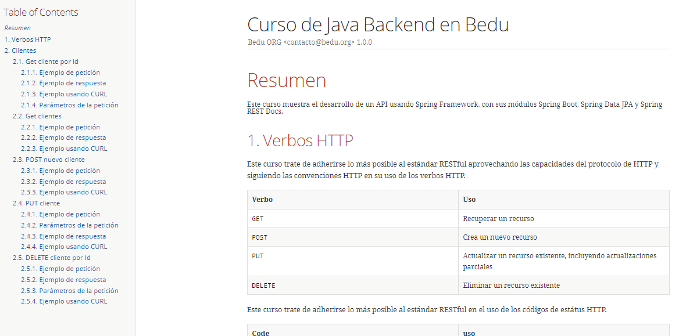

## Postwork Sesión 8

### OBJETIVO
- Generar documentación de servicios, basada en las pruebas unitarias de una aplicación.
- Personalizar la documentación generada con RestDoc.
- Distribuir la documentación de los servicios para ser consumida por otro desarrollador.


### DESARROLLO
En esta sesión se generará la documentación de los servicios generados en las sesiones anteriores, con el objetivo de poder distribuir dicha documentación y que otras personas sepan cómo consumirlos.

Para eso, usaremos Spring REST Docs, el módulo de Spring para generación de documentos.

El postwork se realizará en equipo, los cuales serán formados previamente a la sesión uno.

El propósito de este Postwork es retomar el proyecto del módulo anterior y realizar las modificaciones descritas a continuación.

1. Para cada una de las pruebas, unitarias o de integración, de los servicios REST creados, genera su documentación.

2. Decora la clase de prueba con la anotación `@AutoConfigureRestDocs`. Puedes personalizar la URL de la petición y el puerto si lo consideras necesario.

3. Para cada uno de los métodos HTTP usados en las pruebas (**GET**, **POST**, **PUT** y **DELETE**) genera la documentación con el método `andDo` de la instancia `MockMvc`. Revisa bien qué es lo que ddebes documentar, recuerda que no en todos los métodos se usa un cuerpo de petición o de respuesta. 

4. Dentro del directorio de código fuente de la aplicación crea un subdirectorio `docs` y dentro otro subdirectorio `asciidocs`. Adentro de este crea un archivo llamado `index.adoc`

5. Personaliza el contenido del archivo.

6. En el archivo `pom.xml` del proyecto busca, en la sección de plugins, el plugin `asciidoctor-maven-plugin` y colola los elementos de configuración necesarios para la generació del archivo HTML con la documentación del API.

7. En el archivo `pom.xml` del proyecto configura el `maven-resources-plugin` para distribuir la documentación generada junto dentro del archivo `.jar` generado por Spring Boot.

8. Ejecuta las pruebas de la aplicación. Todas deben ejecutarse de forma correcta.

    

9. Ejecuta la aplicación y entra a la siguiente URL en tu navegador para asegurarte que la documentación se copió de forma correcta:

    http://localhost:8080/docs/index.html

    Debes ver una página como la siguiente.

    


<br>

<details>
	<summary>Solución</summary>

1. Agregar la dependencia *restdocs*

    ```xml
    <dependency>
        <groupId>org.springframework.restdocs</groupId>
        <artifactId>spring-restdocs-mockmvc</artifactId>
        <scope>test</scope>
    </dependency>

    <plugin>
        <groupId>org.asciidoctor</groupId>
        <artifactId>asciidoctor-maven-plugin</artifactId>
        <version>1.5.8</version>
        <executions>
            <execution>
                <id>generate-docs</id>
                <phase>prepare-package</phase>
                <goals>
                    <goal>process-asciidoc</goal>
                </goals>
                <configuration>
                    <backend>html</backend>
                    <sourceDocumentName>index.adoc</sourceDocumentName>
                    <attributes>
                        <snippets>${project.build.directory}/generated-snippets</snippets>
                    </attributes>
                    <sourceDirectory>src/docs/asciidocs</sourceDirectory>
                    <outputDirectory>target/generated-docs</outputDirectory>
                </configuration>
            </execution>
        </executions>
        <dependencies>
            <dependency>
                <groupId>org.springframework.restdocs</groupId>
                <artifactId>spring-restdocs-asciidoctor</artifactId>
                <version>${spring-restdocs.version}</version>
            </dependency>
        </dependencies>
    </plugin>

    <plugin>
        <groupId>org.apache.maven.plugins</groupId>
        <artifactId>maven-resources-plugin</artifactId>
        <version>3.2.0</version>
        <executions>
            <execution>
                <id>copy-resources</id>
                <phase>prepare-package</phase>
                <goals>
                    <goal>copy-resources</goal>
                </goals>
                <configuration>
                    <outputDirectory>${project.build.outputDirectory}/static/docs</outputDirectory>
                    <resources>
                        <resource>
                            <directory>${project.build.directory}/generated-docs</directory>
                        </resource>
                    </resources>
                </configuration>
            </execution>
        </executions>
    </plugin>
    ```

2. Genera el archivo *index.adoc* y agrega la siguiente documentación:

    ```adoc
    = Curso de Java Backend en Bedu
    Bedu ORG <contacto@bedu.org> 1.0.0;
    :doctype: book
    :icons: font
    :source-highlighter: highlightjs
    :toc: left
    :toclevels: 4
    :sectlinks:
    :sectnums:

    [[resumen]]
    = Resumen
    Este curso muestra el desarrollo de un API usando Spring Framework, con sus módulos Spring Boot, Spring Data JPA y Spring REST Docs.


    [[verbos-http]]
    == Verbos HTTP

    Este curso trate de adherirse lo más posible al estándar RESTful aprovechando las capacidades del protocolo de HTTP
    y siguiendo las convenciones HTTP en su uso de los verbos HTTP.

    |===
    | Verbo | Uso

    | `GET`
    | Recuperar un recurso

    | `POST`
    | Crea un nuevo recurso

    | `PUT`
    | Actualizar un recurso existente, incluyendo actualizaciones parciales

    | `DELETE`
    | Eliminar un recurso existente
    |===

    Este curso trate de adherirse lo más posible al estándar RESTful en el uso de los códigos de estátus HTTP.

    |===
    | Code | uso

    | `200 OK`
    | La petición se completó exitosamente

    | `201 Created`
    | Se creó un nuevo recurso. La URL del reurso está disponible en la cabecera `Location` de la respuesta

    | `204 No Content`
    | Se aplicó correctamente la actualización de un recurso

    | `400 Bad Request`
    | La petición está formada de forma incorrecta. El cuerpo de la respuesta incluirá el error, proporcionando más información

    | `404 Not Found`
    | El recurso especificado no existe
    |===


    [[clientes]]
    == Clientes


    === Get cliente por Id
    Obtiene un cliente específico usando su identificador único.

    ==== Ejemplo de petición
    include::{snippets}/cliente/get-cliente/http-request.adoc[]

    ==== Ejemplo de respuesta
    include::{snippets}/cliente/get-cliente/http-response.adoc[]

    ==== Ejemplo usando CURL
    include::{snippets}/cliente/get-cliente/curl-request.adoc[]

    ==== Parámetros de la petición
    include::{snippets}/cliente/get-cliente/path-parameters.adoc[]


    === Get clientes
    Obtiene todos los clientes.

    ==== Ejemplo de petición
    include::{snippets}/cliente/get-clientes/http-request.adoc[]

    ==== Ejemplo de respuesta
    include::{snippets}/cliente/get-clientes/http-response.adoc[]

    ==== Ejemplo usando CURL
    include::{snippets}/cliente/get-clientes/curl-request.adoc[]


    === POST nuevo cliente
    Crea un nuevo cliente

    ==== Ejemplo de petición
    include::{snippets}/cliente/post-cliente/http-request.adoc[]

    ==== Ejemplo de respuesta
    include::{snippets}/cliente/post-cliente/http-response.adoc[]

    ==== Ejemplo usando CURL
    include::{snippets}/cliente/post-cliente/curl-request.adoc[]


    === PUT  cliente
    Actualiza un cliente existente.

    ==== Ejemplo de petición
    include::{snippets}/cliente/put-cliente/http-request.adoc[]

    ==== Parámetros de la petición
    include::{snippets}/cliente/put-cliente/path-parameters.adoc[]

    ==== Ejemplo de respuesta
    include::{snippets}/cliente/put-cliente/http-response.adoc[]

    ==== Ejemplo usando CURL
    include::{snippets}/cliente/put-cliente/curl-request.adoc[]


    === DELETE cliente por Id
    Elimina un cliente específico usando su identificador único.

    ==== Ejemplo de petición
    include::{snippets}/cliente/delete-cliente/http-request.adoc[]

    ==== Ejemplo de respuesta
    include::{snippets}/cliente/delete-cliente/http-response.adoc[]

    ==== Parámetros de la petición
    include::{snippets}/cliente/delete-cliente/path-parameters.adoc[]

    ==== Ejemplo usando CURL
    include::{snippets}/cliente/delete-cliente/curl-request.adoc[]
    ```

3. Agrega en *ClienteControllerTest* la implementación de RestDoc:

    ```java
    @AutoConfigureRestDocs(uriScheme = "https", uriHost = "bedu.org/rest", uriPort = 80)
    @WebMvcTest(ClienteController.class)
    class ClienteControllerTest {

        @Autowired
        private MockMvc mockMvc;

        @MockBean
        private ClienteService clienteService;

        @Test
        void getCliente() throws Exception {
            given(clienteService.obtenCliente(anyLong())).willReturn(Optional.of(Cliente.builder().id(1L).nombre("Nombre").correoContacto("cliente@contacto.com").build()));

            mockMvc.perform(get("/cliente/{clienteId}", 1)
                    .content(MediaType.APPLICATION_JSON_VALUE))
                    .andExpect(status().isOk())
                    .andExpect(content().contentTypeCompatibleWith(MediaType.APPLICATION_JSON))
                    .andExpect(jsonPath("$.id", is(1)))
                    .andExpect(jsonPath("$.correoContacto", is("cliente@contacto.com")))
                    .andExpect(jsonPath("$.nombre", is("Nombre")))

                    .andDo(document("cliente/get-cliente",
                            pathParameters(
                                    parameterWithName("clienteId").description("Identificador del cliente")
                            ),
                            responseFields(
                                    fieldWithPath("id").description("identificador del cliente"),
                                    fieldWithPath("nombre").description("nombre del cliente"),
                                    fieldWithPath("correoContacto").description("correo de contacto del cliente"),
                                    fieldWithPath("numeroEmpleados").description("número de trabajadores del cliente"),
                                    fieldWithPath("direccion").description("domicilio del cliente")
                            )));
        }

        @Test
        void getClientes() throws Exception {

            List<Cliente> clientes = Arrays.asList(
                    Cliente.builder().id(1L).nombre("Nombre 1").direccion("Direccion 1").numeroEmpleados(10).correoContacto("contacto@cliente1.com").build(),
                    Cliente.builder().id(2L).nombre("Nombre 2").direccion("Direccion 2").numeroEmpleados(10).correoContacto("contacto@cliente2.com").build(),
                    Cliente.builder().id(3L).nombre("Nombre 3").direccion("Direccion 3").numeroEmpleados(10).correoContacto("contacto@cliente3.com").build()
            );

            given(clienteService.obtenClientes()).willReturn(clientes);

            mockMvc.perform(get("/cliente")
                    .content(MediaType.APPLICATION_JSON_VALUE))
                    .andExpect(status().isOk())
                    .andExpect(content().contentTypeCompatibleWith(MediaType.APPLICATION_JSON))
                    .andExpect(jsonPath("$[0].id", is(1)))
                    .andExpect(jsonPath("$[1].id", is(2)))
                    .andExpect(jsonPath("$[2].id", is(3)))
                    .andExpect(jsonPath("$[0].correoContacto", is("contacto@cliente1.com")))
                    .andExpect(jsonPath("$[2].nombre", is("Nombre 3")))

                    .andDo(document("cliente/get-clientes",
                            responseFields(
                                    fieldWithPath("[].id").description("identificador del cliente"),
                                    fieldWithPath("[].nombre").description("nombre del cliente"),
                                    fieldWithPath("[].correoContacto").description("correo de contacto del cliente"),
                                    fieldWithPath("[].numeroEmpleados").description("número de trabajadores del cliente"),
                                    fieldWithPath("[].direccion").description("domicilio del cliente")
                            )));
        }

        @Test
        void creaCliente() throws Exception {
            Cliente clienteParametro = Cliente.builder().nombre("Nombre").direccion("Direccion").numeroEmpleados(10).correoContacto("contacto@cliente.com").build();
            Cliente clienteRespuesta = Cliente.builder().id(1L).nombre("Nombre").direccion("Direccion").numeroEmpleados(10).correoContacto("contacto@cliente.com").build();

            given(clienteService.guardaCliente(clienteParametro)).willReturn(clienteRespuesta);

            mockMvc.perform(post("/cliente")
                    .contentType(MediaType.APPLICATION_JSON)
                    .content(new ObjectMapper().writeValueAsString(clienteParametro)))
                    .andExpect(status().isCreated())

                    .andDo(document("cliente/post-cliente",
                            requestFields(
                                    fieldWithPath("id").description("El identificador del nuevo cliente"),
                                    fieldWithPath("nombre").description("El nombre del cliente"),
                                    fieldWithPath("direccion").description("La dirección del cliente"),
                                    fieldWithPath("correoContacto").description("La dirección de correo electrónico de contacto"),
                                    fieldWithPath("numeroEmpleados").description("El número de personas que trabajan en las oficinas e cliente")
                            ),
                            responseHeaders(
                                    headerWithName("Location").description("La ubicación del recurso (su identificador generado")
                            ))
                    );
        }

        @Test
        void actualizaCliente() throws Exception {

            Cliente clienteParametro = Cliente.builder().id(1L).nombre("Nombre").direccion("Direccion").numeroEmpleados(10).correoContacto("contacto@cliente.com").build();

            mockMvc.perform(put("/cliente/{clienteId}", 1)
                    .contentType(MediaType.APPLICATION_JSON)
                    .content(new ObjectMapper().writeValueAsString(clienteParametro)))
                    .andExpect(status().isNoContent())

                    .andDo(document("cliente/put-cliente",
                            pathParameters(
                                    parameterWithName("clienteId").description("Identificador del cliente")
                            ),
                            requestFields(
                                    fieldWithPath("id").description("El identificador del nuevo cliente"),
                                    fieldWithPath("nombre").description("El nombre del cliente"),
                                    fieldWithPath("direccion").description("La dirección del cliente"),
                                    fieldWithPath("correoContacto").description("La dirección de correo electrónico de contacto"),
                                    fieldWithPath("numeroEmpleados").description("El número de personas que trabajan en las oficinas e cliente")
                            )
                    ));
        }

        @Test
        void eliminaCliente() throws Exception {
            mockMvc.perform(delete("/cliente/{clienteId}", 1)
                    .content(MediaType.APPLICATION_JSON_VALUE))
                    .andExpect(status().isNoContent())

                    .andDo(document("cliente/delete-cliente",
                            pathParameters(
                                    parameterWithName("clienteId").description("Identificador del cliente")
                            )));
        }
    }
    ```

8. Ejecuta las pruebas de la aplicación. Todas deben ejecutarse de forma correcta.

    

9. Ejecuta la aplicación y entra a la siguiente URL en tu navegador para asegurarte que la documentación se copió de forma correcta:

    http://localhost:8080/docs/index.html

    Debes ver una página como la siguiente.

    

</details>

<br>

[**`Regresar`**](../)
