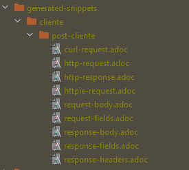
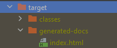
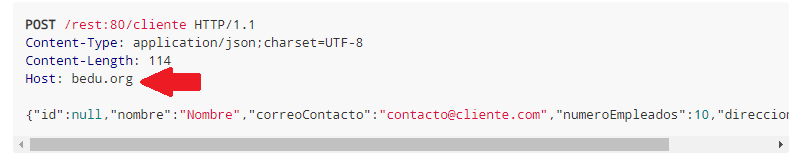

## Reto 02: Generación de documentación de respuestas para POST y personalizacion de URL y puerto de peticiones

### OBJETIVO

- Documentar los parámetros que se envían en el cuerpo de una petición POST y las respuestas recibidas.
- Generar un documento HTML con la documentación para poder distribuirlo.
- Personalizar el contenido de la documentación, así como la URL (host, esquema y puerto) al que apuntan los ejemplos.

#### REQUISITOS
- Tener instalado el IDE IntelliJ Idea Community Edition con el plugin de Lombok activado.
- Tener instalada la última versión del JDK 11 o 17.


### DESARROLLO
- Crea un nuevo proyecto usando Spring Initilizr y agrega las dependencias de **Spring Web**, **Spring Rest Docs** y **Lombok**.
- Crea los subpaquetes: `controllers` y `model`.
- Crea una clase `Cliente`, con las anotaciones `@Data`y `@Builder`, y los siguientes atributos:
    - private Long id;
    - private String nombre;
    - private String correoContacto;
    - private int numeroEmpleados;
    - private String direccion;
- Crea un servicio Rest `ClienteController` e implementa el siguiente método:

    ```java
        @PostMapping
        public ResponseEntity<Void> creaCliente(@RequestBody Cliente cliente) {

        }
    ```
- Crea una clase de prueba `ClienteControllerTest` que verifique las operación.
- Genera la documentación de la petición usando el método `requestFields` y el método `fieldWithPath`.
- Genera la documentación de la respuesta usado los métodos `responseHeaders`y `headerWithName`.
- Personaliza la documentación generada, a través de una archivo `index.adoc`.
- Personaliza la URL de las peticiones a través de los atributos de la anotación `@AutoConfigureRestDocs`.

</br>

<details>
	<summary>Solución</summary>


1. Entra al sitio de <a href="https://start.spring.io/" target="_blank">Spring Initializr</a>. Ahí verás una sola página dividida en dos secciones. Comienza llenando la información de la sección del lado izquierdo. Selecciona:

2. En la ventana que se abre selecciona las siguientes opciones:
    - Grupo, artefacto y nombre del proyecto.
    - Tipo de proyecto: **Maven Project**.
    - Lenguaje: **Java**.
    - Forma de empaquetar la aplicación: **jar**.
    - Versión de Java: **11** o **17**.

3. En la sección de la derecha (las dependencias) presiona el botón `Add dependencies` y en la ventana que se abre busca la dependencia `Spring Web`, `Spring Rest Docs`, y `Lombok`. En automático se agregarán también las dependencias para realizar pruebas unitarias.

4. Dale un nombre y una ubicación al proyecto y presiona el botón *Generate*.

5. En el proyecto que se acaba de crear debes tener el siguiente paquete `org.bedu.java.backend.sesion8.reto2`. Dentro crea los subpaquetes: `controllers` y `model`.

6. Dentro del paquete `model` crea una clase llamada `Cliente` de la siguiente forma:

    ```java
    @Data
    @Builder
    public class Cliente {
        private Long id;
        private String nombre;
        private String correoContacto;
        private int numeroEmpleados;
        private String direccion;
    }

    ```

7. En el paquete `controllers` crea una clase llamada `ClienteController` que represente un servicio REST de Spring:

    ```java
    @RestController
    @RequestMapping("/cliente")
    public class ClienteController {

    }
    ```

8. Coloca un método dentro de esta clase que regresará un `Cliente`.

    ```java
    @PostMapping
    public ResponseEntity<Void> creaCliente(@Validated @RequestBody Cliente cliente){
        return ResponseEntity.created(URI.create("1")).build();
    }
    ```

9. En el directorio de pruebas de Maven agrega una nueva clase llamada `ClienteControllerTest`. Decora la nueva clase con las anotaciones `@AutoConfigureRestDocs` y `@WebMvcTest(ClienteController.class)`. 

    ```java
    @AutoConfigureRestDocs
    @WebMvcTest(ClienteController.class)
    class ClienteControllerTest {

    }
    ```

10. Agrega una instancia de tipo `MockMvc` y decórala con la anotación `@Autowired`:

    ```java
    @Autowired
    private MockMvc mockMvc;
    ```

11. Crea un método llamado `obtenClienteTest` para verificar la obtención del cliente:
    
    ```java
    @Test
    void creaClienteTest() throws Exception {
        Cliente clienteParametro = Cliente.builder().nombre("Nombre").direccion("Direccion").numeroEmpleados(10).correoContacto("contacto@cliente.com").build();

        mockMvc.perform(post("/cliente")
                .contentType(MediaType.APPLICATION_JSON)
                .content(new ObjectMapper().writeValueAsString(clienteParametro)))
                .andExpect(status().isCreated())

    }
    ```

12. Ejecuta la prueba, esta debe pasar de forma correcta.

13. Indica en la prueba que esta debe generar documentación, y que la misma se debe colocar en el directrio `cliente/get-cliente`. Se documentarán los parámetros de la petición (en este caso el parámetro `clienteId`).
    
    ```java
     @Test
    void creaClienteTest() throws Exception {
        Cliente clienteParametro = Cliente.builder().nombre("Nombre").direccion("Direccion").numeroEmpleados(10).correoContacto("contacto@cliente.com").build();

        mockMvc.perform(post("/cliente")
                .contentType(MediaType.APPLICATION_JSON)
                .content(new ObjectMapper().writeValueAsString(clienteParametro)))
                .andExpect(status().isCreated())

                .andDo(document("cliente/post-cliente",
                        requestFields(
                                fieldWithPath("id").description("El identificador del nuevo cliente"),
                                fieldWithPath("nombre").description("El nombre del cliente"),
                                fieldWithPath("direccion").description("La dirección del cliente"),
                                fieldWithPath("correoContacto").description("La dirección de correo electrónico de contacto"),
                                fieldWithPath("numeroEmpleados").description("El número de personas que trabajan en las oficinas e cliente")
                        ),
                        responseHeaders(
                                headerWithName("Location").description("La ubicación del recurso (su identificador generado")
                        ))
                );
    }
    ```

14. Ejecuta la prueba haciendo nuevamente. En el directorio `target` se ha creado un subdirectorio `generated-snippets` y adentro de este un conjunto de archivos `.adoc`, Estos contienen la información generada de la ejecución de la prueba.

    

15. Modifica la anotación `@AutoConfigureRestDocs` de la siguiente forma: 

    `@AutoConfigureRestDocs(uriScheme = "https", uriHost = "bedu.org/rest", uriPort = 80)`

16. Dentro del directorio de código fuente de la aplicación crea un subdirectorio `docs` y dentro otro subdirectorio `asciidocs`. Adentro de este crea un archivo llamado `index.adoc`:

17. Coloca el siguiente contenido dentro del archivo:
    ```adoc
    = Curso de Java Backend en Bedu
    Bedu ORG <contacto@bedu.org> 1.0.0;
    :doctype: book
    :icons: font
    :source-highlighter: highlightjs
    :toc: left
    :toclevels: 4
    :sectlinks:
    :sectnums:

    [[resumen]]
    = Resumen
    Este curso muestra el desarrollo de un API usando Spring Framework, con sus módulos Spring Boot, Spring Data JPA y Spring REST Docs.


    [[verbos-http]]
    == Verbos HTTP

    Este curso trate de adherirse lo más posible al estándar RESTful aprovechando las capacidades del protocolo de HTTP
    y siguiendo las convenciones HTTP en su uso de los verbos HTTP.

    |===
    | Verbo | Uso

    | `GET`
    | Recuperar un recurso

    | `POST`
    | Crea un nuevo recurso

    | `PUT`
    | Actualizar un recurso existente, incluyendo actualizaciones parciales

    | `DELETE`
    | Eliminar un recurso existente
    |===

    Este curso trate de adherirse lo más posible al estándar RESTful en el uso de los códigos de estátus HTTP.

    |===
    | Code | uso

    | `200 OK`
    | La petición se completó exitosamente

    | `201 Created`
    | Se creó un nuevo recurso. La URL del reurso está disponible en la cabecera `Location` de la respuesta

    | `204 No Content`
    | Se aplicó correctamente la actualización de un recurso

    | `400 Bad Request`
    | La petición está formada de forma incorrecta. El cuerpo de la respuesta incluirá el error, proporcionando más información

    | `404 Not Found`
    | El recurso especificado no existe
    |===


    [[clientes]]
    == Clientes

    === POST nuevo cliente
    Crea un nuevo cliente

    ==== Ejemplo de petición
    include::{snippets}/cliente/post-cliente/http-request.adoc[]

    ==== Ejemplo de respuesta
    include::{snippets}/cliente/post-cliente/http-response.adoc[]

    ==== Ejemplo usando CURL
    include::{snippets}/cliente/post-cliente/curl-request.adoc[]


    ```

18. En el archivo `pom.xml` del proyecto busca, en la sección de plugins, el plugin `asciidoctor-maven-plugin` y colola las siguientes elementos dentro de la etiqueta `<configuration>`:

    ```xml
    <sourceDocumentName>index.adoc</sourceDocumentName>
    <attributes>
        <snippets>${project.build.directory}/generated-snippets</snippets>
    </attributes>
    <sourceDirectory>src/docs/asciidocs</sourceDirectory>
    <outputDirectory>target/generated-docs</outputDirectory>
    ```

    El plugin debe uedar de la siguiente forma:
    ```xml
    <plugin>
        <groupId>org.asciidoctor</groupId>
        <artifactId>asciidoctor-maven-plugin</artifactId>
        <version>1.5.8</version>
        <executions>
            <execution>
                <id>generate-docs</id>
                <phase>prepare-package</phase>
                <goals>
                    <goal>process-asciidoc</goal>
                </goals>
                <configuration>
                    <backend>html</backend>
                    <sourceDocumentName>index.adoc</sourceDocumentName>
                    <attributes>
                        <snippets>${project.build.directory}/generated-snippets</snippets>
                    </attributes>
                    <sourceDirectory>src/docs/asciidocs</sourceDirectory>
                    <outputDirectory>target/generated-docs</outputDirectory>
                </configuration>
            </execution>
        </executions>
        <dependencies>
            <dependency>
                <groupId>org.springframework.restdocs</groupId>
                <artifactId>spring-restdocs-asciidoctor</artifactId>
                <version>${spring-restdocs.version}</version>
            </dependency>
        </dependencies>
    </plugin>
    ```

19. Ejecuta nuevamente la prueba. Dentro del directorio `target` debe haberse creado un subdirectorio `generated-docs` y dentro de este un archivo llamado `index.html`.

    

20. Abre este archivo en un navegador. La página con la documentación debe verse de la siguiente forma:

    

</details>


<br>

[**`Siguiente`** -> ejemplo 03](../Ejemplo-03/)